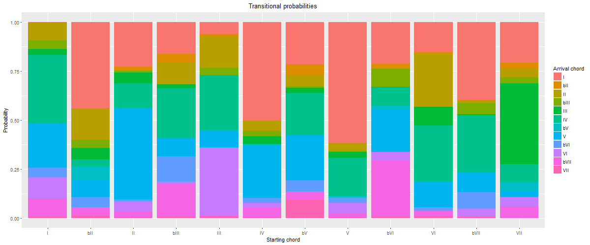
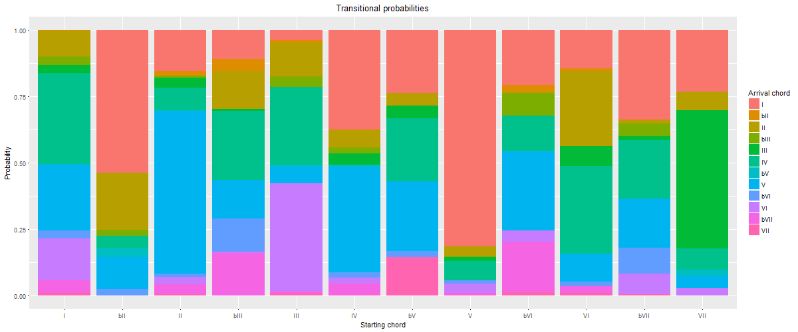

latex input:	mmd-article-header
Title:	A cluster analysis of harmony in the McGill Billboard data set
Subtitle:
Author:	Kris P. Shaffer, et al.
Base Header Level:	2
latex mode:	memoir
latex input:	mmd-article-begin-doc
latex footer:	mmd-memoir-footer

# Abstract

In this study, we set out to perform a cluster analysis of harmonic structures (specifically, chord-to-chord transitions) in the McGill Billboard data set, in order to determine whether there is evidence of multiple harmonic grammars/practices in the corpus, and if so, what was the optimal division of songs according to those harmonic grammars. We defined *optimal* as providing meaningful, specific information about the harmonic practices of songs in the cluster, but general enough to be used as a guide to songwriting and predictive listening. We tested two hypotheses in our cluster analysis — first that 5–8 clusters would be optimal, based on the work of Walter Everett, and second that 15 clusters would be optimal, based on a set of user-generated genre tags reported by Hendrik Schreiber. At the beginning of our study, we predicted that a solution with 5–8 clusters would be more likely to prove optimal than a 15-cluster solution, given what we knew about the disconnect between genre and style and having found Everett's "tonal systems" compelling.

After parsing the McGill Billboard dataset and converting harmonies from absolute pitch designations (lead-sheet symbols) to key-specific designations (Roman numerals), we created a 144-dimensional vector for each song containing the probabilities of occurrence of each of the twelve chord roots given a specific previous chord root (12x12, hence 144 dimensions) and subjected the 144-dimensional vector for each of the 730 songs in the McGill Billboard data set to a K-means cluster analysis using Python and SciKit-Learn. We examined the results of the cluster analysis for cardinalities of 1 through 15 clusters for musical significance and determined that the optimal clustering solution is likely to be within the 5–8 cluster range. We also proposed that a map of cluster types emerging as the number of clusters increases from one to eight constitutes an even greater aid to our understanding of how various harmonic practices, styles, and sub-styles make up the McGill Billboard data set.

# Introduction: Recent studies

What is rock? Is it a genre? a style? a conglomeration of genres and subgenres, styles and substyles? Is it a single entity at all? Or is it such a diffuse and subjective category that study of its underlying structure is doomed to failure?

Recent empirical studies of rock (or pop/rock) harmony have touched upon these problematic questions. Referring to their study of a sample of songs from *Rolling Stone* magazine's "500 Greatest Songs of All Times," DeClercq and Temperley (2011) write, "'rock' proves to be a problematic term. ... It might be argued that what our corpus represents is not a single unified style, but perhaps several styles, each of which may have a more consistent harmonic logic than is reflected by the data we have presented above (this brings to mind Everett's six 'tonal systems')" (50–51). Similarly, John Ashley Burgoyne concludes his (2011) dissertation analyzing a sample of songs from the *Billboard* Hot 100 reiterating the point that "most proportions derived from data are 'over-dispersed'," with the harmonic structure of the McGill Billboard corpus being no exception (188). By "over-dispersed" Burgoyne means that the harmonic structures of individual songs are noticeably different from the average structures of the corpus. This song-by-song uniqueness is not surprising, given the creativity of songwriters, but it problematizes the use of corpus-wide averages as representative measures of the pop/rock corpus as a whole, let alone the greater population of which the corpus is a sample.

The problematic nature of the terms "rock," "pop," and "pop/rock" likely emerge for a number of reasons. First, these terms are applied to very large repertoires of music by musicians and listeners alike. Hendrik Schreiber (2015) investigated user-generated genre tags in online music services and found that "pop/rock" was applied to as many as 60% of recent popular songs; when separated into finer grained categories, "pop" was applied to roughly 7%, "rock" to 39%, and the rock-related terms "metal" and "punk" were applied to another 7% of songs (p. 246). "Rock" and "pop/rock" seem to be very broad categories, and perhaps ill-defined, or at least diversely defined, among listeners.

Second, there is a disconnect between genre and style that is not always accounted for in empirical musical studies. Allan F. Moore (2001) addresses this distinction in detail. For our purposes, it is most significant to note the *social* component to genre and the *structural* focus of style. When computational theorists study the structure of songs, we cannot assume a shared underlying structural *grammar* simply because listeners have categorized songs according to the same *genre*. For example, in an article introducing the Million Song Dataset (2011), Thierry Bertin-Mahieux et al. provide sample genre tags for Britney Spears and Bon Jovi, from The Echo Nest and from Musicbrainz. Bon Jovi is tagged as "Adult Contemporary," "Arena Rock," and "80s" (The Echo Nest); "Hard Rock," "Glam Metal," and "American" (Musicbrainz). Britney Spears is tagged as "Teen Pop," "Soft Rock," and "Female" (The Echo Nest); "Pop," "American," and "Dance" (Musicbrainz). Even without an empirical comparison of the structural properties of these two artists' music, we can see likely social components to these tags that would be difficult to delineate structurally. For example, what makes Britney Spears's music "female," especially considering the fact that a number of her songs were written by men? And why is Bon Jovi's music "hard" rock while Britney Spears's music is "soft" rock? Is there an objective structural feature set that delineates hard from soft in this context, or is there a social, and gendered, component to these genre tags, as is likely with the "female" tag applied to Britney Spears? Further, consider the tags likely contributed by those whose musical preferences differ. We suggest that a fan of country or gospel is more likely to use the word "metal" when describing Bon Jovi than a fan of Judas Priest and Black Sabbath is. At the very least, we cannot rule out the possible subjectivity of these terms without further empirical study.

Whatever the reasons, it is clear that it would be beneficial to study further the possibility of multiple stylistic practices being contained within the broad genre labels of "pop" and "rock," especially when considering these terms over the course of a time period as broad as the *Rolling Stone* and McGill Billboard corpora represent.

However, there is a chicken-and-egg problem here. In order to precisely define "rock" or one of its potential sub-styles empirically, we need to know what songs do and don't belong within the category of "rock." However, as Burgoyne and DeClercq/Temperley show, we *don't* know which songs do and do not belong inside that category. For that we need to define the style structurally based on data from the songs contained in it. Which requires knowing which songs belong to the style. Which requires defining the style structurally. And so on, ad infinitum.

But there is an empirical tool that can assist us with this problem. Both Burgoyne and DeClercq and Temperley mention the machine-learning technique of *cluster analysis* as a possible tool for discovering the emergent harmonic styles represented in these corpora. K-Means cluster analysis is an unsupervised machine-learning algorithm that takes a collection of data points, measures the Euclidean distance from each other in some predefined space, and attempts to find the tightest clusters of data points: those groups of points (in this case, songs) that are the most near (like) each other, but the most distant from (unlike) the points in other clusters. This tightness-of-clusters property is a sum-of-squares statistical measurement called *inertia*. This gives us a tool to crack the chicken-and-egg problem described in the introduction: collect a large dataset of popular songs, define each song as a point in (144-dimension) harmonic-practice space, perform a cluster analysis of the corpus in that space, and uncover the clustering solution with the best inertia and the greatest musicological significance. Then we can analyze the songs in each cluster to find what specific harmonic practices are contained within the larger corpus, whose properties have been averaged over by the corpus-wide analysis.

We (the instructor and students in a vertically integrated, interdisciplinary course on computational music analysis at the University of Colorado–Boulder) performed just such an analysis on the songs in the McGill Billboard Dataset (Version 2.0). As the following results demonstrate, there do seem to be multiple distinct harmonic (sub-)grammars present in the McGill Billboard corpus, and the results of the K-means cluster analysis help us to define those (sub-)grammars precisely, adding nuance to our understanding of the harmonic structural properties of pop/rock music.

# The dataset

To conduct this study, we used the McGill Billboard dataset (version 2.0, available from http://ddmal.music.mcgill.ca/billboard and described in detail in Burgoyne 2011). This dataset, which we will refer to as BB, contains detailed harmonic information for 730 songs taken from the Billboard Hot 100 Singles charts from August 1958 through November 1991 (Burgoyne 2011, p. 131). Because it is taken from the Hot 100, it is a sample of songs that were popular at some point in their history, but does not claim to represent a single genre. In fact, the Hot 100 list routinely comprises a variety of genres, and as noted above, presents a statistically "over-dispersed" harmonic practice, with most songs exhibiting significantly different harmonic structures than the corpus average. Thus it not only provides a ready-made collection of harmonically tagged musical data for computational analysis, but it also presents an ideal environment for testing the hypothesis that there are multiple structural grammars in the broad category of pop/rock music.

However, BB is not entirely ready-made for such an analysis. The dataset contains detailed harmonic tagging, but as absolute chord designations (i.e., lead-sheet symbols) rather than relative to a tonic (i.e., Roman numerals). Thus,, we created a parser (a Python script) that would use the absolute chord data and the tonic pitch provided in BB's metadata for each song, and produce a list of chords as functional entities, represented by Roman numerals.

We also decided to use those Roman numerals to represent *only the scale-degree of the chord's root*, not chord quality or the presence of chord extensions (sevenths, ninths, elevenths, thirteenths), the absence of chord tones (power chords), or the presence of suspended tones (typically seconds or fourths). This was partly because of the emphasis on root progressions in many theories of tonal harmony, but mostly because of statistical concerns. When dealing with bigrams (chord-to-chord progressions) and twelve possible chord roots, there are 144 (12x12) possible bigrams, and thus 144 dimensions to a potential cluster analysis. This is already a very high-dimensional study, especially given the size of the dataset, and most of these dimensions will be empty for a given song (that is, zero occurrences of that particular bigram). Each additional chord parameter adds twelve new possible starting and ending chords, rapidly increasing the dimensionality of the harmonic space. And since a very small set of chord qualities and configurations account for such a high percentage of the chords in the corpus (five chord types ― major and minor triads, and dominant-, minor-, and major-seventh chords ― account for 85.7% of the chords in the corpus; Burgoyne 2011, p. 163), the potential statistical payoff of accounting for a variety of chord types was very low and came at both a computational and a statistical cost.

Once we had the harmonic data reduced and translated to chord roots relative to a tonic, we analyzed each song for its chord-progression content. For each chord-to-chord transition (bigram), we calculated the probability of the arrival chord given the starting chord. Given a IV chord, what is the probability in a given song that the following chord is I? flat-II? II? ... VII? For each song, this analysis produced 144 probability values: I–I, I–♭II, I–II, ... VII–VII. The twelve probabilities that start with the same chord (e.g., I–I, I–♭II, ... I–VII) sum to 1 (or to 0, if the starting chord is not present in the song). This set of 144 values served as the basis both of our corpus-wide average calculations and the cluster analysis.

Following is a sample bigram analysis for a single song, "Does Anybody Really Know What Time It Is?" by Chicago, represented as a 12x12 table. Probabilities represent the probability of the target chord (top row) given the preceding chord (left column). Each row sums to 1 or 0.

|  | I | ♭II | II | ♭III | III | IV | ♭V | V | ♭VI | VI | ♭VII | VII |
| --: | :-: | :-: | :-: | :-: | :-: | :-: | :-: | :-: | :-: | :-: | :-: | :-: |
| I | 0.0 | 0.0 | 0.0 | 0.0 | 0.0 | 0.364 | 0.0 | 0.091 | 0.182 | 0.0 | 0.273 | 0.091 |
| ♭II | 0.0 | 0.0 | 0.0 | 0.0 | 0.0 | 0.0 | 0.0 | 0.0 | 0.0 | 0.0 | 1.0 | 0.0 |
| II | 0 | 0 | 0 | 0 | 0 | 0 | 0 | 0 | 0 | 0 | 0 | 0 |
| ♭III | 0.0 | 1.0 | 0.0 | 0.0 | 0.0 | 0.0 | 0.0 | 0.0 | 0.0 | 0.0 | 0.0 | 0.0 |
| III | 0.0 | 0.0 | 0.0 | 1.0 | 0.0 | 0.0 | 0.0 | 0.0 | 0.0 | 0.0 | 0.0 | 0.0 |
| IV | 0.75 | 0.0 | 0.0 | 0.0 | 0.0 | 0.0 | 0.0 | 0.25 | 0.0 | 0.0 | 0.0 | 0.0 |
| ♭V | 0 | 0 | 0 | 0 | 0 | 0 | 0 | 0 | 0 | 0 | 0 | 0 |
| V | 0.5 | 0.0 | 0.0 | 0.0 | 0.0 | 0.0 | 0.0 | 0.0 | 0.0 | 0.5 | 0.0 | 0.0 |
| ♭VI | 0.5 | 0.0 | 0.0 | 0.0 | 0.5 | 0.0 | 0.0 | 0.0 | 0.0 | 0.0 | 0.0 | 0.0 |
| VI | 0.5 | 0.0 | 0.0 | 0.0 | 0.0 | 0.0 | 0.0 | 0.0 | 0.0 | 0.0 | 0.5 | 0.0 |
| ♭VII | 0.8 | 0.0 | 0.0 | 0.0 | 0.0 | 0.0 | 0.0 | 0.0 | 0.0 | 0.2 | 0.0 | 0.0 |
| VII | 0.0 | 0.0 | 0.0 | 0.0 | 0.0 | 0.0 | 0.0 | 0.0 | 0.0 | 0.0 | 1.0 | 0.0 |
[Average probability of the occurrence of a target chord (top row) given a previous chord (left column) in "Does Anybody Really Know What Time It Is?" by Chicago.]

And following is the song-by-song average for the entire corpus. (All average probability tables in this article have been normalized so that each row sums to 1. Because some songs will have zeroes for each value in a row, not all averages will sum to 1 without this normalization, leading to difficulty reading and interpreting the tables. Normalized tables make both within-table and cross-table comparisons easier.)

|  | I | ♭II | II | ♭III | III | IV | ♭V | V | ♭VI | VI | ♭VII | VII |
| --: | :-: | :-: | :-: | :-: | :-: | :-: | :-: | :-: | :-: | :-: | :-: | :-: |
| I | 0.0 | 0.005 | 0.089 | 0.044 | 0.031 | 0.347 | 0.002 | 0.227 | 0.049 | 0.107 | 0.092 | 0.007 |
| ♭II | 0.441 | 0.0 | 0.159 | 0.043 | 0.058 | 0.038 | 0.066 | 0.087 | 0.055 | 0.0 | 0.038 | 0.014 |
| II | 0.228 | 0.02 | 0.0 | 0.009 | 0.056 | 0.125 | 0.002 | 0.465 | 0.01 | 0.05 | 0.031 | 0.003 |
| ♭III | 0.162 | 0.043 | 0.114 | 0.0 | 0.019 | 0.255 | 0.0 | 0.092 | 0.131 | 0.009 | 0.167 | 0.007 |
| III | 0.06 | 0.012 | 0.162 | 0.036 | 0.0 | 0.279 | 0.006 | 0.084 | 0.0 | 0.346 | 0.005 | 0.008 |
| IV | 0.504 | 0.001 | 0.052 | 0.027 | 0.039 | 0.0 | 0.007 | 0.268 | 0.024 | 0.026 | 0.05 | 0.001 |
| ♭V | 0.216 | 0.059 | 0.054 | 0.007 | 0.027 | 0.216 | 0.0 | 0.23 | 0.056 | 0.0 | 0.041 | 0.095 |
| V | 0.618 | 0.001 | 0.04 | 0.005 | 0.03 | 0.196 | 0.005 | 0.0 | 0.028 | 0.053 | 0.024 | 0.001 |
| ♭VI | 0.213 | 0.022 | 0.002 | 0.093 | 0.003 | 0.096 | 0.02 | 0.214 | 0.0 | 0.045 | 0.286 | 0.006 |
| VI | 0.153 | 0.007 | 0.273 | 0.001 | 0.094 | 0.286 | 0.001 | 0.132 | 0.017 | 0.0 | 0.028 | 0.008 |
| ♭VII | 0.399 | 0.001 | 0.013 | 0.057 | 0.006 | 0.289 | 0.0 | 0.103 | 0.084 | 0.041 | 0.0 | 0.007 |
| VII | 0.209 | 0.03 | 0.045 | 0.03 | 0.414 | 0.092 | 0.045 | 0.03 | 0.0 | 0.046 | 0.06 | 0.0 |
[Whole-corpus average probability of the occurrence of a target chord (top row) given a previous chord (left column).]

# Analytical methods

The goal of this study is to use the machine-learning technique of K-means cluster analysis in combination with ad hoc human analysis to test the hypothesis that the McGill Billboard dataset contains exemplars of multiple harmonic grammars, rather than a single harmonic grammar represented by a corpus-wide probabilistic average (see above figure). In statistical terms, we hypothesize that the BB corpus is not a sample of a single population of "pop/rock" songs, but rather a mixture of samples from a variety of musical styles. We also hope to produce empirical data that problematizes the equating of style and genre, something that is common in the machine learning community when addressing musical data, particularly in discussions of music recommendation systems. ***EXAMPLES***

To test this hypothesis, we subjected the 144-dimensional bigram (chord-to-chord transition) analysis described above to a K-means cluster analysis. As described in the introduction, K-Means cluster analysis is an unsupervised machine-learning algorithm that takes a collection of data points, measures the Euclidean distance from each other in some predefined space, and attempts to find the tightest clusters of data points, a sum-of-squares statistical measurement called *inertia*.

K-means cluster analysis, like all unsupervised machine-learning algorithms, has the advantage of the resulting clusters ― in this case, the harmonic grammars present in the corpus ― being emergent. However, the *number* of clusters must be predetermined by the analyst, and can be anything from one cluster (a trivial case) to 730 clusters (another trivial case, with each cluster containing a single song). How do we choose the appropriate number of clusters? (We will refer to the number of clusters as the *cardinality* of the clustering solution.)

For a dataset the size of BB, it is not difficult to run the clustering algorithm multiple times with different cardinalities, even on a personal computer. (We used an eight-core Mac Pro for this study, and it was more than up to the task, running multiple clustering epochs in a matter of minutes.) Further, each clustering solution produces a single *inertia* value that represents the tightness of the clusters, making it easy to compare the results of even a large number of cardinalities to find the tightest fit.

However, the more clusters contained in a solution, the more unwieldy the musical analysis. Harmonic "grammars" proliferate, and categories become too small to represent a meaningful generalization of a musical practice. Further, our study would also hit a *human* bottleneck if we were to analyze the 144 probability values in all 266,815 clusters produced by running the algorithm on each cardinality from 1 to 730. In order to find an optimal clustering solution, we need to form a specific hypothesis to test, limiting the algorithmic output to something that is both analyzable by humans and that has the potential to represent something that is musically meaningful.

With that in mind, we formed two specific hypotheses based on existing research on style and genre in popular music, and sought clustering solutions in and around those hypothetical scenarios.

The first hypothesis comes from Walt Everett's (2004) six "tonal systems," two of which were divided into two subsystems, rendering a potential of 6–8 harmonic grammars in music Everett categorized as "rock" (note the genre–style relationship). It is important to note that in Everett's article, he purposefully went *outside* the popularity charts to find songs that he believed were important or influential in rock history. This led to at least one tonal system that likely would not exist in a study that, like ours, is based entirely on the Billboard charts. Based on Everett's study, then, we hypothesized that there were between five and eight harmonic (sub-)grammars in the BB corpus, and thus that a clustering solution with cardinality 5, 6, 7, or 8 would be optimal.

The second hypothesis comes from Schreiber (2015), who settled on a list of fifteen *genre* tags for popular music, based on user-generated tags for songs affiliated with another popular music dataset. We decided to test the hypothesis that the relationship between user-tagged genre and structural style would be strong and, therefore, there would be fifteen harmonic (sub-)grammars in the BB corpus, leading to an optimal clustering solution with cardinality 15. (Note that because we find the genre–style conflation to be problematic, and because harmonic grammar is not the only distinguishing marker of a musical style, we predicted that cardinality 15 would *not* likely produce the optimal clustering solution.)

To test these hypotheses, as well as other options near to them, we constructed a set of scripts (using Python and the machine-learning toolkit SciKit-Learn) that would run the clustering algorithm for cardinalities 1–15. This would give us a base-line inertia value for a corpus-wide average (cardinality 1), as well as all of the cardinalities suggested by the Everett-based hypothesis and the Schreiber-based hypothesis, and other values between those. (We were also open to the possibility of testing a higher cardinality if the results of these tests suggested it would be useful, but as will be discussed in what follows, that was not the case.)

*All code, as well as the parsed and key-oriented version of the BB corpus that we used, can be found in our GitHub repository for this project (github.com/corpusmusic/bb-cluster). We invite interested readers to reproduce our results, as well as to submit corrections and/or enhancements to the repository.*

# The results

The results of each clustering solution for the 730-song corpus can be found [in our GitHub repository](https://github.com/corpusmusic/bb-cluster/blob/master/song_metadata_and_clusters.csv). In what follows, we discuss the implications of those solutions statistically and musicologically.

## Inertia values

Our clustering script produced solutions with the following inertia values (lower is better):

| Number of clusters | Inertia |
| --: | :-- |
| 1 | 1940.24 |
| 2 | 1792.53 |
| 3 | 1698.93 |
| 4 | 1618.68 |
| 5 | 1561.78 |
| 6 | 1516.65 |
| 7 | 1478.38 |
| 8 | 1444.09 |
| 9 | 1413.61 |
| 10 | 1386.81 |
| 11 | 1360.44 |
| 12 | 1337.93 |
| 13 | 1318.02 |
| 14 | 1299.14 |
| 15 | 1277.28 |
[Inertia values for K-means cluster analysis of McGill Billboard data set, with cardinalities 1–15. All values rounded to two decimal places.]

Increasing the number of clusters not surprisingly brings the inertia down. Also not surprising, the more clusters there are, the less of an impact the addition of a single cluster to the model has on the inertia value. Taken on its own, this list of inertia values suggests that the 15-cluster solution is the best of those tested, but also suggests that increasing the number of clusters still further would result in tighter, more meaningful clusters.

However, we are searching for a meaningful generalization of harmonic practice. As discussed above, we want to find a balance between reflecting the nuance of each individual song (a 730-cluster solution) and the generalizability of a single grammar or common set of patterns that allows us to speak at the level of a stylistic practice. Thus we must examine the *musical* significance of the clustering solutions in addition to the statistical tightness of the clusters before drawing any conclusions.

## Musical analysis of the clusters

### 1-cluster solution (inertia 1940.24)

The 1-cluster solution is the same as analyzing the entire corpus without a clustering algorithm. It is a trivial case, but serves as a base-line for the subsequent clustering solutions. Following is a visualization of transitional probabilities for the entire corpus, with starting chords on the X axis and arrival chords denoted by color. Bar heights represent the probability of the arrival chord given the starting chord, and have been normalized so that each column sums to 1 (as explained above).

**1-cluster solution, cluster 1.** Average probability of the occurrence of a target chord (denoted by color) given a starting chord (x axis).

We can readily see in this table that it mixes several common practices in pop/rock harmony. For example, I most often progresses to IV or V, IV to I or V, and V to I. This is already a mix of common-practice tonality (I–IV–V–I) and blues (I–IV–I–V–IV–I). A descending circle-of-fifths progression is also apparent, as VII progresses most often to III, III to VI, VI to II, II to V, and V to I. The modal/minor-key progression ♭VI–♭VII–I also stands out. So while this may serve as a not unhelpful summary of pop/rock harmonic practices, it could not be used to make predictions about what harmonic practices are likely to occur in a specific context, nor to guide a songwriter in the emulation of the style in a single song.

### 2-cluster solution (inertia 1792.53)

Aside from a large drop in the inertia value, there is clear musical significance to this solution. While there is still a mixture of practices present in each cluster, there is also a meaningful division. Cluster 1 contains authentic, common-practice classical progressions (I tends to progress to IV, IV to V, and V to I), alongside the related descending circle-of-fifths progression, and minor-key ♭VI–♭VII–I. Sample songs include "Will You Love Me Tomorrow" by The Shirelles (1961), "Help!" by The Beatles (1965), "Hocus Pocus" by Focus (1973), "Heartbreaker" by Pat Benetar (1980), and "Need You Tonight" by INXS (1988). Cluster 2 also contains this minor-key pattern, but generally emphasizes plagal and blues progressions (V–IV–I and ♭VII–IV–I), as in "The Twist" by Chubby Checker (1962), "Dream Police" by Cheap Trick (1979), and "White Wedding" by Billy Idol (1983). We can parse more finely while still providing helpful generalizations, but this division of pop/rock harmonic practices into authentic and plagal grammars is a helpful distinction.

**2-cluster solution, cluster 1.** Average probability of the occurrence of a target chord (denoted by color) given a starting chord (x axis).

**2-cluster solution, cluster 2.** Average probability of the occurrence of a target chord (denoted by color) given a starting chord (x axis).

### 3-cluster solution (inertia 1698.93)

In the three-cluster solution, the minor-key pattern (♭VI–♭VII–I) no longer spreads across two clusters, but is contained in Cluster 2 alongside the authentic major-key "doo-wop" progression (I–VI–IV–V–I). Cluster 1 emphasizes the descending circle of fifths, with songs like "Kokomo" by The Beach Boys (1988) and "Tell It Like It Is" by Aaron Neville (1966). Cluster 3 emphasizes plagal harmony (both the ♭VII–IV–I and the blues-based V–IV–I). Again, this seems to be a musically meaningful refinement.

**3-cluster solution, cluster 1.** Average probability of the occurrence of a target chord (denoted by color) given a starting chord (x axis).

**3-cluster solution, cluster 2.** Average probability of the occurrence of a target chord (denoted by color) given a starting chord (x axis).

**3-cluster solution, cluster 3.** Average probability of the occurrence of a target chord (denoted by color) given a starting chord (x axis).

### 4-cluster solution (inertia 1618.68)

The 4-cluster solution seems to be a bit of a regression musically speaking. Cluster 1 emphasizes the descending circle of fifths, but the minor-key pattern ("Hearbreaker") has broken away from doo-wop and joined the circle of fifths in Cluster 1. Cluster 2 emphasizes plagal progressions, and Cluster 3 authentic/doo-wop harmony. Cluster 4 is another odd mixture, with both descending and ascending circle-of-fifths progressions rising to prominence. (The ascending circle of fifths is represented by the "double-plagal" ♭VII–IV–I, which is also strongly present in Cluster 2. See "Country Road" by James Taylor (1971) for a song that mixes authentic and double-plagal progressions. "Maybe I'm Amazed" by Paul McCartney (1977) represents the more extended ascending-fifth progression in this cluster.) While there are more clusters and a lower inertia value, this clustering solution seems *less* musically meaningful than the 3-cluster solution, which has a clear division between known practices.

**4-cluster solution, cluster 1.** Average probability of the occurrence of a target chord (denoted by color) given a starting chord (x axis).

**4-cluster solution, cluster 2.** Average probability of the occurrence of a target chord (denoted by color) given a starting chord (x axis).

**4-cluster solution, cluster 3.** Average probability of the occurrence of a target chord (denoted by color) given a starting chord (x axis).

**4-cluster solution, cluster 4.** Average probability of the occurrence of a target chord (denoted by color) given a starting chord (x axis).

### 5-cluster solution (inertia 1561.78)

The 5-cluster solution produces a more musically meaningful clustering than the 4-cluster solution. Cluster 1 contains plagal (including double-plagal) patterns ("The Twist" and "Country Road"). Cluster 2 emphasizes modal harmony, with many chords preferring to go to flat-VII, and with II, V, and flat-VII all tending to progress to I ("Heartbreaker"). Cluster 3 is the now-familiar descending-fifths cluster ("Kokomo" and "Tell It Like It Is"), and Cluster 4 the authentic/doo-wop (VI–IV–V–I) cluster ("Will You Love Me"). In Cluster 5 a new practice emerges, which we dubbed "tonic lovers." In this cluster, most of the commonly occurring chords tend to progress to I at very high probabilities. Examples include "Ob-La-Di, Ob-La-Da" by The Beatles (1968―the McGill Billboard dataset incorrectly dates this song as 1976), "You've Got Another Thing Comin'" by Judas Priest (1982), and "Amanda" by Boston (1986). Though not a commonly discussed (sub-)grammar, this pattern recurs frequently in our cluster analysis.

**5-cluster solution, cluster 1.** Average probability of the occurrence of a target chord (denoted by color) given a starting chord (x axis).

**5-cluster solution, cluster 2.** Average probability of the occurrence of a target chord (denoted by color) given a starting chord (x axis).

**5-cluster solution, cluster 3.** Average probability of the occurrence of a target chord (denoted by color) given a starting chord (x axis).

**5-cluster solution, cluster 4.** Average probability of the occurrence of a target chord (denoted by color) given a starting chord (x axis).

**5-cluster solution, cluster 5.** Average probability of the occurrence of a target chord (denoted by color) given a starting chord (x axis).

### 6-cluster solution (inertia 1516.65)

The 6-cluster solution contains some now well established patterns, and continues the process of refining the musical significance of the clusters. Cluster 1 is plagal, Cluster 2 authentic/doo-wop, Cluster 4 tonic lovers, Cluster 5 descending fifths, and Cluster 6 combines modal patterns with common minor-key patterns (like ♭VI–♭VII–I). While these are straightforward and musically meaningful clusters, Cluster 3 is not. This is a cluster we could not make good sense of, and have dubbed it "miscellaneous."

**6-cluster solution, cluster 1.** Average probability of the occurrence of a target chord (denoted by color) given a starting chord (x axis).

**6-cluster solution, cluster 2.** Average probability of the occurrence of a target chord (denoted by color) given a starting chord (x axis).

**6-cluster solution, cluster 3.** Average probability of the occurrence of a target chord (denoted by color) given a starting chord (x axis).

**6-cluster solution, cluster 4.** Average probability of the occurrence of a target chord (denoted by color) given a starting chord (x axis).

**6-cluster solution, cluster 5.** Average probability of the occurrence of a target chord (denoted by color) given a starting chord (x axis).

**6-cluster solution, cluster 6.** Average probability of the occurrence of a target chord (denoted by color) given a starting chord (x axis).

### 7-cluster solution (inertia 1478. 38)

The 7-cluster solution generally represents a further refinement on the 6-cluster solution. Plagal progressions occupy Clusters 1 (blues-based, like "The Twist") and 2 (double-plagal, like "Country Road"). Cluster 3 emphasizes authentic/doo-wop, Cluster 5 minor, and Cluster 6 descending fifths. Cluster 4 is another miscellaneous cluster, and Cluster 7 fits the tonic-lovers pattern.

**7-cluster solution, cluster 1.** Average probability of the occurrence of a target chord (denoted by color) given a starting chord (x axis).

**7-cluster solution, cluster 2.** Average probability of the occurrence of a target chord (denoted by color) given a starting chord (x axis).

**7-cluster solution, cluster 3.** Average probability of the occurrence of a target chord (denoted by color) given a starting chord (x axis).

**7-cluster solution, cluster 4.** Average probability of the occurrence of a target chord (denoted by color) given a starting chord (x axis).

**7-cluster solution, cluster 5.** Average probability of the occurrence of a target chord (denoted by color) given a starting chord (x axis).

**7-cluster solution, cluster 6.** Average probability of the occurrence of a target chord (denoted by color) given a starting chord (x axis).

**7-cluster solution, cluster 7.** Average probability of the occurrence of a target chord (denoted by color) given a starting chord (x axis).

### 8-cluster solution (inertia 1444.09)

The 8-cluster solution presents some new patterns. Several familiar (sub-)grammars are present: tonic lovers in Cluster 1, double-plagal in Cluster 2, doo-wop in Cluster 5, minor in Cluster 6, plagal (or "subdominant lovers," given the tendency of almost every chord to progress to IV) in Cluster 7, and descending fifths in Cluster 8.

Two new refinements occur in this solution. First, the "authentic" harmonic patterns split into two. This is the first solution in which the doo-wop progression is exemplified not only by a tendency for VI to progress to IV, IV to V, and V to I, but *also* for I to progress to VI more often than any other chord. Thus, we see the clear emergence of a specific four-chord cycle in this cluster. Other authentic progressions come in Cluster 4, which we have dubbed "X–V–I" since several common chords (namely, II, IV, and VI) all tend to progress to V, which overwhelmingly tends to progress to I. Examples include "Rocky Mountain High" by John Denver (1972), "Heartbreaker" by Pat Benetar (1980), "Every Little Thing She Does Is Magic" by The Police (1981), and "Motownphilly" by Boys II Men (1991). Like the split of the authentic cluster in the 3-cluster solution into descending-fifths and authentic/doo-wop in the 4-cluster solution, this further split into descending-fifths, X–V–I, and doo-wop in the 8-cluster solution holds into the higher-cardinality solutions.

Another new pattern to emerge is the descending-fifths-no-V pattern in Cluster 3. This pattern is generally characterized by a preference of VII to progress to III, III to VI, VI to II, and II *directly to I*. V is generally uncommon in this cluster. While few songs contain the VII–III–VI–II–I progression, significant fragments of it can be found in songs like "Eight Days a Week" by The Beatles (1965), "In-A-Gadda-Da-Vida" by Iron Butterfly (1968), "Play that Funky Music" by Wild Cherry (1976), and "Silent Lucidity" by Queensrÿche (1991). Though not as resilient as some other harmonic patterns, this descending-fifths-no-V pattern does recur as the defining characteristic of clusters in some of the higher-cardinality solutions.

**8-cluster solution, cluster 1.** Average probability of the occurrence of a target chord (denoted by color) given a starting chord (x axis).

**8-cluster solution, cluster 2.** Average probability of the occurrence of a target chord (denoted by color) given a starting chord (x axis).

**8-cluster solution, cluster 3.** Average probability of the occurrence of a target chord (denoted by color) given a starting chord (x axis).

**8-cluster solution, cluster 4.** Average probability of the occurrence of a target chord (denoted by color) given a starting chord (x axis).

**8-cluster solution, cluster 5.** Average probability of the occurrence of a target chord (denoted by color) given a starting chord (x axis).

**8-cluster solution, cluster 6.** Average probability of the occurrence of a target chord (denoted by color) given a starting chord (x axis).

**8-cluster solution, cluster 7.** Average probability of the occurrence of a target chord (denoted by color) given a starting chord (x axis).

**8-cluster solution, cluster 8.** Average probability of the occurrence of a target chord (denoted by color) given a starting chord (x axis).

### 9-cluster solution (inertia 1413.61)

At the 9-cluster solution and beyond, parsing becomes overly fine, and sometimes with musically confusing results. For this reason (and because of the sheer amount of tables), we will omit the probability tables from the article, but instead direct readers to Appendix 1 and our GitHub repository where those tables and other details of data can be found.

The 9-cluster solution contains some familiar patterns: authentic X–V–I (or, in this case, more precisely X–IV–V–I) in Cluster 1, tonic lovers in Cluster 2, minor-key patterns in Cluster 3, double-plagal in Cluster 4, descending fifths in Cluster 5, doo-wop in Cluster 7, and blues-based plagal in Cluster 8. Cluster 6, though, it a difficult-to-categorize miscellaneous cluster. Cluster 9 contains a mixture of tonic lovers (already characterizing Cluster 2) and II–V–I progressions. It seems like II–V–I and IV–V–I might be separating at this level of clustering, but another cluster needs to be added to the mix in order to refine that division.

### 10-cluster solution (inertia 1386.81)

Indeed, that turns out to be the case. The 10-cluster solution emphasizes IV–V–I in Cluster 10 and II–V–I in Cluster 6. Other familiar patterns are descending fifths in Cluster 1, blues-based plagal in Cluster 2, tonic lovers in Cluster 3, doo-wop in Cluster 4, double-plagal in Cluster 5, minor-key patterns in Cluster 7, and descending-fifths-no-V in Cluster 8. Cluster 9, however, is a hard-to-define cluster that emphasizes few progressions to a substantial degree besides IV–I.

### 11-cluster solution (inertia 1360.44)

At the 11-cluster level, a number of specific tonic-expansion patterns emerge as dominating clusters. In other words, the "tonic lovers" category begins to be parsed more finely. This is apparent in Clusters 1 and 3 (general tonic lovers), Cluster 11 (deceptive tonic lovers ― where most common chords prefer to progress to I except for V, which prefers to progress to VI), Cluster 4 (emphasizes I–V–I), and Cluster 8 (emphasizes I–II–I). While these are no doubt important harmonic patterns in the corpus (as well as important points of distinction from common-practice classical tonality), it is difficult to consider this level of parsing to be on the level of *style* or harmonic *grammar*. However, other more grammatical clusters do emerge in the 11-cluster solution alongside these tonic-expansion patterns: minor-key patterns in Cluster 2, blues-based plagal harmony in Cluster 5, double-plagal and II–V–I mixed in Cluster 6, doo-wop in Cluster 7, descending fifths in Cluster 9, and classical-like authentic harmony (with II preferring to go to IV) in Cluster 10.

Given the mixture of tonic-expansion clusters and broader stylistic categories in this solution, it seems less musically useful than some of the lower-cardinality solutions.

### 12-cluster solution (inertial 1337.93)

The 12-cluster solution contains a number of now familiar (sub-)grammars: descending fifths in Cluster 2, doo-wop in Cluster 3, X–V–I authentic in Cluster 8, circle-of-fifths-no-V in Cluster 9, minor-key patterns in Clusters 10 and 11, and double-plagal in Cluster 12. There are also a number of tonic-lovers or tonic-expansion-based clusters: Cluster 4 (general), Cluster 6 (I–V–I), and Cluster 7 (tonic-lovers mixed again with II–V–I). "Subdominant lovers" also returns in Cluster 1. There is also a hard-to-categorize "miscellaneous" cluster in Cluster 5.

### 13-cluster solution (inertia 1318.02)

The 13-cluster solution contains a number of familiar (sub-)grammars: doo-wop in Cluster 4, blues-based plagal in Cluster 5, descending fifths in Cluster 6, tonic lovers in Cluster 8, IV–V–I in Cluster 9, double-plagal in Cluster 10, tonic lovers mixed with II–V–I in Cluster 12, and minor (♭VI–♭VII–I) in Cluster 13. There is also a new pattern I–♭III–IV–I (a minor version of the ["Puff" progression](http://openmusictheory.com/popRockHarmony-puff.html)) in Cluster 1 (as in "Born to Be Wild" by Steppenwolf (1968) and "Trampled Under Foot" by Led Zeppelin (1975)), as well as a number of tonic-expansion clusters: I–IV–I in Cluster 3, I–II–I in Cluster 7, and I–V–I in Cluster 11. Finally, there is a hard-to-categorize "miscellaneous" cluster in Cluster 2, which emphasizes progressions to IV and to I, but which could not be characterized simply as X–IV–I.

### 14-cluster solution (inertia 1299.14)

The 14-cluster solution continues the pattern of adding clusters based on specific chord progressions, rather than practices that are general enough to be considered on the level of style. Familiar grammars include minor (♭VI–♭VII–I) in Cluster 1, X–V–I authentic in Clusters 2 and 5, doo-wop in Clusters 3 and 4 (Cluster 3 using IV and Cluster 4 using II as the predominant chord), double-plagal in Cluster 7, modal (X–♭VII–I) in Cluster 10, and descending fifths in Cluster 14. There are also tonic-lovers and tonic-expansion clusters in Cluster 6 (I–II–I), Cluster 8 (I–IV–I and I–V–I), Cluster 9 (I–IV–I mixed with blues-based plagal), Cluster 11 (X–IV–I and X–V–I), Cluster 12 (I–IV–I mixed with II–V–I), and Cluster 13 (I–IV–I). The splitting of coherent categories like doo-wop into multiple clusters, and the mixing of tonic-expansion patterns with authentic and plagal patterns render this a relatively unhelpful clustering solution.

### 15-cluster solution (inertia 1277.28)

The 15-cluster solution also contains familiar (sub-)grammars: blues-based plagal in Cluster 2, doo-wop (with IV) in Cluster 6, double-plagal in Cluster 7, authentic X–V–I in Cluster 9, minor-key (♭VI–♭VII–I) in Cluster 10, authentic IV–V–I in Cluster 11, descending fifths in Cluster 12, doo-wop (with II) in Cluster 13, and minor "Puff" in Cluster 15. Cluster 14 orients around II–IV–V–I, similar to the authentic cluster with II–IV above. There is one new harmonic schema in this solution: the ♭VII–♭VI–(V)–I lament progression, the characteristic progression of Cluster 8. There are also a number of tonic-expansion clusters: I–IV–I in Cluster 1, I–IV–I and I–V–I in Cluster 3, I–II–I in Cluster 4, and I–V–I in Cluster 5.

# Discussion and interpretation

With the above musical categorizations in place, we can hone in on some clustering solutions that are more optimal than others. The goal is to find a solution that balances generalizability ― the ability for a single model to represent a large number of songs ― with nuance ― avoiding the "averaging out" of distinct practices into a single representation that is of limited musical and explanatory usefulness.

As hinted at above, the optimal number of clusters seems to be between five and eight. Notably, this is right where Everett's tonal systems lie (six systems, with two divided into two subsystems each for a total of eight). Each of these solutions has musical merit.

The five-cluster solution divides pop/rock harmonic practices into two authentic clusters (one doo-wop-based and one descending-fifths-based), one plagal cluster, one modal/minor cluster, and one "tonic lovers." The six-cluster solution introduces a "miscellaneous" cluster. While that seems to be a step backwards, it also is appropriate to account for a number of songs that do not fit neatly into these other boxes. The seven-cluster solution is similar but replaces a single plagal cluster with a blues-based plagal cluster and a double-plagal cluster. The eight-cluster solution removes the miscellaneous cluster, divides the authentic further into fifths-based, doo-wop-based, and X–V–I, and introduces a new descending-fifths-no-V category. From the 9-cluster solution to the 15-cluster solution, these distinct yet still general categories begin to give way to mixed categories, overly specific progression-based clusters, and more difficult-to-categorize clusters.

It is not easy to choose a single optimal solution among these options (5–8 clusters). In one sense, the more general 5-cluster solution is ideal, as each stylistics grouping is markedly distinct. However, the divisions introduced in the 7-cluster and 8-cluster models provide additional helpful musical distinctions, without parsing too finely. If forced to make a decision, we choose the 8-cluster solution, but with the very strong caveat that other desired emphases would lead to different decisions.

Overall, though, we find that the map that emerges from the exploration of clusters at a number of different cardinalities is the most instructive. Watching the categories emerge, conflate, disappear, and reappear as the number of clusters grows helps us understand pop/rock harmonic practices more than any single clustering solution. That map (***See cluster_map_sketch.png for a hand-drawn version; final version will be created in Adobe Illustrator***) shows authentic/plagal is a helpful first distinction within pop/rock harmonic practice. It also shows how readily the descending-fifths schema emerges as an independent, resilient harmonic practice. It also shows the fraught relationship that minor-key harmony has with various major-key constructs, as predominately minor-key patterns move in and out of clusters dominated by authentic major progressions, plagal progressions, modal harmony, and its own cluster. Such a map is not a typical product of a cluster analysis, but in the case of pop/rock harmony and other somewhat subjective objects of study, such a map can provide both a helpful summary of various clustering options and a map of the hierarchy of categorical structures in the corpus that is similar to and easier to read and interpret than a hierarchical cluster of all the songs in the corpus (Example \*\*\*).

It also seems apparent that dividing the corpus by user-tagged genres does not lead to more nuanced stylistic groupings. Not only does the 15-cluster solution (hypothesized based on Schreiber's 15-genre list of genres based on user-provided labels) produce less useful results than the 5-, 6-, 7-, and 8-cluster solutions, but only some of the distinctions introduced as the cluster cardinality increases could be considered genre-related. For example, distinguishing blues-based plagal harmony from other harmonic practices tends to align well with a genre (or the influence of a genre on a songwriter), but the parsing of two types of doo-wop progressions (with II or with IV) does not. And despite its name, even the separating out of a doo-wop-based cluster is not necessarily genre-associated, as the I–VI–IV–V–I cycle is common in many other (sub-)genres.

Empirically discerning the degree of the connection between style and genre in popular music is currently difficult because the datasets with the most robust genre tagging (such as Schreiber's Tagtraum dataset) do not have an accompanying robust harmonic analysis, and the datasets with the most robust harmonic analysis do not include robust genre tagging. There is also a very small intersection between BB and Tagtraum, rendering a merged dataset too small to draw statistical conclusions. We are hopeful that future work on computational musicology will lead to larger datasets with robust harmonic transcriptions which can be cross-referenced with the already large Tagtraum dataset. We are also hopeful that work in music information retrieval will soon reach a high enough harmonic accuracy rate to produce harmonic transcriptions reliable enough to categorize songs by (sub-)grammar, even if some of the harmonic nuances are missing. Such a milestone would increase the size of datasets available for cross-referencing stylistic (i.e., structural) traits with the more socially constructed traits of genres.

# Conclusion

In this study, we set out to perform a cluster analysis of harmonic structures (specifically, chord-to-chord transitions) in the McGill Billboard data set. We subjected the harmonic content (specifically chord-to-chord transitions, or bigrams) of the 730 songs in the McGill Billboard data set to a K-means cluster analysis and determined that as we progress from a whole-corpus analysis through an increasing number of clusters, terminating with eight clusters, we generally gain nuance in our understanding of the various harmonic practices, styles, and sub-styles that make up the McGill Billboard data set.

We conclude, then, that there *are* likely multiple harmonic styles present in the McGill Billboard data set, and that K-means cluster analysis is a helpful (and not particularly difficult) machine-learning tool for empirical studies of musical harmony. And though further work in corpus creation and/or music information retrieval will be required to explore it more fully, we also remain skeptical of empirical musicological work and music-recommendation engines that collapse the more socially determined concept of genre and the primarily structurally defined concept of style into a single mode of musical distinctions.

# Appendix 1 – Transitional probability tables for all clusters

## 1-Cluster Solution, Cluster No. 1

|  | I | ♭II | II | ♭III | III | IV | ♭V | V | ♭VI | VI | ♭VII | VII |
| --: | :-: | :-: | :-: | :-: | :-: | :-: | :-: | :-: | :-: | :-: | :-: | :-: |
| I | 0.0 | 0.005 | 0.089 | 0.044 | 0.031 | 0.347 | 0.002 | 0.227 | 0.049 | 0.107 | 0.092 | 0.007 |
| ♭II | 0.441 | 0.0 | 0.159 | 0.043 | 0.058 | 0.038 | 0.066 | 0.087 | 0.055 | 0.0 | 0.038 | 0.014 |
| II | 0.228 | 0.02 | 0.0 | 0.009 | 0.056 | 0.125 | 0.002 | 0.465 | 0.01 | 0.05 | 0.031 | 0.003 |
| ♭III | 0.162 | 0.043 | 0.114 | 0.0 | 0.019 | 0.255 | 0.0 | 0.092 | 0.131 | 0.009 | 0.167 | 0.007 |
| III | 0.06 | 0.012 | 0.162 | 0.036 | 0.0 | 0.279 | 0.006 | 0.084 | 0.0 | 0.346 | 0.005 | 0.008 |
| IV | 0.504 | 0.001 | 0.052 | 0.027 | 0.039 | 0.0 | 0.007 | 0.268 | 0.024 | 0.026 | 0.05 | 0.001 |
| ♭V | 0.216 | 0.059 | 0.054 | 0.007 | 0.027 | 0.216 | 0.0 | 0.23 | 0.056 | 0.0 | 0.041 | 0.095 |
| V | 0.618 | 0.001 | 0.04 | 0.005 | 0.03 | 0.196 | 0.005 | 0.0 | 0.028 | 0.053 | 0.024 | 0.001 |
| ♭VI | 0.213 | 0.022 | 0.002 | 0.093 | 0.003 | 0.096 | 0.02 | 0.214 | 0.0 | 0.045 | 0.286 | 0.006 |
| VI | 0.153 | 0.007 | 0.273 | 0.001 | 0.094 | 0.286 | 0.001 | 0.132 | 0.017 | 0.0 | 0.028 | 0.008 |
| ♭VII | 0.399 | 0.001 | 0.013 | 0.057 | 0.006 | 0.289 | 0.0 | 0.103 | 0.084 | 0.041 | 0.0 | 0.007 |
| VII | 0.209 | 0.03 | 0.045 | 0.03 | 0.414 | 0.092 | 0.045 | 0.03 | 0.0 | 0.046 | 0.06 | 0.0 |

## 2-Cluster Solution, Cluster No. 1

|  | I | ♭II | II | ♭III | III | IV | ♭V | V | ♭VI | VI | ♭VII | VII |
| --: | :-: | :-: | :-: | :-: | :-: | :-: | :-: | :-: | :-: | :-: | :-: | :-: |
| I | 0.0 | 0.003 | 0.099 | 0.031 | 0.03 | 0.343 | 0.004 | 0.247 | 0.03 | 0.158 | 0.047 | 0.008 |
| ♭II | 0.538 | 0.0 | 0.214 | 0.024 | 0.0 | 0.048 | 0.033 | 0.119 | 0.024 | 0.0 | 0.0 | 0.0 |
| II | 0.155 | 0.018 | 0.0 | 0.008 | 0.037 | 0.086 | 0.002 | 0.611 | 0.014 | 0.028 | 0.037 | 0.004 |
| ♭III | 0.112 | 0.044 | 0.142 | 0.0 | 0.007 | 0.262 | 0.0 | 0.143 | 0.126 | 0.004 | 0.16 | 0.0 |
| III | 0.039 | 0.011 | 0.127 | 0.04 | 0.0 | 0.292 | 0.009 | 0.061 | 0.0 | 0.408 | 0.006 | 0.007 |
| IV | 0.377 | 0.002 | 0.064 | 0.024 | 0.042 | 0.0 | 0.007 | 0.398 | 0.021 | 0.021 | 0.044 | 0.001 |
| ♭V | 0.238 | 0.0 | 0.048 | 0.0 | 0.048 | 0.238 | 0.0 | 0.262 | 0.024 | 0.0 | 0.0 | 0.143 |
| V | 0.816 | 0.001 | 0.036 | 0.002 | 0.015 | 0.072 | 0.001 | 0.0 | 0.012 | 0.036 | 0.008 | 0.001 |
| ♭VI | 0.207 | 0.027 | 0.003 | 0.086 | 0.0 | 0.133 | 0.001 | 0.298 | 0.0 | 0.041 | 0.191 | 0.011 |
| VI | 0.146 | 0.01 | 0.282 | 0.001 | 0.075 | 0.328 | 0.0 | 0.107 | 0.017 | 0.0 | 0.023 | 0.01 |
| ♭VII | 0.339 | 0.002 | 0.013 | 0.047 | 0.013 | 0.221 | 0.0 | 0.186 | 0.096 | 0.077 | 0.0 | 0.005 |
| VII | 0.233 | 0.0 | 0.07 | 0.0 | 0.521 | 0.081 | 0.023 | 0.047 | 0.0 | 0.026 | 0.0 | 0.0 |

## 2-Cluster Solution, Cluster No. 2

|  | I | ♭II | II | ♭III | III | IV | ♭V | V | ♭VI | VI | ♭VII | VII |
| --: | :-: | :-: | :-: | :-: | :-: | :-: | :-: | :-: | :-: | :-: | :-: | :-: |
| I | 0.0 | 0.008 | 0.075 | 0.061 | 0.032 | 0.352 | 0.0 | 0.2 | 0.075 | 0.04 | 0.151 | 0.005 |
| ♭II | 0.293 | 0.0 | 0.073 | 0.073 | 0.146 | 0.024 | 0.117 | 0.037 | 0.102 | 0.0 | 0.098 | 0.037 |
| II | 0.39 | 0.024 | 0.0 | 0.011 | 0.097 | 0.211 | 0.003 | 0.144 | 0.0 | 0.1 | 0.017 | 0.003 |
| ♭III | 0.214 | 0.041 | 0.086 | 0.0 | 0.03 | 0.248 | 0.0 | 0.039 | 0.136 | 0.015 | 0.175 | 0.015 |
| III | 0.096 | 0.015 | 0.221 | 0.03 | 0.0 | 0.259 | 0.0 | 0.123 | 0.0 | 0.242 | 0.004 | 0.01 |
| IV | 0.673 | 0.0 | 0.037 | 0.032 | 0.035 | 0.0 | 0.008 | 0.095 | 0.029 | 0.032 | 0.058 | 0.001 |
| ♭V | 0.188 | 0.135 | 0.062 | 0.016 | 0.0 | 0.188 | 0.0 | 0.188 | 0.099 | 0.0 | 0.094 | 0.031 |
| V | 0.167 | 0.001 | 0.048 | 0.01 | 0.062 | 0.48 | 0.014 | 0.0 | 0.064 | 0.09 | 0.061 | 0.001 |
| ♭VI | 0.219 | 0.017 | 0.0 | 0.099 | 0.007 | 0.059 | 0.039 | 0.131 | 0.0 | 0.048 | 0.38 | 0.0 |
| VI | 0.17 | 0.0 | 0.254 | 0.0 | 0.133 | 0.195 | 0.004 | 0.185 | 0.016 | 0.0 | 0.039 | 0.004 |
| ♭VII | 0.446 | 0.001 | 0.012 | 0.065 | 0.0 | 0.342 | 0.0 | 0.038 | 0.075 | 0.013 | 0.0 | 0.008 |
| VII | 0.167 | 0.083 | 0.0 | 0.083 | 0.222 | 0.111 | 0.083 | 0.0 | 0.0 | 0.083 | 0.167 | 0.0 |

## 3-Cluster Solution, Cluster No. 1

|  | I | ♭II | II | ♭III | III | IV | ♭V | V | ♭VI | VI | ♭VII | VII |
| --: | :-: | :-: | :-: | :-: | :-: | :-: | :-: | :-: | :-: | :-: | :-: | :-: |
| I | 0.0 | 0.007 | 0.191 | 0.02 | 0.052 | 0.315 | 0.009 | 0.185 | 0.003 | 0.161 | 0.045 | 0.013 |
| ♭II | 0.455 | 0.0 | 0.455 | 0.045 | 0.0 | 0.0 | 0.045 | 0.0 | 0.0 | 0.0 | 0.0 | 0.0 |
| II | 0.055 | 0.006 | 0.0 | 0.003 | 0.027 | 0.044 | 0.0 | 0.836 | 0.0 | 0.01 | 0.017 | 0.003 |
| ♭III | 0.104 | 0.042 | 0.208 | 0.0 | 0.104 | 0.167 | 0.0 | 0.219 | 0.115 | 0.0 | 0.042 | 0.0 |
| III | 0.023 | 0.021 | 0.148 | 0.021 | 0.0 | 0.212 | 0.014 | 0.057 | 0.0 | 0.49 | 0.007 | 0.007 |
| IV | 0.397 | 0.0 | 0.147 | 0.015 | 0.077 | 0.0 | 0.02 | 0.278 | 0.004 | 0.025 | 0.035 | 0.003 |
| ♭V | 0.125 | 0.0 | 0.063 | 0.0 | 0.063 | 0.188 | 0.0 | 0.375 | 0.031 | 0.0 | 0.0 | 0.156 |
| V | 0.676 | 0.001 | 0.091 | 0.002 | 0.042 | 0.1 | 0.002 | 0.0 | 0.014 | 0.061 | 0.011 | 0.002 |
| ♭VI | 0.311 | 0.067 | 0.0 | 0.167 | 0.0 | 0.1 | 0.0 | 0.133 | 0.0 | 0.133 | 0.067 | 0.022 |
| VI | 0.13 | 0.01 | 0.528 | 0.0 | 0.061 | 0.163 | 0.0 | 0.092 | 0.0 | 0.0 | 0.01 | 0.007 |
| ♭VII | 0.254 | 0.0 | 0.01 | 0.016 | 0.042 | 0.335 | 0.0 | 0.126 | 0.065 | 0.141 | 0.0 | 0.012 |
| VII | 0.138 | 0.0 | 0.069 | 0.0 | 0.736 | 0.023 | 0.034 | 0.0 | 0.0 | 0.0 | 0.0 | 0.0 |

## 3-Cluster Solution, Cluster No. 2

|  | I | ♭II | II | ♭III | III | IV | ♭V | V | ♭VI | VI | ♭VII | VII |
| --: | :-: | :-: | :-: | :-: | :-: | :-: | :-: | :-: | :-: | :-: | :-: | :-: |
| I | 0.0 | 0.008 | 0.082 | 0.046 | 0.024 | 0.263 | 0.0 | 0.203 | 0.095 | 0.15 | 0.125 | 0.005 |
| ♭II | 0.529 | 0.0 | 0.0 | 0.062 | 0.062 | 0.062 | 0.033 | 0.156 | 0.073 | 0.0 | 0.021 | 0.0 |
| II | 0.44 | 0.041 | 0.0 | 0.025 | 0.088 | 0.187 | 0.006 | 0.033 | 0.022 | 0.081 | 0.071 | 0.006 |
| ♭III | 0.187 | 0.031 | 0.12 | 0.0 | 0.0 | 0.176 | 0.0 | 0.074 | 0.135 | 0.019 | 0.258 | 0.0 |
| III | 0.083 | 0.011 | 0.181 | 0.047 | 0.0 | 0.303 | 0.0 | 0.081 | 0.0 | 0.275 | 0.003 | 0.016 |
| IV | 0.143 | 0.003 | 0.047 | 0.057 | 0.049 | 0.0 | 0.004 | 0.514 | 0.054 | 0.031 | 0.099 | 0.0 |
| ♭V | 0.25 | 0.083 | 0.0 | 0.0 | 0.0 | 0.25 | 0.0 | 0.188 | 0.104 | 0.0 | 0.0 | 0.125 |
| V | 0.719 | 0.001 | 0.019 | 0.009 | 0.024 | 0.111 | 0.001 | 0.0 | 0.044 | 0.043 | 0.03 | 0.0 |
| ♭VI | 0.193 | 0.016 | 0.003 | 0.078 | 0.0 | 0.087 | 0.008 | 0.248 | 0.0 | 0.024 | 0.343 | 0.0 |
| VI | 0.15 | 0.008 | 0.105 | 0.002 | 0.074 | 0.453 | 0.0 | 0.135 | 0.021 | 0.0 | 0.041 | 0.011 |
| ♭VII | 0.513 | 0.003 | 0.017 | 0.083 | 0.0 | 0.115 | 0.0 | 0.121 | 0.129 | 0.019 | 0.0 | 0.001 |
| VII | 0.25 | 0.0 | 0.063 | 0.0 | 0.149 | 0.219 | 0.125 | 0.125 | 0.0 | 0.069 | 0.0 | 0.0 |

## 3-Cluster Solution, Cluster No. 3

|  | I | ♭II | II | ♭III | III | IV | ♭V | V | ♭VI | VI | ♭VII | VII |
| --: | :-: | :-: | :-: | :-: | :-: | :-: | :-: | :-: | :-: | :-: | :-: | :-: |
| I | 0.0 | 0.002 | 0.033 | 0.056 | 0.025 | 0.455 | 0.0 | 0.277 | 0.03 | 0.03 | 0.085 | 0.006 |
| ♭II | 0.239 | 0.0 | 0.065 | 0.0 | 0.13 | 0.043 | 0.165 | 0.065 | 0.096 | 0.0 | 0.13 | 0.065 |
| II | 0.395 | 0.029 | 0.0 | 0.0 | 0.088 | 0.264 | 0.004 | 0.075 | 0.018 | 0.117 | 0.009 | 0.0 |
| ♭III | 0.157 | 0.061 | 0.056 | 0.0 | 0.0 | 0.418 | 0.0 | 0.05 | 0.133 | 0.0 | 0.103 | 0.022 |
| III | 0.085 | 0.0 | 0.159 | 0.045 | 0.0 | 0.354 | 0.0 | 0.134 | 0.0 | 0.216 | 0.006 | 0.0 |
| IV | 0.844 | 0.0 | 0.009 | 0.01 | 0.013 | 0.0 | 0.004 | 0.068 | 0.01 | 0.022 | 0.02 | 0.0 |
| ♭V | 0.308 | 0.115 | 0.077 | 0.019 | 0.0 | 0.231 | 0.0 | 0.077 | 0.058 | 0.0 | 0.115 | 0.0 |
| V | 0.449 | 0.001 | 0.023 | 0.002 | 0.026 | 0.38 | 0.013 | 0.0 | 0.02 | 0.057 | 0.028 | 0.001 |
| ♭VI | 0.224 | 0.019 | 0.0 | 0.1 | 0.013 | 0.115 | 0.056 | 0.168 | 0.0 | 0.058 | 0.235 | 0.013 |
| VI | 0.194 | 0.0 | 0.174 | 0.0 | 0.176 | 0.188 | 0.005 | 0.186 | 0.036 | 0.0 | 0.036 | 0.005 |
| ♭VII | 0.281 | 0.0 | 0.007 | 0.034 | 0.0 | 0.543 | 0.0 | 0.065 | 0.023 | 0.034 | 0.0 | 0.013 |
| VII | 0.273 | 0.091 | 0.0 | 0.091 | 0.182 | 0.091 | 0.0 | 0.0 | 0.0 | 0.091 | 0.182 | 0.0 |

## 4-Cluster Solution, Cluster No. 1

|  | I | ♭II | II | ♭III | III | IV | ♭V | V | ♭VI | VI | ♭VII | VII |
| --: | :-: | :-: | :-: | :-: | :-: | :-: | :-: | :-: | :-: | :-: | :-: | :-: |
| I | 0.0 | 0.019 | 0.128 | 0.079 | 0.03 | 0.141 | 0.0 | 0.093 | 0.183 | 0.057 | 0.27 | 0.0 |
| ♭II | 0.439 | 0.0 | 0.073 | 0.073 | 0.073 | 0.098 | 0.024 | 0.11 | 0.085 | 0.0 | 0.024 | 0.0 |
| II | 0.485 | 0.063 | 0.0 | 0.039 | 0.109 | 0.082 | 0.0 | 0.046 | 0.045 | 0.097 | 0.033 | 0.0 |
| ♭III | 0.186 | 0.015 | 0.094 | 0.0 | 0.02 | 0.163 | 0.0 | 0.054 | 0.134 | 0.025 | 0.31 | 0.0 |
| III | 0.062 | 0.037 | 0.158 | 0.075 | 0.0 | 0.191 | 0.0 | 0.124 | 0.0 | 0.315 | 0.0 | 0.037 |
| IV | 0.155 | 0.008 | 0.105 | 0.13 | 0.096 | 0.0 | 0.02 | 0.14 | 0.093 | 0.048 | 0.203 | 0.0 |
| ♭V | 0.0 | 0.111 | 0.0 | 0.0 | 0.0 | 0.167 | 0.0 | 0.333 | 0.222 | 0.0 | 0.083 | 0.083 |
| V | 0.379 | 0.0 | 0.046 | 0.023 | 0.092 | 0.169 | 0.0 | 0.0 | 0.15 | 0.059 | 0.083 | 0.0 |
| ♭VI | 0.162 | 0.023 | 0.0 | 0.087 | 0.0 | 0.062 | 0.027 | 0.173 | 0.0 | 0.004 | 0.462 | 0.0 |
| VI | 0.15 | 0.0 | 0.333 | 0.0 | 0.077 | 0.152 | 0.0 | 0.19 | 0.013 | 0.0 | 0.069 | 0.015 |
| ♭VII | 0.599 | 0.004 | 0.012 | 0.085 | 0.0 | 0.078 | 0.0 | 0.064 | 0.155 | 0.005 | 0.0 | 0.0 |
| VII | 0.0 | 0.0 | 0.167 | 0.0 | 0.167 | 0.0 | 0.333 | 0.0 | 0.0 | 0.333 | 0.0 | 0.0 |

## 4-Cluster Solution, Cluster No. 2

|  | I | ♭II | II | ♭III | III | IV | ♭V | V | ♭VI | VI | ♭VII | VII |
| --: | :-: | :-: | :-: | :-: | :-: | :-: | :-: | :-: | :-: | :-: | :-: | :-: |
| I | 0.0 | 0.002 | 0.035 | 0.05 | 0.023 | 0.459 | 0.001 | 0.289 | 0.023 | 0.032 | 0.079 | 0.007 |
| ♭II | 0.214 | 0.0 | 0.071 | 0.0 | 0.143 | 0.0 | 0.181 | 0.071 | 0.105 | 0.0 | 0.143 | 0.071 |
| II | 0.387 | 0.031 | 0.0 | 0.013 | 0.093 | 0.256 | 0.005 | 0.07 | 0.019 | 0.111 | 0.016 | 0.0 |
| ♭III | 0.16 | 0.053 | 0.066 | 0.0 | 0.0 | 0.433 | 0.0 | 0.033 | 0.132 | 0.0 | 0.097 | 0.026 |
| III | 0.091 | 0.0 | 0.165 | 0.049 | 0.0 | 0.346 | 0.0 | 0.12 | 0.0 | 0.224 | 0.006 | 0.0 |
| IV | 0.861 | 0.0 | 0.009 | 0.01 | 0.009 | 0.0 | 0.004 | 0.063 | 0.005 | 0.023 | 0.017 | 0.0 |
| ♭V | 0.333 | 0.125 | 0.083 | 0.021 | 0.0 | 0.25 | 0.0 | 0.083 | 0.021 | 0.0 | 0.083 | 0.0 |
| V | 0.443 | 0.001 | 0.018 | 0.002 | 0.027 | 0.389 | 0.014 | 0.0 | 0.017 | 0.059 | 0.029 | 0.001 |
| ♭VI | 0.249 | 0.024 | 0.0 | 0.11 | 0.016 | 0.129 | 0.038 | 0.178 | 0.0 | 0.073 | 0.167 | 0.016 |
| VI | 0.195 | 0.0 | 0.167 | 0.0 | 0.181 | 0.179 | 0.005 | 0.192 | 0.044 | 0.0 | 0.037 | 0.0 |
| ♭VII | 0.25 | 0.0 | 0.007 | 0.022 | 0.0 | 0.573 | 0.0 | 0.071 | 0.022 | 0.041 | 0.0 | 0.014 |
| VII | 0.3 | 0.1 | 0.0 | 0.1 | 0.2 | 0.1 | 0.0 | 0.0 | 0.0 | 0.0 | 0.2 | 0.0 |

## 4-Cluster Solution, Cluster No. 3

|  | I | ♭II | II | ♭III | III | IV | ♭V | V | ♭VI | VI | ♭VII | VII |
| --: | :-: | :-: | :-: | :-: | :-: | :-: | :-: | :-: | :-: | :-: | :-: | :-: |
| I | 0.0 | 0.001 | 0.056 | 0.03 | 0.023 | 0.36 | 0.001 | 0.268 | 0.032 | 0.197 | 0.023 | 0.008 |
| ♭II | 0.7 | 0.0 | 0.0 | 0.0 | 0.0 | 0.0 | 0.05 | 0.25 | 0.0 | 0.0 | 0.0 | 0.0 |
| II | 0.389 | 0.019 | 0.0 | 0.0 | 0.065 | 0.294 | 0.009 | 0.061 | 0.0 | 0.069 | 0.085 | 0.009 |
| ♭III | 0.203 | 0.083 | 0.13 | 0.0 | 0.0 | 0.233 | 0.0 | 0.132 | 0.128 | 0.0 | 0.09 | 0.0 |
| III | 0.079 | 0.004 | 0.164 | 0.022 | 0.0 | 0.372 | 0.0 | 0.072 | 0.0 | 0.281 | 0.004 | 0.0 |
| IV | 0.186 | 0.0 | 0.024 | 0.016 | 0.03 | 0.0 | 0.003 | 0.637 | 0.04 | 0.02 | 0.044 | 0.0 |
| ♭V | 0.4 | 0.0 | 0.0 | 0.0 | 0.0 | 0.4 | 0.0 | 0.1 | 0.0 | 0.0 | 0.0 | 0.1 |
| V | 0.818 | 0.001 | 0.017 | 0.003 | 0.013 | 0.094 | 0.001 | 0.0 | 0.008 | 0.035 | 0.009 | 0.0 |
| ♭VI | 0.257 | 0.0 | 0.007 | 0.056 | 0.0 | 0.125 | 0.0 | 0.347 | 0.0 | 0.056 | 0.153 | 0.0 |
| VI | 0.151 | 0.011 | 0.038 | 0.003 | 0.07 | 0.568 | 0.0 | 0.104 | 0.017 | 0.0 | 0.025 | 0.011 |
| ♭VII | 0.329 | 0.0 | 0.026 | 0.093 | 0.0 | 0.232 | 0.0 | 0.226 | 0.054 | 0.038 | 0.0 | 0.003 |
| VII | 0.333 | 0.0 | 0.0 | 0.0 | 0.116 | 0.292 | 0.0 | 0.167 | 0.0 | 0.093 | 0.0 | 0.0 |

## 4-Cluster Solution, Cluster No. 4

|  | I | ♭II | II | ♭III | III | IV | ♭V | V | ♭VI | VI | ♭VII | VII |
| --: | :-: | :-: | :-: | :-: | :-: | :-: | :-: | :-: | :-: | :-: | :-: | :-: |
| I | 0.0 | 0.004 | 0.18 | 0.021 | 0.053 | 0.319 | 0.008 | 0.188 | 0.003 | 0.166 | 0.046 | 0.013 |
| ♭II | 0.5 | 0.0 | 0.4 | 0.05 | 0.0 | 0.0 | 0.05 | 0.0 | 0.0 | 0.0 | 0.0 | 0.0 |
| II | 0.046 | 0.005 | 0.0 | 0.002 | 0.025 | 0.036 | 0.0 | 0.856 | 0.0 | 0.01 | 0.018 | 0.003 |
| ♭III | 0.068 | 0.045 | 0.227 | 0.0 | 0.068 | 0.182 | 0.0 | 0.239 | 0.125 | 0.0 | 0.045 | 0.0 |
| III | 0.026 | 0.015 | 0.161 | 0.023 | 0.0 | 0.208 | 0.015 | 0.054 | 0.0 | 0.481 | 0.008 | 0.008 |
| IV | 0.407 | 0.0 | 0.141 | 0.015 | 0.077 | 0.0 | 0.013 | 0.281 | 0.003 | 0.026 | 0.035 | 0.003 |
| ♭V | 0.143 | 0.0 | 0.071 | 0.0 | 0.071 | 0.143 | 0.0 | 0.357 | 0.036 | 0.0 | 0.0 | 0.179 |
| V | 0.689 | 0.001 | 0.09 | 0.002 | 0.027 | 0.101 | 0.002 | 0.0 | 0.015 | 0.062 | 0.011 | 0.002 |
| ♭VI | 0.262 | 0.071 | 0.0 | 0.179 | 0.0 | 0.107 | 0.0 | 0.143 | 0.0 | 0.143 | 0.071 | 0.024 |
| VI | 0.128 | 0.01 | 0.529 | 0.0 | 0.06 | 0.163 | 0.0 | 0.091 | 0.0 | 0.0 | 0.01 | 0.008 |
| ♭VII | 0.262 | 0.0 | 0.011 | 0.016 | 0.043 | 0.313 | 0.0 | 0.13 | 0.067 | 0.145 | 0.0 | 0.013 |
| VII | 0.138 | 0.0 | 0.069 | 0.0 | 0.736 | 0.023 | 0.034 | 0.0 | 0.0 | 0.0 | 0.0 | 0.0 |

## 5-Cluster Solution, Cluster No. 1

|  | I | ♭II | II | ♭III | III | IV | ♭V | V | ♭VI | VI | ♭VII | VII |
| --: | :-: | :-: | :-: | :-: | :-: | :-: | :-: | :-: | :-: | :-: | :-: | :-: |
| I | 0.0 | 0.001 | 0.037 | 0.056 | 0.028 | 0.456 | 0.001 | 0.254 | 0.018 | 0.034 | 0.108 | 0.007 |
| ♭II | 0.2 | 0.0 | 0.0 | 0.0 | 0.2 | 0.0 | 0.253 | 0.1 | 0.147 | 0.0 | 0.0 | 0.1 |
| II | 0.33 | 0.026 | 0.0 | 0.0 | 0.112 | 0.285 | 0.0 | 0.102 | 0.0 | 0.134 | 0.011 | 0.0 |
| ♭III | 0.233 | 0.042 | 0.083 | 0.0 | 0.0 | 0.392 | 0.0 | 0.01 | 0.156 | 0.0 | 0.042 | 0.042 |
| III | 0.121 | 0.0 | 0.221 | 0.0 | 0.0 | 0.29 | 0.0 | 0.155 | 0.0 | 0.205 | 0.007 | 0.0 |
| IV | 0.826 | 0.0 | 0.012 | 0.009 | 0.014 | 0.0 | 0.004 | 0.077 | 0.007 | 0.031 | 0.02 | 0.0 |
| ♭V | 0.3 | 0.15 | 0.1 | 0.025 | 0.0 | 0.3 | 0.0 | 0.0 | 0.025 | 0.0 | 0.1 | 0.0 |
| V | 0.106 | 0.002 | 0.027 | 0.003 | 0.041 | 0.646 | 0.023 | 0.0 | 0.015 | 0.096 | 0.04 | 0.0 |
| ♭VI | 0.38 | 0.042 | 0.0 | 0.139 | 0.0 | 0.111 | 0.065 | 0.056 | 0.0 | 0.125 | 0.083 | 0.0 |
| VI | 0.151 | 0.0 | 0.164 | 0.0 | 0.192 | 0.252 | 0.006 | 0.152 | 0.028 | 0.0 | 0.055 | 0.0 |
| ♭VII | 0.242 | 0.0 | 0.01 | 0.01 | 0.0 | 0.64 | 0.0 | 0.037 | 0.016 | 0.026 | 0.0 | 0.019 |
| VII | 0.143 | 0.143 | 0.0 | 0.143 | 0.286 | 0.143 | 0.0 | 0.0 | 0.0 | 0.0 | 0.143 | 0.0 |

## 5-Cluster Solution, Cluster No. 2

|  | I | ♭II | II | ♭III | III | IV | ♭V | V | ♭VI | VI | ♭VII | VII |
| --: | :-: | :-: | :-: | :-: | :-: | :-: | :-: | :-: | :-: | :-: | :-: | :-: |
| I | 0.0 | 0.02 | 0.143 | 0.081 | 0.032 | 0.149 | 0.0 | 0.06 | 0.193 | 0.053 | 0.269 | 0.001 |
| ♭II | 0.409 | 0.0 | 0.068 | 0.068 | 0.068 | 0.091 | 0.023 | 0.102 | 0.08 | 0.0 | 0.091 | 0.0 |
| II | 0.478 | 0.066 | 0.0 | 0.049 | 0.114 | 0.086 | 0.0 | 0.047 | 0.023 | 0.102 | 0.034 | 0.0 |
| ♭III | 0.173 | 0.036 | 0.077 | 0.0 | 0.041 | 0.156 | 0.0 | 0.049 | 0.119 | 0.026 | 0.322 | 0.0 |
| III | 0.065 | 0.039 | 0.165 | 0.116 | 0.0 | 0.199 | 0.0 | 0.09 | 0.0 | 0.288 | 0.0 | 0.039 |
| IV | 0.166 | 0.009 | 0.11 | 0.108 | 0.1 | 0.0 | 0.026 | 0.14 | 0.097 | 0.032 | 0.212 | 0.0 |
| ♭V | 0.0 | 0.095 | 0.0 | 0.0 | 0.0 | 0.143 | 0.0 | 0.429 | 0.19 | 0.0 | 0.071 | 0.071 |
| V | 0.364 | 0.0 | 0.055 | 0.026 | 0.077 | 0.164 | 0.0 | 0.0 | 0.169 | 0.057 | 0.087 | 0.0 |
| ♭VI | 0.172 | 0.023 | 0.0 | 0.072 | 0.008 | 0.063 | 0.028 | 0.145 | 0.0 | 0.02 | 0.469 | 0.0 |
| VI | 0.196 | 0.0 | 0.315 | 0.0 | 0.08 | 0.11 | 0.0 | 0.187 | 0.013 | 0.0 | 0.084 | 0.015 |
| ♭VII | 0.613 | 0.004 | 0.012 | 0.088 | 0.0 | 0.072 | 0.0 | 0.055 | 0.148 | 0.007 | 0.0 | 0.0 |
| VII | 0.0 | 0.0 | 0.125 | 0.0 | 0.125 | 0.0 | 0.25 | 0.0 | 0.0 | 0.25 | 0.25 | 0.0 |

## 5-Cluster Solution, Cluster No. 3

|  | I | ♭II | II | ♭III | III | IV | ♭V | V | ♭VI | VI | ♭VII | VII |
| --: | :-: | :-: | :-: | :-: | :-: | :-: | :-: | :-: | :-: | :-: | :-: | :-: |
| I | 0.0 | 0.004 | 0.167 | 0.02 | 0.044 | 0.316 | 0.009 | 0.202 | 0.003 | 0.175 | 0.046 | 0.014 |
| ♭II | 0.5 | 0.0 | 0.4 | 0.05 | 0.0 | 0.0 | 0.05 | 0.0 | 0.0 | 0.0 | 0.0 | 0.0 |
| II | 0.034 | 0.005 | 0.0 | 0.0 | 0.024 | 0.026 | 0.0 | 0.872 | 0.004 | 0.011 | 0.022 | 0.004 |
| ♭III | 0.079 | 0.053 | 0.211 | 0.0 | 0.026 | 0.158 | 0.0 | 0.224 | 0.197 | 0.0 | 0.053 | 0.0 |
| III | 0.028 | 0.017 | 0.152 | 0.008 | 0.0 | 0.204 | 0.017 | 0.052 | 0.0 | 0.505 | 0.008 | 0.008 |
| IV | 0.408 | 0.0 | 0.148 | 0.017 | 0.085 | 0.0 | 0.012 | 0.258 | 0.004 | 0.028 | 0.037 | 0.004 |
| ♭V | 0.154 | 0.0 | 0.077 | 0.0 | 0.077 | 0.154 | 0.0 | 0.308 | 0.038 | 0.0 | 0.0 | 0.192 |
| V | 0.699 | 0.001 | 0.079 | 0.002 | 0.033 | 0.096 | 0.002 | 0.0 | 0.015 | 0.059 | 0.012 | 0.002 |
| ♭VI | 0.262 | 0.071 | 0.0 | 0.25 | 0.0 | 0.107 | 0.0 | 0.143 | 0.0 | 0.071 | 0.071 | 0.024 |
| VI | 0.119 | 0.011 | 0.586 | 0.0 | 0.069 | 0.108 | 0.0 | 0.098 | 0.0 | 0.0 | 0.0 | 0.009 |
| ♭VII | 0.266 | 0.0 | 0.011 | 0.017 | 0.046 | 0.28 | 0.0 | 0.139 | 0.071 | 0.155 | 0.0 | 0.014 |
| VII | 0.138 | 0.0 | 0.069 | 0.0 | 0.736 | 0.023 | 0.034 | 0.0 | 0.0 | 0.0 | 0.0 | 0.0 |

## 5-Cluster Solution, Cluster No. 4

|  | I | ♭II | II | ♭III | III | IV | ♭V | V | ♭VI | VI | ♭VII | VII |
| --: | :-: | :-: | :-: | :-: | :-: | :-: | :-: | :-: | :-: | :-: | :-: | :-: |
| I | 0.0 | 0.0 | 0.078 | 0.012 | 0.039 | 0.326 | 0.002 | 0.201 | 0.026 | 0.291 | 0.023 | 0.003 |
| ♭II | 0.9 | 0.0 | 0.0 | 0.0 | 0.0 | 0.0 | 0.1 | 0.0 | 0.0 | 0.0 | 0.0 | 0.0 |
| II | 0.254 | 0.022 | 0.0 | 0.0 | 0.031 | 0.33 | 0.011 | 0.224 | 0.0 | 0.058 | 0.06 | 0.011 |
| ♭III | 0.24 | 0.083 | 0.26 | 0.0 | 0.0 | 0.083 | 0.0 | 0.069 | 0.208 | 0.0 | 0.056 | 0.0 |
| III | 0.038 | 0.005 | 0.132 | 0.026 | 0.0 | 0.414 | 0.0 | 0.06 | 0.0 | 0.319 | 0.005 | 0.0 |
| IV | 0.125 | 0.0 | 0.022 | 0.006 | 0.024 | 0.0 | 0.004 | 0.772 | 0.012 | 0.018 | 0.017 | 0.0 |
| ♭V | 0.5 | 0.0 | 0.0 | 0.0 | 0.0 | 0.25 | 0.0 | 0.125 | 0.0 | 0.0 | 0.0 | 0.125 |
| V | 0.755 | 0.001 | 0.025 | 0.003 | 0.022 | 0.113 | 0.0 | 0.0 | 0.007 | 0.064 | 0.009 | 0.0 |
| ♭VI | 0.208 | 0.0 | 0.0 | 0.1 | 0.0 | 0.133 | 0.0 | 0.308 | 0.0 | 0.1 | 0.15 | 0.0 |
| VI | 0.125 | 0.012 | 0.052 | 0.003 | 0.072 | 0.641 | 0.0 | 0.075 | 0.018 | 0.0 | 0.002 | 0.0 |
| ♭VII | 0.386 | 0.0 | 0.0 | 0.061 | 0.0 | 0.294 | 0.0 | 0.136 | 0.05 | 0.068 | 0.0 | 0.005 |
| VII | 0.4 | 0.0 | 0.0 | 0.0 | 0.05 | 0.35 | 0.0 | 0.2 | 0.0 | 0.0 | 0.0 | 0.0 |

## 5-Cluster Solution, Cluster No. 5

|  | I | ♭II | II | ♭III | III | IV | ♭V | V | ♭VI | VI | ♭VII | VII |
| --: | :-: | :-: | :-: | :-: | :-: | :-: | :-: | :-: | :-: | :-: | :-: | :-: |
| I | 0.0 | 0.004 | 0.041 | 0.048 | 0.015 | 0.424 | 0.0 | 0.371 | 0.033 | 0.024 | 0.032 | 0.008 |
| ♭II | 0.5 | 0.0 | 0.167 | 0.0 | 0.0 | 0.0 | 0.0 | 0.333 | 0.0 | 0.0 | 0.0 | 0.0 |
| II | 0.549 | 0.015 | 0.0 | 0.02 | 0.074 | 0.098 | 0.007 | 0.111 | 0.044 | 0.029 | 0.054 | 0.0 |
| ♭III | 0.113 | 0.032 | 0.081 | 0.0 | 0.0 | 0.429 | 0.0 | 0.151 | 0.059 | 0.0 | 0.135 | 0.0 |
| III | 0.083 | 0.0 | 0.145 | 0.1 | 0.0 | 0.325 | 0.0 | 0.097 | 0.0 | 0.25 | 0.0 | 0.0 |
| IV | 0.691 | 0.0 | 0.022 | 0.037 | 0.015 | 0.0 | 0.001 | 0.131 | 0.037 | 0.022 | 0.045 | 0.0 |
| ♭V | 0.333 | 0.0 | 0.0 | 0.0 | 0.0 | 0.333 | 0.0 | 0.333 | 0.0 | 0.0 | 0.0 | 0.0 |
| V | 0.888 | 0.0 | 0.02 | 0.001 | 0.007 | 0.05 | 0.002 | 0.0 | 0.013 | 0.006 | 0.012 | 0.002 |
| ♭VI | 0.183 | 0.0 | 0.008 | 0.03 | 0.0 | 0.128 | 0.0 | 0.429 | 0.0 | 0.0 | 0.206 | 0.017 |
| VI | 0.287 | 0.0 | 0.132 | 0.0 | 0.069 | 0.068 | 0.0 | 0.288 | 0.052 | 0.0 | 0.069 | 0.034 |
| ♭VII | 0.256 | 0.0 | 0.025 | 0.084 | 0.0 | 0.289 | 0.0 | 0.246 | 0.068 | 0.034 | 0.0 | 0.0 |
| VII | 0.667 | 0.0 | 0.0 | 0.0 | 0.148 | 0.0 | 0.0 | 0.0 | 0.0 | 0.185 | 0.0 | 0.0 |

## 6-Cluster Solution, Cluster No. 1

|  | I | ♭II | II | ♭III | III | IV | ♭V | V | ♭VI | VI | ♭VII | VII |
| --: | :-: | :-: | :-: | :-: | :-: | :-: | :-: | :-: | :-: | :-: | :-: | :-: |
| I | 0.0 | 0.001 | 0.012 | 0.056 | 0.025 | 0.486 | 0.001 | 0.255 | 0.02 | 0.033 | 0.109 | 0.002 |
| ♭II | 0.2 | 0.0 | 0.0 | 0.0 | 0.2 | 0.0 | 0.253 | 0.1 | 0.147 | 0.0 | 0.0 | 0.1 |
| II | 0.026 | 0.037 | 0.0 | 0.0 | 0.198 | 0.419 | 0.0 | 0.127 | 0.0 | 0.194 | 0.0 | 0.0 |
| ♭III | 0.303 | 0.04 | 0.04 | 0.0 | 0.0 | 0.417 | 0.0 | 0.01 | 0.15 | 0.0 | 0.0 | 0.04 |
| III | 0.176 | 0.0 | 0.17 | 0.0 | 0.0 | 0.324 | 0.0 | 0.145 | 0.0 | 0.176 | 0.009 | 0.0 |
| IV | 0.81 | 0.0 | 0.009 | 0.027 | 0.009 | 0.0 | 0.005 | 0.079 | 0.007 | 0.031 | 0.022 | 0.0 |
| ♭V | 0.333 | 0.167 | 0.0 | 0.028 | 0.0 | 0.333 | 0.0 | 0.0 | 0.028 | 0.0 | 0.111 | 0.0 |
| V | 0.116 | 0.002 | 0.027 | 0.014 | 0.022 | 0.655 | 0.022 | 0.0 | 0.016 | 0.084 | 0.042 | 0.0 |
| ♭VI | 0.343 | 0.044 | 0.0 | 0.147 | 0.0 | 0.118 | 0.069 | 0.059 | 0.0 | 0.132 | 0.088 | 0.0 |
| VI | 0.154 | 0.0 | 0.13 | 0.0 | 0.17 | 0.25 | 0.008 | 0.198 | 0.023 | 0.0 | 0.068 | 0.0 |
| ♭VII | 0.241 | 0.0 | 0.01 | 0.01 | 0.0 | 0.652 | 0.0 | 0.041 | 0.017 | 0.007 | 0.0 | 0.021 |
| VII | 0.2 | 0.2 | 0.0 | 0.2 | 0.2 | 0.2 | 0.0 | 0.0 | 0.0 | 0.0 | 0.0 | 0.0 |

## 6-Cluster Solution, Cluster No. 2

|  | I | ♭II | II | ♭III | III | IV | ♭V | V | ♭VI | VI | ♭VII | VII |
| --: | :-: | :-: | :-: | :-: | :-: | :-: | :-: | :-: | :-: | :-: | :-: | :-: |
| I | 0.0 | 0.0 | 0.071 | 0.011 | 0.041 | 0.33 | 0.002 | 0.195 | 0.018 | 0.305 | 0.024 | 0.003 |
| ♭II | 0.9 | 0.0 | 0.0 | 0.0 | 0.0 | 0.0 | 0.1 | 0.0 | 0.0 | 0.0 | 0.0 | 0.0 |
| II | 0.147 | 0.024 | 0.0 | 0.0 | 0.03 | 0.394 | 0.012 | 0.247 | 0.0 | 0.065 | 0.067 | 0.012 |
| ♭III | 0.287 | 0.1 | 0.312 | 0.0 | 0.0 | 0.0 | 0.0 | 0.05 | 0.25 | 0.0 | 0.0 | 0.0 |
| III | 0.042 | 0.006 | 0.116 | 0.028 | 0.0 | 0.42 | 0.0 | 0.065 | 0.0 | 0.318 | 0.006 | 0.0 |
| IV | 0.125 | 0.0 | 0.025 | 0.006 | 0.025 | 0.0 | 0.004 | 0.769 | 0.009 | 0.019 | 0.017 | 0.0 |
| ♭V | 0.5 | 0.0 | 0.0 | 0.0 | 0.0 | 0.25 | 0.0 | 0.125 | 0.0 | 0.0 | 0.0 | 0.125 |
| V | 0.761 | 0.001 | 0.025 | 0.004 | 0.022 | 0.107 | 0.0 | 0.0 | 0.007 | 0.064 | 0.01 | 0.0 |
| ♭VI | 0.245 | 0.0 | 0.0 | 0.059 | 0.0 | 0.157 | 0.0 | 0.258 | 0.0 | 0.118 | 0.164 | 0.0 |
| VI | 0.136 | 0.012 | 0.053 | 0.003 | 0.073 | 0.627 | 0.0 | 0.075 | 0.018 | 0.0 | 0.002 | 0.0 |
| ♭VII | 0.341 | 0.0 | 0.0 | 0.067 | 0.0 | 0.307 | 0.0 | 0.15 | 0.055 | 0.075 | 0.0 | 0.005 |
| VII | 0.4 | 0.0 | 0.0 | 0.0 | 0.05 | 0.35 | 0.0 | 0.2 | 0.0 | 0.0 | 0.0 | 0.0 |

## 6-Cluster Solution, Cluster No. 3

|  | I | ♭II | II | ♭III | III | IV | ♭V | V | ♭VI | VI | ♭VII | VII |
| --: | :-: | :-: | :-: | :-: | :-: | :-: | :-: | :-: | :-: | :-: | :-: | :-: |
| I | 0.0 | 0.007 | 0.385 | 0.006 | 0.05 | 0.235 | 0.0 | 0.163 | 0.012 | 0.085 | 0.042 | 0.015 |
| ♭II | 0.0 | 0.0 | 1.0 | 0.0 | 0.0 | 0.0 | 0.0 | 0.0 | 0.0 | 0.0 | 0.0 | 0.0 |
| II | 0.773 | 0.004 | 0.0 | 0.007 | 0.057 | 0.041 | 0.0 | 0.064 | 0.007 | 0.038 | 0.009 | 0.0 |
| ♭III | 0.0 | 0.0 | 0.222 | 0.0 | 0.222 | 0.111 | 0.0 | 0.148 | 0.111 | 0.0 | 0.185 | 0.0 |
| III | 0.0 | 0.014 | 0.326 | 0.028 | 0.0 | 0.261 | 0.0 | 0.051 | 0.0 | 0.311 | 0.0 | 0.009 |
| IV | 0.432 | 0.0 | 0.132 | 0.001 | 0.161 | 0.0 | 0.023 | 0.153 | 0.01 | 0.054 | 0.034 | 0.0 |
| ♭V | 0.0 | 0.0 | 0.333 | 0.0 | 0.0 | 0.0 | 0.0 | 0.667 | 0.0 | 0.0 | 0.0 | 0.0 |
| V | 0.426 | 0.0 | 0.104 | 0.0 | 0.125 | 0.2 | 0.005 | 0.0 | 0.025 | 0.08 | 0.036 | 0.0 |
| ♭VI | 0.167 | 0.0 | 0.0 | 0.278 | 0.0 | 0.074 | 0.0 | 0.259 | 0.0 | 0.111 | 0.111 | 0.0 |
| VI | 0.083 | 0.0 | 0.39 | 0.0 | 0.095 | 0.23 | 0.0 | 0.13 | 0.012 | 0.0 | 0.053 | 0.006 |
| ♭VII | 0.256 | 0.0 | 0.0 | 0.0 | 0.062 | 0.375 | 0.0 | 0.119 | 0.125 | 0.062 | 0.0 | 0.0 |
| VII | 0.0 | 0.0 | 0.167 | 0.0 | 0.5 | 0.0 | 0.0 | 0.0 | 0.0 | 0.0 | 0.333 | 0.0 |

## 6-Cluster Solution, Cluster No. 4

|  | I | ♭II | II | ♭III | III | IV | ♭V | V | ♭VI | VI | ♭VII | VII |
| --: | :-: | :-: | :-: | :-: | :-: | :-: | :-: | :-: | :-: | :-: | :-: | :-: |
| I | 0.0 | 0.003 | 0.022 | 0.057 | 0.012 | 0.447 | 0.0 | 0.389 | 0.022 | 0.023 | 0.016 | 0.009 |
| ♭II | 0.375 | 0.0 | 0.125 | 0.0 | 0.0 | 0.0 | 0.0 | 0.375 | 0.125 | 0.0 | 0.0 | 0.0 |
| II | 0.229 | 0.079 | 0.0 | 0.035 | 0.118 | 0.175 | 0.013 | 0.148 | 0.053 | 0.053 | 0.096 | 0.0 |
| ♭III | 0.086 | 0.034 | 0.052 | 0.0 | 0.0 | 0.484 | 0.0 | 0.161 | 0.037 | 0.0 | 0.145 | 0.0 |
| III | 0.097 | 0.0 | 0.024 | 0.118 | 0.0 | 0.294 | 0.0 | 0.164 | 0.0 | 0.304 | 0.0 | 0.0 |
| IV | 0.717 | 0.0 | 0.021 | 0.033 | 0.012 | 0.0 | 0.006 | 0.121 | 0.042 | 0.013 | 0.036 | 0.0 |
| ♭V | 0.25 | 0.0 | 0.0 | 0.0 | 0.0 | 0.25 | 0.0 | 0.5 | 0.0 | 0.0 | 0.0 | 0.0 |
| V | 0.9 | 0.0 | 0.007 | 0.002 | 0.014 | 0.041 | 0.002 | 0.0 | 0.013 | 0.007 | 0.013 | 0.002 |
| ♭VI | 0.219 | 0.04 | 0.01 | 0.036 | 0.0 | 0.127 | 0.0 | 0.328 | 0.0 | 0.0 | 0.22 | 0.02 |
| VI | 0.333 | 0.0 | 0.113 | 0.0 | 0.04 | 0.072 | 0.0 | 0.261 | 0.06 | 0.0 | 0.08 | 0.04 |
| ♭VII | 0.257 | 0.0 | 0.032 | 0.073 | 0.0 | 0.33 | 0.0 | 0.244 | 0.021 | 0.042 | 0.0 | 0.0 |
| VII | 0.667 | 0.0 | 0.0 | 0.0 | 0.148 | 0.0 | 0.0 | 0.0 | 0.0 | 0.185 | 0.0 | 0.0 |

## 6-Cluster Solution, Cluster No. 5

|  | I | ♭II | II | ♭III | III | IV | ♭V | V | ♭VI | VI | ♭VII | VII |
| --: | :-: | :-: | :-: | :-: | :-: | :-: | :-: | :-: | :-: | :-: | :-: | :-: |
| I | 0.0 | 0.004 | 0.155 | 0.02 | 0.043 | 0.317 | 0.009 | 0.208 | 0.003 | 0.179 | 0.047 | 0.015 |
| ♭II | 0.545 | 0.0 | 0.364 | 0.045 | 0.0 | 0.0 | 0.045 | 0.0 | 0.0 | 0.0 | 0.0 | 0.0 |
| II | 0.016 | 0.01 | 0.0 | 0.0 | 0.023 | 0.027 | 0.0 | 0.884 | 0.004 | 0.009 | 0.024 | 0.004 |
| ♭III | 0.075 | 0.05 | 0.3 | 0.0 | 0.025 | 0.15 | 0.0 | 0.213 | 0.138 | 0.0 | 0.05 | 0.0 |
| III | 0.03 | 0.018 | 0.146 | 0.027 | 0.0 | 0.209 | 0.018 | 0.057 | 0.0 | 0.478 | 0.009 | 0.009 |
| IV | 0.391 | 0.0 | 0.153 | 0.027 | 0.081 | 0.0 | 0.012 | 0.257 | 0.004 | 0.037 | 0.035 | 0.004 |
| ♭V | 0.154 | 0.0 | 0.077 | 0.0 | 0.077 | 0.154 | 0.0 | 0.308 | 0.038 | 0.0 | 0.0 | 0.192 |
| V | 0.705 | 0.001 | 0.078 | 0.002 | 0.032 | 0.097 | 0.002 | 0.0 | 0.015 | 0.053 | 0.013 | 0.002 |
| ♭VI | 0.262 | 0.071 | 0.0 | 0.179 | 0.0 | 0.107 | 0.0 | 0.214 | 0.0 | 0.071 | 0.071 | 0.024 |
| VI | 0.135 | 0.012 | 0.571 | 0.0 | 0.071 | 0.1 | 0.0 | 0.102 | 0.0 | 0.0 | 0.0 | 0.009 |
| ♭VII | 0.266 | 0.0 | 0.011 | 0.017 | 0.011 | 0.28 | 0.0 | 0.174 | 0.071 | 0.155 | 0.0 | 0.014 |
| VII | 0.138 | 0.0 | 0.069 | 0.0 | 0.736 | 0.023 | 0.034 | 0.0 | 0.0 | 0.0 | 0.0 | 0.0 |

## 6-Cluster Solution, Cluster No. 6

|  | I | ♭II | II | ♭III | III | IV | ♭V | V | ♭VI | VI | ♭VII | VII |
| --: | :-: | :-: | :-: | :-: | :-: | :-: | :-: | :-: | :-: | :-: | :-: | :-: |
| I | 0.0 | 0.024 | 0.015 | 0.107 | 0.022 | 0.112 | 0.0 | 0.065 | 0.276 | 0.02 | 0.358 | 0.001 |
| ♭II | 0.429 | 0.0 | 0.0 | 0.086 | 0.086 | 0.114 | 0.029 | 0.086 | 0.057 | 0.0 | 0.114 | 0.0 |
| II | 0.054 | 0.1 | 0.0 | 0.16 | 0.086 | 0.1 | 0.0 | 0.05 | 0.1 | 0.25 | 0.1 | 0.0 |
| ♭III | 0.178 | 0.042 | 0.042 | 0.0 | 0.0 | 0.141 | 0.0 | 0.033 | 0.157 | 0.03 | 0.377 | 0.0 |
| III | 0.171 | 0.073 | 0.0 | 0.146 | 0.0 | 0.0 | 0.0 | 0.146 | 0.0 | 0.366 | 0.0 | 0.098 |
| IV | 0.237 | 0.012 | 0.013 | 0.096 | 0.0 | 0.0 | 0.0 | 0.206 | 0.133 | 0.0 | 0.303 | 0.0 |
| ♭V | 0.0 | 0.167 | 0.0 | 0.0 | 0.0 | 0.25 | 0.0 | 0.0 | 0.333 | 0.0 | 0.125 | 0.125 |
| V | 0.497 | 0.0 | 0.022 | 0.009 | 0.0 | 0.152 | 0.0 | 0.0 | 0.19 | 0.059 | 0.07 | 0.0 |
| ♭VI | 0.164 | 0.008 | 0.0 | 0.065 | 0.008 | 0.063 | 0.028 | 0.194 | 0.0 | 0.004 | 0.467 | 0.0 |
| VI | 0.234 | 0.0 | 0.196 | 0.0 | 0.188 | 0.063 | 0.0 | 0.206 | 0.031 | 0.0 | 0.063 | 0.021 |
| ♭VII | 0.635 | 0.004 | 0.012 | 0.102 | 0.0 | 0.041 | 0.0 | 0.046 | 0.152 | 0.007 | 0.0 | 0.0 |
| VII | 0.0 | 0.0 | 0.0 | 0.0 | 0.0 | 0.0 | 0.333 | 0.0 | 0.0 | 0.333 | 0.333 | 0.0 |

## 7-Cluster Solution, Cluster No. 1

|  | I | ♭II | II | ♭III | III | IV | ♭V | V | ♭VI | VI | ♭VII | VII |
| --: | :-: | :-: | :-: | :-: | :-: | :-: | :-: | :-: | :-: | :-: | :-: | :-: |
| I | 0.0 | 0.001 | 0.008 | 0.008 | 0.033 | 0.427 | 0.0 | 0.434 | 0.01 | 0.028 | 0.047 | 0.002 |
| ♭II | 0.0 | 0.0 | 0.0 | 0.0 | 0.0 | 0.0 | 0.333 | 0.25 | 0.167 | 0.0 | 0.0 | 0.25 |
| II | 0.139 | 0.0 | 0.0 | 0.0 | 0.127 | 0.496 | 0.0 | 0.131 | 0.0 | 0.107 | 0.0 | 0.0 |
| ♭III | 0.458 | 0.0 | 0.0 | 0.0 | 0.0 | 0.542 | 0.0 | 0.0 | 0.0 | 0.0 | 0.0 | 0.0 |
| III | 0.194 | 0.0 | 0.222 | 0.0 | 0.0 | 0.375 | 0.0 | 0.12 | 0.0 | 0.088 | 0.0 | 0.0 |
| IV | 0.753 | 0.0 | 0.016 | 0.003 | 0.017 | 0.0 | 0.005 | 0.144 | 0.009 | 0.035 | 0.019 | 0.0 |
| ♭V | 0.667 | 0.333 | 0.0 | 0.0 | 0.0 | 0.0 | 0.0 | 0.0 | 0.0 | 0.0 | 0.0 | 0.0 |
| V | 0.118 | 0.0 | 0.024 | 0.004 | 0.003 | 0.771 | 0.003 | 0.0 | 0.0 | 0.055 | 0.022 | 0.0 |
| ♭VI | 0.187 | 0.0 | 0.0 | 0.25 | 0.0 | 0.125 | 0.25 | 0.0 | 0.0 | 0.187 | 0.0 | 0.0 |
| VI | 0.142 | 0.0 | 0.159 | 0.0 | 0.14 | 0.224 | 0.0 | 0.254 | 0.032 | 0.0 | 0.048 | 0.0 |
| ♭VII | 0.332 | 0.0 | 0.031 | 0.0 | 0.0 | 0.515 | 0.0 | 0.101 | 0.021 | 0.0 | 0.0 | 0.0 |
| VII | 0.0 | 0.5 | 0.0 | 0.0 | 0.5 | 0.0 | 0.0 | 0.0 | 0.0 | 0.0 | 0.0 | 0.0 |

## 7-Cluster Solution, Cluster No. 2

|  | I | ♭II | II | ♭III | III | IV | ♭V | V | ♭VI | VI | ♭VII | VII |
| --: | :-: | :-: | :-: | :-: | :-: | :-: | :-: | :-: | :-: | :-: | :-: | :-: |
| I | 0.0 | 0.004 | 0.03 | 0.124 | 0.017 | 0.504 | 0.001 | 0.047 | 0.042 | 0.03 | 0.192 | 0.01 |
| ♭II | 0.286 | 0.0 | 0.0 | 0.0 | 0.214 | 0.071 | 0.129 | 0.0 | 0.086 | 0.0 | 0.214 | 0.0 |
| II | 0.276 | 0.053 | 0.0 | 0.0 | 0.053 | 0.211 | 0.013 | 0.211 | 0.0 | 0.184 | 0.0 | 0.0 |
| ♭III | 0.265 | 0.083 | 0.061 | 0.0 | 0.0 | 0.298 | 0.0 | 0.008 | 0.167 | 0.0 | 0.088 | 0.03 |
| III | 0.025 | 0.0 | 0.1 | 0.2 | 0.0 | 0.125 | 0.0 | 0.175 | 0.0 | 0.35 | 0.025 | 0.0 |
| IV | 0.845 | 0.0 | 0.005 | 0.064 | 0.0 | 0.0 | 0.004 | 0.03 | 0.006 | 0.014 | 0.033 | 0.0 |
| ♭V | 0.125 | 0.062 | 0.0 | 0.031 | 0.0 | 0.375 | 0.0 | 0.125 | 0.094 | 0.0 | 0.188 | 0.0 |
| V | 0.16 | 0.011 | 0.133 | 0.045 | 0.068 | 0.015 | 0.091 | 0.0 | 0.095 | 0.177 | 0.193 | 0.011 |
| ♭VI | 0.329 | 0.037 | 0.0 | 0.125 | 0.025 | 0.15 | 0.058 | 0.067 | 0.0 | 0.075 | 0.133 | 0.0 |
| VI | 0.248 | 0.0 | 0.124 | 0.0 | 0.125 | 0.269 | 0.02 | 0.049 | 0.029 | 0.0 | 0.117 | 0.02 |
| ♭VII | 0.252 | 0.0 | 0.0 | 0.058 | 0.0 | 0.615 | 0.0 | 0.007 | 0.011 | 0.034 | 0.0 | 0.022 |
| VII | 0.286 | 0.0 | 0.0 | 0.143 | 0.0 | 0.143 | 0.0 | 0.0 | 0.0 | 0.143 | 0.286 | 0.0 |

## 7-Cluster Solution, Cluster No. 3

|  | I | ♭II | II | ♭III | III | IV | ♭V | V | ♭VI | VI | ♭VII | VII |
| --: | :-: | :-: | :-: | :-: | :-: | :-: | :-: | :-: | :-: | :-: | :-: | :-: |
| I | 0.0 | 0.0 | 0.084 | 0.015 | 0.046 | 0.327 | 0.002 | 0.187 | 0.021 | 0.285 | 0.029 | 0.003 |
| ♭II | 0.9 | 0.0 | 0.0 | 0.0 | 0.0 | 0.0 | 0.1 | 0.0 | 0.0 | 0.0 | 0.0 | 0.0 |
| II | 0.248 | 0.023 | 0.0 | 0.023 | 0.033 | 0.295 | 0.012 | 0.24 | 0.0 | 0.062 | 0.052 | 0.012 |
| ♭III | 0.279 | 0.077 | 0.163 | 0.0 | 0.038 | 0.135 | 0.0 | 0.064 | 0.192 | 0.0 | 0.051 | 0.0 |
| III | 0.042 | 0.006 | 0.102 | 0.028 | 0.0 | 0.427 | 0.0 | 0.028 | 0.0 | 0.362 | 0.006 | 0.0 |
| IV | 0.123 | 0.0 | 0.027 | 0.009 | 0.012 | 0.0 | 0.004 | 0.78 | 0.013 | 0.014 | 0.018 | 0.0 |
| ♭V | 0.5 | 0.0 | 0.0 | 0.0 | 0.0 | 0.25 | 0.0 | 0.125 | 0.0 | 0.0 | 0.0 | 0.125 |
| V | 0.787 | 0.001 | 0.027 | 0.001 | 0.015 | 0.095 | 0.0 | 0.0 | 0.009 | 0.061 | 0.005 | 0.0 |
| ♭VI | 0.219 | 0.0 | 0.0 | 0.105 | 0.0 | 0.193 | 0.0 | 0.231 | 0.0 | 0.105 | 0.146 | 0.0 |
| VI | 0.114 | 0.012 | 0.055 | 0.004 | 0.065 | 0.686 | 0.0 | 0.051 | 0.012 | 0.0 | 0.0 | 0.0 |
| ♭VII | 0.412 | 0.0 | 0.0 | 0.07 | 0.0 | 0.236 | 0.0 | 0.158 | 0.093 | 0.026 | 0.0 | 0.005 |
| VII | 0.4 | 0.0 | 0.0 | 0.0 | 0.05 | 0.35 | 0.0 | 0.2 | 0.0 | 0.0 | 0.0 | 0.0 |

## 7-Cluster Solution, Cluster No. 4

|  | I | ♭II | II | ♭III | III | IV | ♭V | V | ♭VI | VI | ♭VII | VII |
| --: | :-: | :-: | :-: | :-: | :-: | :-: | :-: | :-: | :-: | :-: | :-: | :-: |
| I | 0.0 | 0.021 | 0.34 | 0.031 | 0.077 | 0.161 | 0.005 | 0.197 | 0.003 | 0.128 | 0.03 | 0.006 |
| ♭II | 0.333 | 0.0 | 0.333 | 0.0 | 0.0 | 0.0 | 0.111 | 0.0 | 0.111 | 0.0 | 0.111 | 0.0 |
| II | 0.602 | 0.015 | 0.0 | 0.008 | 0.122 | 0.073 | 0.0 | 0.086 | 0.015 | 0.057 | 0.022 | 0.0 |
| ♭III | 0.083 | 0.0 | 0.417 | 0.0 | 0.167 | 0.0 | 0.0 | 0.083 | 0.083 | 0.083 | 0.083 | 0.0 |
| III | 0.062 | 0.011 | 0.264 | 0.046 | 0.0 | 0.208 | 0.0 | 0.131 | 0.0 | 0.266 | 0.0 | 0.011 |
| IV | 0.297 | 0.0 | 0.17 | 0.02 | 0.227 | 0.0 | 0.026 | 0.124 | 0.005 | 0.094 | 0.037 | 0.0 |
| ♭V | 0.0 | 0.111 | 0.167 | 0.0 | 0.0 | 0.0 | 0.0 | 0.333 | 0.139 | 0.0 | 0.0 | 0.25 |
| V | 0.366 | 0.0 | 0.101 | 0.006 | 0.204 | 0.136 | 0.005 | 0.0 | 0.026 | 0.115 | 0.042 | 0.0 |
| ♭VI | 0.062 | 0.042 | 0.0 | 0.188 | 0.0 | 0.083 | 0.083 | 0.417 | 0.0 | 0.125 | 0.0 | 0.0 |
| VI | 0.139 | 0.0 | 0.366 | 0.0 | 0.152 | 0.16 | 0.0 | 0.139 | 0.011 | 0.0 | 0.028 | 0.005 |
| ♭VII | 0.133 | 0.0 | 0.067 | 0.0 | 0.067 | 0.311 | 0.0 | 0.156 | 0.2 | 0.067 | 0.0 | 0.0 |
| VII | 0.0 | 0.0 | 0.125 | 0.0 | 0.625 | 0.0 | 0.25 | 0.0 | 0.0 | 0.0 | 0.0 | 0.0 |

## 7-Cluster Solution, Cluster No. 5

|  | I | ♭II | II | ♭III | III | IV | ♭V | V | ♭VI | VI | ♭VII | VII |
| --: | :-: | :-: | :-: | :-: | :-: | :-: | :-: | :-: | :-: | :-: | :-: | :-: |
| I | 0.0 | 0.012 | 0.021 | 0.071 | 0.0 | 0.12 | 0.0 | 0.071 | 0.312 | 0.016 | 0.376 | 0.0 |
| ♭II | 0.519 | 0.0 | 0.0 | 0.111 | 0.111 | 0.111 | 0.0 | 0.111 | 0.037 | 0.0 | 0.0 | 0.0 |
| II | 0.3 | 0.125 | 0.0 | 0.075 | 0.0 | 0.0 | 0.0 | 0.125 | 0.125 | 0.125 | 0.125 | 0.0 |
| ♭III | 0.09 | 0.0 | 0.059 | 0.0 | 0.0 | 0.169 | 0.0 | 0.047 | 0.162 | 0.008 | 0.465 | 0.0 |
| III | 0.0 | 0.125 | 0.25 | 0.0 | 0.0 | 0.25 | 0.0 | 0.0 | 0.0 | 0.25 | 0.0 | 0.125 |
| IV | 0.149 | 0.015 | 0.016 | 0.079 | 0.024 | 0.0 | 0.0 | 0.223 | 0.159 | 0.0 | 0.337 | 0.0 |
| ♭V | 0.0 | 0.0 | 0.0 | 0.0 | 0.0 | 1.0 | 0.0 | 0.0 | 0.0 | 0.0 | 0.0 | 0.0 |
| V | 0.484 | 0.0 | 0.0 | 0.01 | 0.0 | 0.195 | 0.0 | 0.0 | 0.208 | 0.033 | 0.068 | 0.0 |
| ♭VI | 0.176 | 0.003 | 0.0 | 0.073 | 0.0 | 0.027 | 0.002 | 0.176 | 0.0 | 0.004 | 0.539 | 0.0 |
| VI | 0.2 | 0.0 | 0.08 | 0.0 | 0.1 | 0.1 | 0.0 | 0.32 | 0.05 | 0.0 | 0.15 | 0.0 |
| ♭VII | 0.687 | 0.004 | 0.0 | 0.086 | 0.0 | 0.038 | 0.0 | 0.046 | 0.134 | 0.006 | 0.0 | 0.0 |
| VII | 0 | 0 | 0 | 0 | 0 | 0 | 0 | 0 | 0 | 0 | 0 | 0 |

## 7-Cluster Solution, Cluster No. 6

|  | I | ♭II | II | ♭III | III | IV | ♭V | V | ♭VI | VI | ♭VII | VII |
| --: | :-: | :-: | :-: | :-: | :-: | :-: | :-: | :-: | :-: | :-: | :-: | :-: |
| I | 0.0 | 0.004 | 0.164 | 0.02 | 0.039 | 0.316 | 0.007 | 0.197 | 0.003 | 0.187 | 0.047 | 0.015 |
| ♭II | 0.5 | 0.0 | 0.4 | 0.05 | 0.0 | 0.0 | 0.05 | 0.0 | 0.0 | 0.0 | 0.0 | 0.0 |
| II | 0.021 | 0.006 | 0.0 | 0.0 | 0.021 | 0.024 | 0.0 | 0.893 | 0.0 | 0.009 | 0.023 | 0.004 |
| ♭III | 0.067 | 0.067 | 0.233 | 0.0 | 0.0 | 0.167 | 0.0 | 0.283 | 0.183 | 0.0 | 0.0 | 0.0 |
| III | 0.029 | 0.019 | 0.15 | 0.01 | 0.0 | 0.201 | 0.019 | 0.052 | 0.0 | 0.5 | 0.01 | 0.01 |
| IV | 0.417 | 0.0 | 0.145 | 0.014 | 0.07 | 0.0 | 0.012 | 0.27 | 0.002 | 0.03 | 0.037 | 0.004 |
| ♭V | 0.167 | 0.0 | 0.083 | 0.0 | 0.083 | 0.167 | 0.0 | 0.333 | 0.042 | 0.0 | 0.0 | 0.125 |
| V | 0.722 | 0.001 | 0.073 | 0.002 | 0.026 | 0.099 | 0.002 | 0.0 | 0.012 | 0.054 | 0.007 | 0.002 |
| ♭VI | 0.333 | 0.091 | 0.0 | 0.136 | 0.0 | 0.136 | 0.0 | 0.182 | 0.0 | 0.091 | 0.0 | 0.03 |
| VI | 0.126 | 0.012 | 0.595 | 0.0 | 0.068 | 0.085 | 0.0 | 0.104 | 0.0 | 0.0 | 0.0 | 0.009 |
| ♭VII | 0.228 | 0.0 | 0.013 | 0.02 | 0.013 | 0.285 | 0.0 | 0.161 | 0.083 | 0.18 | 0.0 | 0.016 |
| VII | 0.148 | 0.0 | 0.074 | 0.0 | 0.716 | 0.025 | 0.037 | 0.0 | 0.0 | 0.0 | 0.0 | 0.0 |

## 7-Cluster Solution, Cluster No. 7

|  | I | ♭II | II | ♭III | III | IV | ♭V | V | ♭VI | VI | ♭VII | VII |
| --: | :-: | :-: | :-: | :-: | :-: | :-: | :-: | :-: | :-: | :-: | :-: | :-: |
| I | 0.0 | 0.003 | 0.019 | 0.052 | 0.01 | 0.456 | 0.0 | 0.373 | 0.029 | 0.024 | 0.026 | 0.008 |
| ♭II | 0.375 | 0.0 | 0.125 | 0.0 | 0.0 | 0.0 | 0.0 | 0.375 | 0.125 | 0.0 | 0.0 | 0.0 |
| II | 0.342 | 0.079 | 0.0 | 0.035 | 0.066 | 0.175 | 0.0 | 0.101 | 0.053 | 0.053 | 0.096 | 0.0 |
| ♭III | 0.107 | 0.036 | 0.036 | 0.0 | 0.0 | 0.466 | 0.0 | 0.167 | 0.039 | 0.0 | 0.15 | 0.0 |
| III | 0.083 | 0.0 | 0.0 | 0.067 | 0.0 | 0.4 | 0.0 | 0.117 | 0.0 | 0.333 | 0.0 | 0.0 |
| IV | 0.704 | 0.0 | 0.023 | 0.032 | 0.012 | 0.0 | 0.006 | 0.132 | 0.041 | 0.017 | 0.034 | 0.0 |
| ♭V | 0.333 | 0.0 | 0.0 | 0.0 | 0.0 | 0.333 | 0.0 | 0.333 | 0.0 | 0.0 | 0.0 | 0.0 |
| V | 0.908 | 0.0 | 0.007 | 0.001 | 0.006 | 0.045 | 0.002 | 0.0 | 0.013 | 0.008 | 0.009 | 0.0 |
| ♭VI | 0.203 | 0.037 | 0.009 | 0.033 | 0.0 | 0.117 | 0.0 | 0.378 | 0.0 | 0.0 | 0.204 | 0.019 |
| VI | 0.321 | 0.0 | 0.071 | 0.0 | 0.077 | 0.07 | 0.0 | 0.289 | 0.058 | 0.0 | 0.077 | 0.038 |
| ♭VII | 0.242 | 0.0 | 0.03 | 0.069 | 0.0 | 0.31 | 0.0 | 0.26 | 0.05 | 0.04 | 0.0 | 0.0 |
| VII | 0.5 | 0.0 | 0.0 | 0.0 | 0.222 | 0.0 | 0.0 | 0.0 | 0.0 | 0.278 | 0.0 | 0.0 |

## 8-Cluster Solution, Cluster No. 1

|  | I | ♭II | II | ♭III | III | IV | ♭V | V | ♭VI | VI | ♭VII | VII |
| --: | :-: | :-: | :-: | :-: | :-: | :-: | :-: | :-: | :-: | :-: | :-: | :-: |
| I | 0.0 | 0.005 | 0.023 | 0.055 | 0.013 | 0.398 | 0.0 | 0.401 | 0.034 | 0.034 | 0.027 | 0.01 |
| ♭II | 0.375 | 0.0 | 0.125 | 0.0 | 0.0 | 0.0 | 0.0 | 0.375 | 0.125 | 0.0 | 0.0 | 0.0 |
| II | 0.298 | 0.071 | 0.0 | 0.032 | 0.107 | 0.183 | 0.012 | 0.139 | 0.071 | 0.048 | 0.04 | 0.0 |
| ♭III | 0.121 | 0.034 | 0.086 | 0.0 | 0.0 | 0.459 | 0.0 | 0.115 | 0.052 | 0.0 | 0.133 | 0.0 |
| III | 0.103 | 0.0 | 0.025 | 0.125 | 0.0 | 0.375 | 0.0 | 0.122 | 0.0 | 0.25 | 0.0 | 0.0 |
| IV | 0.759 | 0.0 | 0.024 | 0.035 | 0.004 | 0.0 | 0.006 | 0.085 | 0.039 | 0.012 | 0.035 | 0.0 |
| ♭V | 0.25 | 0.0 | 0.0 | 0.0 | 0.0 | 0.25 | 0.0 | 0.5 | 0.0 | 0.0 | 0.0 | 0.0 |
| V | 0.904 | 0.0 | 0.014 | 0.002 | 0.008 | 0.037 | 0.002 | 0.0 | 0.015 | 0.009 | 0.007 | 0.002 |
| ♭VI | 0.149 | 0.04 | 0.0 | 0.036 | 0.0 | 0.107 | 0.0 | 0.401 | 0.0 | 0.0 | 0.247 | 0.02 |
| VI | 0.389 | 0.0 | 0.097 | 0.0 | 0.083 | 0.09 | 0.0 | 0.194 | 0.063 | 0.0 | 0.042 | 0.042 |
| ♭VII | 0.266 | 0.0 | 0.033 | 0.075 | 0.0 | 0.259 | 0.0 | 0.269 | 0.055 | 0.044 | 0.0 | 0.0 |
| VII | 0.75 | 0.0 | 0.0 | 0.0 | 0.111 | 0.0 | 0.0 | 0.0 | 0.0 | 0.139 | 0.0 | 0.0 |

## 8-Cluster Solution, Cluster No. 2

|  | I | ♭II | II | ♭III | III | IV | ♭V | V | ♭VI | VI | ♭VII | VII |
| --: | :-: | :-: | :-: | :-: | :-: | :-: | :-: | :-: | :-: | :-: | :-: | :-: |
| I | 0.0 | 0.0 | 0.016 | 0.131 | 0.015 | 0.523 | 0.001 | 0.043 | 0.036 | 0.031 | 0.201 | 0.003 |
| ♭II | 0.286 | 0.0 | 0.0 | 0.0 | 0.214 | 0.071 | 0.129 | 0.0 | 0.086 | 0.0 | 0.214 | 0.0 |
| II | 0.194 | 0.062 | 0.0 | 0.0 | 0.062 | 0.243 | 0.0 | 0.219 | 0.0 | 0.219 | 0.0 | 0.0 |
| ♭III | 0.266 | 0.089 | 0.048 | 0.0 | 0.0 | 0.309 | 0.0 | 0.008 | 0.153 | 0.0 | 0.094 | 0.032 |
| III | 0.028 | 0.0 | 0.111 | 0.111 | 0.0 | 0.139 | 0.0 | 0.194 | 0.0 | 0.389 | 0.028 | 0.0 |
| IV | 0.844 | 0.0 | 0.005 | 0.068 | 0.0 | 0.0 | 0.004 | 0.022 | 0.006 | 0.015 | 0.035 | 0.0 |
| ♭V | 0.143 | 0.071 | 0.0 | 0.036 | 0.0 | 0.429 | 0.0 | 0.0 | 0.107 | 0.0 | 0.214 | 0.0 |
| V | 0.119 | 0.013 | 0.14 | 0.053 | 0.079 | 0.018 | 0.105 | 0.0 | 0.084 | 0.205 | 0.184 | 0.0 |
| ♭VI | 0.31 | 0.042 | 0.0 | 0.139 | 0.028 | 0.167 | 0.065 | 0.056 | 0.0 | 0.083 | 0.111 | 0.0 |
| VI | 0.263 | 0.0 | 0.131 | 0.0 | 0.133 | 0.255 | 0.021 | 0.052 | 0.0 | 0.0 | 0.124 | 0.021 |
| ♭VII | 0.277 | 0.0 | 0.0 | 0.039 | 0.0 | 0.627 | 0.0 | 0.008 | 0.012 | 0.013 | 0.0 | 0.024 |
| VII | 0.2 | 0.0 | 0.0 | 0.2 | 0.0 | 0.2 | 0.0 | 0.0 | 0.0 | 0.2 | 0.2 | 0.0 |

## 8-Cluster Solution, Cluster No. 3

|  | I | ♭II | II | ♭III | III | IV | ♭V | V | ♭VI | VI | ♭VII | VII |
| --: | :-: | :-: | :-: | :-: | :-: | :-: | :-: | :-: | :-: | :-: | :-: | :-: |
| I | 0.0 | 0.022 | 0.377 | 0.032 | 0.081 | 0.173 | 0.005 | 0.149 | 0.007 | 0.109 | 0.032 | 0.013 |
| ♭II | 0.333 | 0.0 | 0.333 | 0.0 | 0.0 | 0.0 | 0.111 | 0.0 | 0.111 | 0.0 | 0.111 | 0.0 |
| II | 0.642 | 0.015 | 0.0 | 0.008 | 0.11 | 0.07 | 0.0 | 0.081 | 0.008 | 0.059 | 0.007 | 0.0 |
| ♭III | 0.1 | 0.0 | 0.3 | 0.0 | 0.2 | 0.0 | 0.0 | 0.1 | 0.1 | 0.1 | 0.1 | 0.0 |
| III | 0.059 | 0.013 | 0.218 | 0.05 | 0.0 | 0.204 | 0.0 | 0.126 | 0.0 | 0.318 | 0.0 | 0.013 |
| IV | 0.367 | 0.0 | 0.178 | 0.0 | 0.228 | 0.0 | 0.028 | 0.07 | 0.005 | 0.084 | 0.039 | 0.0 |
| ♭V | 0.0 | 0.111 | 0.167 | 0.0 | 0.0 | 0.0 | 0.0 | 0.333 | 0.139 | 0.0 | 0.0 | 0.25 |
| V | 0.398 | 0.0 | 0.106 | 0.004 | 0.19 | 0.096 | 0.006 | 0.0 | 0.029 | 0.13 | 0.04 | 0.0 |
| ♭VI | 0.188 | 0.042 | 0.0 | 0.188 | 0.0 | 0.083 | 0.083 | 0.167 | 0.0 | 0.125 | 0.125 | 0.0 |
| VI | 0.117 | 0.0 | 0.387 | 0.0 | 0.152 | 0.146 | 0.0 | 0.132 | 0.011 | 0.0 | 0.049 | 0.005 |
| ♭VII | 0.152 | 0.0 | 0.062 | 0.0 | 0.062 | 0.292 | 0.0 | 0.182 | 0.188 | 0.062 | 0.0 | 0.0 |
| VII | 0.0 | 0.0 | 0.1 | 0.0 | 0.5 | 0.0 | 0.2 | 0.0 | 0.0 | 0.0 | 0.2 | 0.0 |

## 8-Cluster Solution, Cluster No. 4

|  | I | ♭II | II | ♭III | III | IV | ♭V | V | ♭VI | VI | ♭VII | VII |
| --: | :-: | :-: | :-: | :-: | :-: | :-: | :-: | :-: | :-: | :-: | :-: | :-: |
| I | 0.0 | 0.0 | 0.09 | 0.019 | 0.034 | 0.53 | 0.0 | 0.24 | 0.026 | 0.011 | 0.046 | 0.005 |
| ♭II | 0.7 | 0.0 | 0.25 | 0.0 | 0.0 | 0.0 | 0.05 | 0.0 | 0.0 | 0.0 | 0.0 | 0.0 |
| II | 0.176 | 0.026 | 0.0 | 0.026 | 0.012 | 0.287 | 0.013 | 0.365 | 0.0 | 0.068 | 0.026 | 0.0 |
| ♭III | 0.239 | 0.091 | 0.284 | 0.0 | 0.0 | 0.023 | 0.0 | 0.167 | 0.167 | 0.0 | 0.03 | 0.0 |
| III | 0.08 | 0.009 | 0.17 | 0.045 | 0.0 | 0.314 | 0.0 | 0.0 | 0.0 | 0.382 | 0.0 | 0.0 |
| IV | 0.099 | 0.0 | 0.015 | 0.019 | 0.02 | 0.0 | 0.0 | 0.82 | 0.01 | 0.013 | 0.005 | 0.0 |
| ♭V | 0.0 | 0.0 | 0.0 | 0.0 | 0.0 | 0.0 | 0.0 | 0.5 | 0.0 | 0.0 | 0.0 | 0.5 |
| V | 0.719 | 0.003 | 0.025 | 0.003 | 0.011 | 0.172 | 0.0 | 0.0 | 0.017 | 0.031 | 0.019 | 0.0 |
| ♭VI | 0.194 | 0.0 | 0.017 | 0.0 | 0.0 | 0.211 | 0.0 | 0.342 | 0.0 | 0.067 | 0.169 | 0.0 |
| VI | 0.096 | 0.077 | 0.208 | 0.011 | 0.13 | 0.079 | 0.0 | 0.323 | 0.038 | 0.0 | 0.038 | 0.0 |
| ♭VII | 0.168 | 0.0 | 0.022 | 0.133 | 0.022 | 0.332 | 0.0 | 0.133 | 0.156 | 0.033 | 0.0 | 0.0 |
| VII | 0.0 | 0.0 | 0.0 | 0.0 | 0.125 | 0.875 | 0.0 | 0.0 | 0.0 | 0.0 | 0.0 | 0.0 |

## 8-Cluster Solution, Cluster No. 5

|  | I | ♭II | II | ♭III | III | IV | ♭V | V | ♭VI | VI | ♭VII | VII |
| --: | :-: | :-: | :-: | :-: | :-: | :-: | :-: | :-: | :-: | :-: | :-: | :-: |
| I | 0.0 | 0.0 | 0.049 | 0.003 | 0.044 | 0.214 | 0.004 | 0.147 | 0.008 | 0.52 | 0.011 | 0.0 |
| ♭II | 0 | 0 | 0 | 0 | 0 | 0 | 0 | 0 | 0 | 0 | 0 | 0 |
| II | 0.272 | 0.0 | 0.0 | 0.0 | 0.054 | 0.13 | 0.0 | 0.373 | 0.0 | 0.029 | 0.12 | 0.022 |
| ♭III | 0.2 | 0.0 | 0.0 | 0.0 | 0.1 | 0.3 | 0.0 | 0.067 | 0.2 | 0.0 | 0.133 | 0.0 |
| III | 0.04 | 0.0 | 0.067 | 0.0 | 0.0 | 0.439 | 0.0 | 0.06 | 0.0 | 0.386 | 0.008 | 0.0 |
| IV | 0.168 | 0.0 | 0.045 | 0.006 | 0.03 | 0.0 | 0.007 | 0.666 | 0.019 | 0.025 | 0.032 | 0.0 |
| ♭V | 0.667 | 0.0 | 0.0 | 0.0 | 0.0 | 0.333 | 0.0 | 0.0 | 0.0 | 0.0 | 0.0 | 0.0 |
| V | 0.763 | 0.0 | 0.033 | 0.0 | 0.032 | 0.073 | 0.0 | 0.0 | 0.007 | 0.086 | 0.006 | 0.0 |
| ♭VI | 0.364 | 0.0 | 0.0 | 0.182 | 0.0 | 0.091 | 0.0 | 0.25 | 0.0 | 0.091 | 0.023 | 0.0 |
| VI | 0.099 | 0.0 | 0.019 | 0.0 | 0.029 | 0.829 | 0.0 | 0.017 | 0.008 | 0.0 | 0.0 | 0.0 |
| ♭VII | 0.512 | 0.0 | 0.0 | 0.03 | 0.0 | 0.212 | 0.0 | 0.136 | 0.009 | 0.091 | 0.0 | 0.009 |
| VII | 0.5 | 0.0 | 0.0 | 0.0 | 0.0 | 0.0 | 0.0 | 0.5 | 0.0 | 0.0 | 0.0 | 0.0 |

## 8-Cluster Solution, Cluster No. 6

|  | I | ♭II | II | ♭III | III | IV | ♭V | V | ♭VI | VI | ♭VII | VII |
| --: | :-: | :-: | :-: | :-: | :-: | :-: | :-: | :-: | :-: | :-: | :-: | :-: |
| I | 0.0 | 0.013 | 0.017 | 0.074 | 0.0 | 0.12 | 0.0 | 0.074 | 0.321 | 0.012 | 0.369 | 0.0 |
| ♭II | 0.519 | 0.0 | 0.0 | 0.111 | 0.111 | 0.111 | 0.0 | 0.111 | 0.037 | 0.0 | 0.0 | 0.0 |
| II | 0.067 | 0.167 | 0.0 | 0.1 | 0.0 | 0.0 | 0.0 | 0.167 | 0.167 | 0.167 | 0.167 | 0.0 |
| ♭III | 0.09 | 0.0 | 0.059 | 0.0 | 0.0 | 0.169 | 0.0 | 0.047 | 0.162 | 0.008 | 0.465 | 0.0 |
| III | 0.0 | 0.167 | 0.0 | 0.0 | 0.0 | 0.333 | 0.0 | 0.0 | 0.0 | 0.333 | 0.0 | 0.167 |
| IV | 0.135 | 0.015 | 0.017 | 0.083 | 0.017 | 0.0 | 0.0 | 0.217 | 0.163 | 0.0 | 0.354 | 0.0 |
| ♭V | 0.0 | 0.0 | 0.0 | 0.0 | 0.0 | 1.0 | 0.0 | 0.0 | 0.0 | 0.0 | 0.0 | 0.0 |
| V | 0.49 | 0.0 | 0.0 | 0.011 | 0.0 | 0.164 | 0.0 | 0.0 | 0.225 | 0.036 | 0.074 | 0.0 |
| ♭VI | 0.182 | 0.003 | 0.0 | 0.075 | 0.0 | 0.028 | 0.002 | 0.165 | 0.0 | 0.005 | 0.541 | 0.0 |
| VI | 0.222 | 0.0 | 0.089 | 0.0 | 0.111 | 0.111 | 0.0 | 0.356 | 0.056 | 0.0 | 0.056 | 0.0 |
| ♭VII | 0.696 | 0.005 | 0.0 | 0.09 | 0.0 | 0.039 | 0.0 | 0.039 | 0.125 | 0.006 | 0.0 | 0.0 |
| VII | 0 | 0 | 0 | 0 | 0 | 0 | 0 | 0 | 0 | 0 | 0 | 0 |

## 8-Cluster Solution, Cluster No. 7

|  | I | ♭II | II | ♭III | III | IV | ♭V | V | ♭VI | VI | ♭VII | VII |
| --: | :-: | :-: | :-: | :-: | :-: | :-: | :-: | :-: | :-: | :-: | :-: | :-: |
| I | 0.0 | 0.001 | 0.008 | 0.008 | 0.033 | 0.411 | 0.0 | 0.43 | 0.01 | 0.028 | 0.067 | 0.002 |
| ♭II | 0.0 | 0.0 | 0.0 | 0.0 | 0.0 | 0.0 | 0.333 | 0.25 | 0.167 | 0.0 | 0.0 | 0.25 |
| II | 0.192 | 0.0 | 0.0 | 0.0 | 0.116 | 0.409 | 0.0 | 0.163 | 0.0 | 0.098 | 0.022 | 0.0 |
| ♭III | 0.458 | 0.0 | 0.0 | 0.0 | 0.0 | 0.542 | 0.0 | 0.0 | 0.0 | 0.0 | 0.0 | 0.0 |
| III | 0.132 | 0.0 | 0.316 | 0.0 | 0.0 | 0.355 | 0.0 | 0.114 | 0.0 | 0.083 | 0.0 | 0.0 |
| IV | 0.755 | 0.0 | 0.016 | 0.003 | 0.02 | 0.0 | 0.005 | 0.128 | 0.011 | 0.043 | 0.02 | 0.0 |
| ♭V | 0.667 | 0.333 | 0.0 | 0.0 | 0.0 | 0.0 | 0.0 | 0.0 | 0.0 | 0.0 | 0.0 | 0.0 |
| V | 0.116 | 0.0 | 0.023 | 0.004 | 0.005 | 0.775 | 0.003 | 0.0 | 0.0 | 0.052 | 0.023 | 0.0 |
| ♭VI | 0.15 | 0.0 | 0.0 | 0.2 | 0.0 | 0.1 | 0.2 | 0.2 | 0.0 | 0.15 | 0.0 | 0.0 |
| VI | 0.149 | 0.0 | 0.18 | 0.0 | 0.132 | 0.225 | 0.0 | 0.239 | 0.03 | 0.0 | 0.045 | 0.0 |
| ♭VII | 0.316 | 0.0 | 0.025 | 0.0 | 0.0 | 0.512 | 0.0 | 0.081 | 0.067 | 0.0 | 0.0 | 0.0 |
| VII | 0.0 | 0.5 | 0.0 | 0.0 | 0.5 | 0.0 | 0.0 | 0.0 | 0.0 | 0.0 | 0.0 | 0.0 |

## 8-Cluster Solution, Cluster No. 8

|  | I | ♭II | II | ♭III | III | IV | ♭V | V | ♭VI | VI | ♭VII | VII |
| --: | :-: | :-: | :-: | :-: | :-: | :-: | :-: | :-: | :-: | :-: | :-: | :-: |
| I | 0.0 | 0.005 | 0.172 | 0.022 | 0.039 | 0.297 | 0.008 | 0.189 | 0.004 | 0.202 | 0.044 | 0.017 |
| ♭II | 0.5 | 0.0 | 0.375 | 0.062 | 0.0 | 0.0 | 0.062 | 0.0 | 0.0 | 0.0 | 0.0 | 0.0 |
| II | 0.017 | 0.006 | 0.0 | 0.0 | 0.021 | 0.025 | 0.0 | 0.895 | 0.0 | 0.006 | 0.026 | 0.004 |
| ♭III | 0.067 | 0.067 | 0.233 | 0.0 | 0.0 | 0.167 | 0.0 | 0.283 | 0.183 | 0.0 | 0.0 | 0.0 |
| III | 0.028 | 0.022 | 0.168 | 0.011 | 0.0 | 0.199 | 0.022 | 0.06 | 0.0 | 0.467 | 0.011 | 0.011 |
| IV | 0.468 | 0.0 | 0.159 | 0.016 | 0.074 | 0.0 | 0.014 | 0.192 | 0.002 | 0.029 | 0.041 | 0.004 |
| ♭V | 0.167 | 0.0 | 0.083 | 0.0 | 0.083 | 0.167 | 0.0 | 0.333 | 0.042 | 0.0 | 0.0 | 0.125 |
| V | 0.748 | 0.0 | 0.07 | 0.003 | 0.028 | 0.078 | 0.002 | 0.0 | 0.009 | 0.051 | 0.008 | 0.003 |
| ♭VI | 0.296 | 0.111 | 0.0 | 0.167 | 0.0 | 0.167 | 0.0 | 0.111 | 0.0 | 0.111 | 0.0 | 0.037 |
| VI | 0.138 | 0.0 | 0.603 | 0.0 | 0.076 | 0.086 | 0.0 | 0.087 | 0.0 | 0.0 | 0.0 | 0.01 |
| ♭VII | 0.233 | 0.0 | 0.0 | 0.022 | 0.0 | 0.296 | 0.0 | 0.175 | 0.061 | 0.196 | 0.0 | 0.017 |
| VII | 0.148 | 0.0 | 0.074 | 0.0 | 0.716 | 0.025 | 0.037 | 0.0 | 0.0 | 0.0 | 0.0 | 0.0 |

## 9-Cluster Solution, Cluster No. 1

|  | I | ♭II | II | ♭III | III | IV | ♭V | V | ♭VI | VI | ♭VII | VII |
| --: | :-: | :-: | :-: | :-: | :-: | :-: | :-: | :-: | :-: | :-: | :-: | :-: |
| I | 0.0 | 0.0 | 0.09 | 0.022 | 0.033 | 0.548 | 0.0 | 0.226 | 0.029 | 0.009 | 0.037 | 0.006 |
| ♭II | 0.9 | 0.0 | 0.0 | 0.0 | 0.0 | 0.0 | 0.1 | 0.0 | 0.0 | 0.0 | 0.0 | 0.0 |
| II | 0.238 | 0.037 | 0.0 | 0.037 | 0.044 | 0.395 | 0.019 | 0.12 | 0.0 | 0.074 | 0.037 | 0.0 |
| ♭III | 0.239 | 0.091 | 0.284 | 0.0 | 0.0 | 0.023 | 0.0 | 0.167 | 0.167 | 0.0 | 0.03 | 0.0 |
| III | 0.083 | 0.011 | 0.194 | 0.056 | 0.0 | 0.356 | 0.0 | 0.0 | 0.0 | 0.3 | 0.0 | 0.0 |
| IV | 0.118 | 0.0 | 0.009 | 0.022 | 0.019 | 0.0 | 0.0 | 0.805 | 0.011 | 0.01 | 0.005 | 0.0 |
| ♭V | 0.0 | 0.0 | 0.0 | 0.0 | 0.0 | 0.0 | 0.0 | 0.5 | 0.0 | 0.0 | 0.0 | 0.5 |
| V | 0.742 | 0.002 | 0.013 | 0.003 | 0.011 | 0.163 | 0.0 | 0.0 | 0.017 | 0.027 | 0.021 | 0.0 |
| ♭VI | 0.208 | 0.0 | 0.018 | 0.0 | 0.0 | 0.226 | 0.0 | 0.295 | 0.0 | 0.071 | 0.181 | 0.0 |
| VI | 0.125 | 0.05 | 0.132 | 0.014 | 0.169 | 0.102 | 0.0 | 0.308 | 0.05 | 0.0 | 0.05 | 0.0 |
| ♭VII | 0.156 | 0.0 | 0.071 | 0.143 | 0.0 | 0.332 | 0.0 | 0.143 | 0.119 | 0.036 | 0.0 | 0.0 |
| VII | 0.0 | 0.0 | 0.0 | 0.0 | 0.125 | 0.875 | 0.0 | 0.0 | 0.0 | 0.0 | 0.0 | 0.0 |

## 9-Cluster Solution, Cluster No. 2

|  | I | ♭II | II | ♭III | III | IV | ♭V | V | ♭VI | VI | ♭VII | VII |
| --: | :-: | :-: | :-: | :-: | :-: | :-: | :-: | :-: | :-: | :-: | :-: | :-: |
| I | 0.0 | 0.005 | 0.024 | 0.057 | 0.013 | 0.39 | 0.0 | 0.412 | 0.035 | 0.028 | 0.025 | 0.01 |
| ♭II | 0.375 | 0.0 | 0.125 | 0.0 | 0.0 | 0.0 | 0.0 | 0.375 | 0.125 | 0.0 | 0.0 | 0.0 |
| II | 0.329 | 0.079 | 0.0 | 0.035 | 0.066 | 0.202 | 0.013 | 0.127 | 0.053 | 0.053 | 0.044 | 0.0 |
| ♭III | 0.125 | 0.036 | 0.054 | 0.0 | 0.0 | 0.475 | 0.0 | 0.119 | 0.054 | 0.0 | 0.138 | 0.0 |
| III | 0.11 | 0.0 | 0.027 | 0.133 | 0.0 | 0.333 | 0.0 | 0.13 | 0.0 | 0.267 | 0.0 | 0.0 |
| IV | 0.763 | 0.0 | 0.025 | 0.027 | 0.004 | 0.0 | 0.006 | 0.084 | 0.04 | 0.017 | 0.034 | 0.0 |
| ♭V | 0.25 | 0.0 | 0.0 | 0.0 | 0.0 | 0.25 | 0.0 | 0.5 | 0.0 | 0.0 | 0.0 | 0.0 |
| V | 0.899 | 0.0 | 0.011 | 0.002 | 0.009 | 0.04 | 0.002 | 0.0 | 0.016 | 0.009 | 0.011 | 0.002 |
| ♭VI | 0.156 | 0.042 | 0.0 | 0.037 | 0.0 | 0.111 | 0.0 | 0.376 | 0.0 | 0.0 | 0.257 | 0.021 |
| VI | 0.347 | 0.0 | 0.097 | 0.0 | 0.083 | 0.09 | 0.0 | 0.236 | 0.062 | 0.0 | 0.042 | 0.042 |
| ♭VII | 0.233 | 0.0 | 0.0 | 0.075 | 0.0 | 0.325 | 0.0 | 0.269 | 0.055 | 0.044 | 0.0 | 0.0 |
| VII | 0.75 | 0.0 | 0.0 | 0.0 | 0.111 | 0.0 | 0.0 | 0.0 | 0.0 | 0.139 | 0.0 | 0.0 |

## 9-Cluster Solution, Cluster No. 3

|  | I | ♭II | II | ♭III | III | IV | ♭V | V | ♭VI | VI | ♭VII | VII |
| --: | :-: | :-: | :-: | :-: | :-: | :-: | :-: | :-: | :-: | :-: | :-: | :-: |
| I | 0.0 | 0.012 | 0.018 | 0.085 | 0.0 | 0.133 | 0.0 | 0.061 | 0.3 | 0.013 | 0.378 | 0.001 |
| ♭II | 0.469 | 0.0 | 0.0 | 0.094 | 0.094 | 0.125 | 0.0 | 0.094 | 0.031 | 0.0 | 0.094 | 0.0 |
| II | 0.057 | 0.143 | 0.0 | 0.086 | 0.0 | 0.286 | 0.0 | 0.0 | 0.143 | 0.143 | 0.143 | 0.0 |
| ♭III | 0.079 | 0.052 | 0.052 | 0.0 | 0.0 | 0.159 | 0.0 | 0.041 | 0.142 | 0.007 | 0.467 | 0.0 |
| III | 0.0 | 0.125 | 0.0 | 0.25 | 0.0 | 0.25 | 0.0 | 0.0 | 0.0 | 0.25 | 0.0 | 0.125 |
| IV | 0.236 | 0.013 | 0.014 | 0.072 | 0.0 | 0.0 | 0.0 | 0.205 | 0.141 | 0.0 | 0.318 | 0.0 |
| ♭V | 0.0 | 0.0 | 0.0 | 0.0 | 0.0 | 0.5 | 0.0 | 0.0 | 0.25 | 0.0 | 0.25 | 0.0 |
| V | 0.486 | 0.0 | 0.0 | 0.011 | 0.0 | 0.157 | 0.0 | 0.0 | 0.202 | 0.073 | 0.071 | 0.0 |
| ♭VI | 0.188 | 0.003 | 0.0 | 0.074 | 0.009 | 0.027 | 0.02 | 0.162 | 0.0 | 0.004 | 0.513 | 0.0 |
| VI | 0.227 | 0.0 | 0.073 | 0.0 | 0.182 | 0.091 | 0.0 | 0.291 | 0.045 | 0.0 | 0.091 | 0.0 |
| ♭VII | 0.708 | 0.004 | 0.0 | 0.084 | 0.0 | 0.045 | 0.0 | 0.036 | 0.115 | 0.008 | 0.0 | 0.0 |
| VII | 0.0 | 0.0 | 0.0 | 0.0 | 0.0 | 0.0 | 0.0 | 0.0 | 0.0 | 0.0 | 1.0 | 0.0 |

## 9-Cluster Solution, Cluster No. 4

|  | I | ♭II | II | ♭III | III | IV | ♭V | V | ♭VI | VI | ♭VII | VII |
| --: | :-: | :-: | :-: | :-: | :-: | :-: | :-: | :-: | :-: | :-: | :-: | :-: |
| I | 0.0 | 0.0 | 0.016 | 0.124 | 0.016 | 0.554 | 0.002 | 0.044 | 0.037 | 0.032 | 0.174 | 0.002 |
| ♭II | 0.333 | 0.0 | 0.0 | 0.0 | 0.333 | 0.0 | 0.2 | 0.0 | 0.133 | 0.0 | 0.0 | 0.0 |
| II | 0.259 | 0.083 | 0.0 | 0.0 | 0.083 | 0.22 | 0.0 | 0.063 | 0.0 | 0.292 | 0.0 | 0.0 |
| ♭III | 0.31 | 0.04 | 0.04 | 0.0 | 0.0 | 0.37 | 0.0 | 0.01 | 0.19 | 0.0 | 0.0 | 0.04 |
| III | 0.036 | 0.0 | 0.143 | 0.0 | 0.0 | 0.036 | 0.0 | 0.25 | 0.0 | 0.5 | 0.036 | 0.0 |
| IV | 0.845 | 0.0 | 0.001 | 0.071 | 0.0 | 0.0 | 0.004 | 0.019 | 0.004 | 0.021 | 0.034 | 0.0 |
| ♭V | 0.167 | 0.083 | 0.0 | 0.042 | 0.0 | 0.5 | 0.0 | 0.0 | 0.042 | 0.0 | 0.167 | 0.0 |
| V | 0.162 | 0.016 | 0.065 | 0.065 | 0.097 | 0.054 | 0.129 | 0.0 | 0.103 | 0.133 | 0.177 | 0.0 |
| ♭VI | 0.339 | 0.05 | 0.0 | 0.1 | 0.0 | 0.2 | 0.011 | 0.067 | 0.0 | 0.1 | 0.133 | 0.0 |
| VI | 0.265 | 0.0 | 0.193 | 0.0 | 0.08 | 0.32 | 0.024 | 0.06 | 0.0 | 0.0 | 0.035 | 0.024 |
| ♭VII | 0.147 | 0.0 | 0.0 | 0.045 | 0.0 | 0.742 | 0.0 | 0.01 | 0.015 | 0.01 | 0.0 | 0.03 |
| VII | 0.25 | 0.0 | 0.0 | 0.25 | 0.0 | 0.25 | 0.0 | 0.0 | 0.0 | 0.25 | 0.0 | 0.0 |

## 9-Cluster Solution, Cluster No. 5

|  | I | ♭II | II | ♭III | III | IV | ♭V | V | ♭VI | VI | ♭VII | VII |
| --: | :-: | :-: | :-: | :-: | :-: | :-: | :-: | :-: | :-: | :-: | :-: | :-: |
| I | 0.0 | 0.009 | 0.1 | 0.031 | 0.068 | 0.326 | 0.013 | 0.11 | 0.002 | 0.286 | 0.033 | 0.021 |
| ♭II | 0.375 | 0.0 | 0.375 | 0.062 | 0.0 | 0.0 | 0.062 | 0.062 | 0.0 | 0.0 | 0.0 | 0.062 |
| II | 0.066 | 0.021 | 0.0 | 0.0 | 0.029 | 0.057 | 0.0 | 0.751 | 0.008 | 0.029 | 0.036 | 0.004 |
| ♭III | 0.05 | 0.0 | 0.3 | 0.0 | 0.0 | 0.0 | 0.0 | 0.275 | 0.375 | 0.0 | 0.0 | 0.0 |
| III | 0.007 | 0.027 | 0.057 | 0.041 | 0.0 | 0.12 | 0.0 | 0.046 | 0.0 | 0.689 | 0.014 | 0.0 |
| IV | 0.455 | 0.0 | 0.059 | 0.0 | 0.064 | 0.0 | 0.011 | 0.291 | 0.004 | 0.063 | 0.046 | 0.008 |
| ♭V | 0.125 | 0.0 | 0.125 | 0.0 | 0.125 | 0.25 | 0.0 | 0.25 | 0.0 | 0.0 | 0.0 | 0.125 |
| V | 0.727 | 0.0 | 0.039 | 0.004 | 0.055 | 0.096 | 0.004 | 0.0 | 0.0 | 0.065 | 0.007 | 0.002 |
| ♭VI | 0.167 | 0.25 | 0.0 | 0.5 | 0.0 | 0.0 | 0.0 | 0.0 | 0.0 | 0.0 | 0.0 | 0.083 |
| VI | 0.02 | 0.0 | 0.792 | 0.0 | 0.039 | 0.071 | 0.0 | 0.067 | 0.0 | 0.0 | 0.0 | 0.011 |
| ♭VII | 0.156 | 0.0 | 0.028 | 0.0 | 0.111 | 0.061 | 0.0 | 0.361 | 0.0 | 0.25 | 0.0 | 0.033 |
| VII | 0.095 | 0.095 | 0.095 | 0.0 | 0.683 | 0.032 | 0.0 | 0.0 | 0.0 | 0.0 | 0.0 | 0.0 |

## 9-Cluster Solution, Cluster No. 6

|  | I | ♭II | II | ♭III | III | IV | ♭V | V | ♭VI | VI | ♭VII | VII |
| --: | :-: | :-: | :-: | :-: | :-: | :-: | :-: | :-: | :-: | :-: | :-: | :-: |
| I | 0.0 | 0.024 | 0.383 | 0.035 | 0.081 | 0.16 | 0.005 | 0.155 | 0.008 | 0.1 | 0.036 | 0.014 |
| ♭II | 0.0 | 0.0 | 0.5 | 0.0 | 0.0 | 0.0 | 0.167 | 0.0 | 0.167 | 0.0 | 0.167 | 0.0 |
| II | 0.651 | 0.005 | 0.0 | 0.008 | 0.117 | 0.074 | 0.0 | 0.075 | 0.0 | 0.058 | 0.011 | 0.0 |
| ♭III | 0.125 | 0.0 | 0.25 | 0.0 | 0.25 | 0.0 | 0.0 | 0.125 | 0.0 | 0.125 | 0.125 | 0.0 |
| III | 0.065 | 0.014 | 0.27 | 0.028 | 0.0 | 0.227 | 0.0 | 0.116 | 0.0 | 0.266 | 0.0 | 0.014 |
| IV | 0.362 | 0.0 | 0.193 | 0.0 | 0.225 | 0.0 | 0.031 | 0.076 | 0.006 | 0.071 | 0.037 | 0.0 |
| ♭V | 0.0 | 0.111 | 0.167 | 0.0 | 0.0 | 0.0 | 0.0 | 0.333 | 0.139 | 0.0 | 0.0 | 0.25 |
| V | 0.348 | 0.0 | 0.113 | 0.0 | 0.208 | 0.109 | 0.007 | 0.0 | 0.033 | 0.135 | 0.048 | 0.0 |
| ♭VI | 0.214 | 0.048 | 0.0 | 0.071 | 0.0 | 0.095 | 0.095 | 0.19 | 0.0 | 0.143 | 0.143 | 0.0 |
| VI | 0.143 | 0.0 | 0.326 | 0.0 | 0.15 | 0.163 | 0.0 | 0.148 | 0.012 | 0.0 | 0.052 | 0.006 |
| ♭VII | 0.173 | 0.0 | 0.071 | 0.0 | 0.0 | 0.333 | 0.0 | 0.136 | 0.214 | 0.071 | 0.0 | 0.0 |
| VII | 0.0 | 0.0 | 0.1 | 0.0 | 0.5 | 0.0 | 0.2 | 0.0 | 0.0 | 0.0 | 0.2 | 0.0 |

## 9-Cluster Solution, Cluster No. 7

|  | I | ♭II | II | ♭III | III | IV | ♭V | V | ♭VI | VI | ♭VII | VII |
| --: | :-: | :-: | :-: | :-: | :-: | :-: | :-: | :-: | :-: | :-: | :-: | :-: |
| I | 0.0 | 0.0 | 0.046 | 0.003 | 0.044 | 0.202 | 0.003 | 0.155 | 0.007 | 0.529 | 0.01 | 0.0 |
| ♭II | 0 | 0 | 0 | 0 | 0 | 0 | 0 | 0 | 0 | 0 | 0 | 0 |
| II | 0.25 | 0.0 | 0.0 | 0.0 | 0.063 | 0.12 | 0.0 | 0.41 | 0.0 | 0.027 | 0.11 | 0.02 |
| ♭III | 0.2 | 0.0 | 0.0 | 0.0 | 0.1 | 0.3 | 0.0 | 0.067 | 0.2 | 0.0 | 0.133 | 0.0 |
| III | 0.036 | 0.0 | 0.083 | 0.0 | 0.0 | 0.41 | 0.0 | 0.102 | 0.0 | 0.362 | 0.007 | 0.0 |
| IV | 0.175 | 0.0 | 0.043 | 0.006 | 0.054 | 0.0 | 0.007 | 0.642 | 0.018 | 0.024 | 0.031 | 0.0 |
| ♭V | 0.667 | 0.0 | 0.0 | 0.0 | 0.0 | 0.333 | 0.0 | 0.0 | 0.0 | 0.0 | 0.0 | 0.0 |
| V | 0.766 | 0.0 | 0.031 | 0.002 | 0.03 | 0.069 | 0.0 | 0.0 | 0.006 | 0.089 | 0.005 | 0.0 |
| ♭VI | 0.364 | 0.0 | 0.0 | 0.182 | 0.0 | 0.091 | 0.0 | 0.25 | 0.0 | 0.091 | 0.023 | 0.0 |
| VI | 0.107 | 0.0 | 0.025 | 0.0 | 0.039 | 0.803 | 0.0 | 0.016 | 0.007 | 0.0 | 0.002 | 0.0 |
| ♭VII | 0.469 | 0.0 | 0.0 | 0.028 | 0.0 | 0.278 | 0.0 | 0.125 | 0.008 | 0.083 | 0.0 | 0.008 |
| VII | 0.5 | 0.0 | 0.0 | 0.0 | 0.0 | 0.0 | 0.0 | 0.5 | 0.0 | 0.0 | 0.0 | 0.0 |

## 9-Cluster Solution, Cluster No. 8

|  | I | ♭II | II | ♭III | III | IV | ♭V | V | ♭VI | VI | ♭VII | VII |
| --: | :-: | :-: | :-: | :-: | :-: | :-: | :-: | :-: | :-: | :-: | :-: | :-: |
| I | 0.0 | 0.0 | 0.007 | 0.009 | 0.031 | 0.412 | 0.0 | 0.428 | 0.011 | 0.03 | 0.07 | 0.002 |
| ♭II | 0.0 | 0.0 | 0.0 | 0.0 | 0.0 | 0.0 | 0.667 | 0.0 | 0.333 | 0.0 | 0.0 | 0.0 |
| II | 0.218 | 0.0 | 0.0 | 0.0 | 0.148 | 0.426 | 0.0 | 0.111 | 0.0 | 0.097 | 0.0 | 0.0 |
| ♭III | 0.458 | 0.0 | 0.0 | 0.0 | 0.0 | 0.542 | 0.0 | 0.0 | 0.0 | 0.0 | 0.0 | 0.0 |
| III | 0.147 | 0.0 | 0.294 | 0.0 | 0.0 | 0.397 | 0.0 | 0.069 | 0.0 | 0.093 | 0.0 | 0.0 |
| IV | 0.771 | 0.0 | 0.017 | 0.003 | 0.022 | 0.0 | 0.005 | 0.122 | 0.011 | 0.031 | 0.018 | 0.0 |
| ♭V | 0.667 | 0.333 | 0.0 | 0.0 | 0.0 | 0.0 | 0.0 | 0.0 | 0.0 | 0.0 | 0.0 | 0.0 |
| V | 0.1 | 0.0 | 0.024 | 0.004 | 0.002 | 0.8 | 0.003 | 0.0 | 0.0 | 0.049 | 0.017 | 0.0 |
| ♭VI | 0.15 | 0.0 | 0.0 | 0.2 | 0.0 | 0.1 | 0.2 | 0.2 | 0.0 | 0.15 | 0.0 | 0.0 |
| VI | 0.163 | 0.0 | 0.086 | 0.0 | 0.161 | 0.242 | 0.0 | 0.255 | 0.037 | 0.0 | 0.056 | 0.0 |
| ♭VII | 0.395 | 0.0 | 0.031 | 0.0 | 0.0 | 0.39 | 0.0 | 0.101 | 0.083 | 0.0 | 0.0 | 0.0 |
| VII | 0.0 | 0.0 | 0.0 | 0.0 | 1.0 | 0.0 | 0.0 | 0.0 | 0.0 | 0.0 | 0.0 | 0.0 |

## 9-Cluster Solution, Cluster No. 9

|  | I | ♭II | II | ♭III | III | IV | ♭V | V | ♭VI | VI | ♭VII | VII |
| --: | :-: | :-: | :-: | :-: | :-: | :-: | :-: | :-: | :-: | :-: | :-: | :-: |
| I | 0.0 | 0.001 | 0.22 | 0.01 | 0.017 | 0.323 | 0.001 | 0.29 | 0.005 | 0.057 | 0.069 | 0.009 |
| ♭II | 0.75 | 0.0 | 0.25 | 0.0 | 0.0 | 0.0 | 0.0 | 0.0 | 0.0 | 0.0 | 0.0 | 0.0 |
| II | 0.006 | 0.0 | 0.0 | 0.0 | 0.007 | 0.006 | 0.0 | 0.956 | 0.007 | 0.002 | 0.014 | 0.003 |
| ♭III | 0.1 | 0.1 | 0.3 | 0.0 | 0.0 | 0.25 | 0.0 | 0.15 | 0.0 | 0.0 | 0.1 | 0.0 |
| III | 0.074 | 0.0 | 0.297 | 0.0 | 0.0 | 0.382 | 0.059 | 0.088 | 0.0 | 0.071 | 0.0 | 0.029 |
| IV | 0.406 | 0.0 | 0.2 | 0.044 | 0.061 | 0.0 | 0.012 | 0.225 | 0.003 | 0.018 | 0.03 | 0.0 |
| ♭V | 0.25 | 0.0 | 0.0 | 0.0 | 0.0 | 0.0 | 0.0 | 0.5 | 0.125 | 0.0 | 0.0 | 0.125 |
| V | 0.679 | 0.002 | 0.124 | 0.0 | 0.004 | 0.107 | 0.0 | 0.0 | 0.024 | 0.042 | 0.017 | 0.003 |
| ♭VI | 0.2 | 0.0 | 0.0 | 0.15 | 0.0 | 0.15 | 0.0 | 0.3 | 0.0 | 0.1 | 0.1 | 0.0 |
| VI | 0.437 | 0.05 | 0.079 | 0.0 | 0.152 | 0.025 | 0.0 | 0.207 | 0.0 | 0.0 | 0.05 | 0.0 |
| ♭VII | 0.33 | 0.0 | 0.0 | 0.026 | 0.0 | 0.42 | 0.0 | 0.037 | 0.109 | 0.079 | 0.0 | 0.0 |
| VII | 0.25 | 0.0 | 0.0 | 0.0 | 0.625 | 0.0 | 0.125 | 0.0 | 0.0 | 0.0 | 0.0 | 0.0 |

## 10-Cluster Solution, Cluster No. 1

|  | I | ♭II | II | ♭III | III | IV | ♭V | V | ♭VI | VI | ♭VII | VII |
| --: | :-: | :-: | :-: | :-: | :-: | :-: | :-: | :-: | :-: | :-: | :-: | :-: |
| I | 0.0 | 0.008 | 0.108 | 0.034 | 0.062 | 0.315 | 0.016 | 0.073 | 0.002 | 0.322 | 0.036 | 0.023 |
| ♭II | 0.333 | 0.0 | 0.5 | 0.083 | 0.0 | 0.0 | 0.083 | 0.0 | 0.0 | 0.0 | 0.0 | 0.0 |
| II | 0.048 | 0.012 | 0.0 | 0.0 | 0.032 | 0.046 | 0.0 | 0.801 | 0.0 | 0.023 | 0.034 | 0.004 |
| ♭III | 0.063 | 0.0 | 0.25 | 0.0 | 0.0 | 0.0 | 0.0 | 0.344 | 0.344 | 0.0 | 0.0 | 0.0 |
| III | 0.007 | 0.029 | 0.06 | 0.014 | 0.0 | 0.132 | 0.0 | 0.035 | 0.0 | 0.709 | 0.014 | 0.0 |
| IV | 0.501 | 0.0 | 0.065 | 0.0 | 0.071 | 0.0 | 0.012 | 0.262 | 0.004 | 0.026 | 0.051 | 0.009 |
| ♭V | 0.111 | 0.0 | 0.111 | 0.0 | 0.111 | 0.222 | 0.0 | 0.333 | 0.0 | 0.0 | 0.0 | 0.111 |
| V | 0.762 | 0.0 | 0.038 | 0.005 | 0.052 | 0.075 | 0.004 | 0.0 | 0.0 | 0.055 | 0.008 | 0.002 |
| ♭VI | 0.222 | 0.333 | 0.0 | 0.333 | 0.0 | 0.0 | 0.0 | 0.0 | 0.0 | 0.0 | 0.0 | 0.111 |
| VI | 0.039 | 0.0 | 0.763 | 0.0 | 0.031 | 0.092 | 0.0 | 0.063 | 0.0 | 0.0 | 0.0 | 0.013 |
| ♭VII | 0.17 | 0.0 | 0.03 | 0.0 | 0.121 | 0.067 | 0.0 | 0.303 | 0.0 | 0.273 | 0.0 | 0.036 |
| VII | 0.105 | 0.0 | 0.105 | 0.0 | 0.754 | 0.035 | 0.0 | 0.0 | 0.0 | 0.0 | 0.0 | 0.0 |

## 10-Cluster Solution, Cluster No. 2

|  | I | ♭II | II | ♭III | III | IV | ♭V | V | ♭VI | VI | ♭VII | VII |
| --: | :-: | :-: | :-: | :-: | :-: | :-: | :-: | :-: | :-: | :-: | :-: | :-: |
| I | 0.0 | 0.002 | 0.01 | 0.01 | 0.038 | 0.418 | 0.0 | 0.451 | 0.011 | 0.032 | 0.027 | 0.002 |
| ♭II | 0.0 | 0.0 | 0.0 | 0.0 | 0.0 | 0.0 | 0.333 | 0.25 | 0.167 | 0.0 | 0.0 | 0.25 |
| II | 0.171 | 0.0 | 0.0 | 0.0 | 0.123 | 0.456 | 0.0 | 0.132 | 0.0 | 0.118 | 0.0 | 0.0 |
| ♭III | 0.458 | 0.0 | 0.0 | 0.0 | 0.0 | 0.542 | 0.0 | 0.0 | 0.0 | 0.0 | 0.0 | 0.0 |
| III | 0.187 | 0.0 | 0.234 | 0.0 | 0.0 | 0.359 | 0.0 | 0.135 | 0.0 | 0.083 | 0.0 | 0.0 |
| IV | 0.792 | 0.0 | 0.016 | 0.003 | 0.017 | 0.0 | 0.006 | 0.115 | 0.01 | 0.029 | 0.012 | 0.0 |
| ♭V | 0.667 | 0.333 | 0.0 | 0.0 | 0.0 | 0.0 | 0.0 | 0.0 | 0.0 | 0.0 | 0.0 | 0.0 |
| V | 0.103 | 0.0 | 0.026 | 0.005 | 0.008 | 0.781 | 0.003 | 0.0 | 0.0 | 0.057 | 0.018 | 0.0 |
| ♭VI | 0.187 | 0.0 | 0.0 | 0.25 | 0.0 | 0.125 | 0.25 | 0.0 | 0.0 | 0.187 | 0.0 | 0.0 |
| VI | 0.157 | 0.0 | 0.155 | 0.0 | 0.152 | 0.226 | 0.0 | 0.221 | 0.036 | 0.0 | 0.054 | 0.0 |
| ♭VII | 0.532 | 0.0 | 0.05 | 0.0 | 0.0 | 0.224 | 0.0 | 0.161 | 0.033 | 0.0 | 0.0 | 0.0 |
| VII | 0.0 | 0.5 | 0.0 | 0.0 | 0.5 | 0.0 | 0.0 | 0.0 | 0.0 | 0.0 | 0.0 | 0.0 |

## 10-Cluster Solution, Cluster No. 3

|  | I | ♭II | II | ♭III | III | IV | ♭V | V | ♭VI | VI | ♭VII | VII |
| --: | :-: | :-: | :-: | :-: | :-: | :-: | :-: | :-: | :-: | :-: | :-: | :-: |
| I | 0.0 | 0.006 | 0.024 | 0.055 | 0.013 | 0.398 | 0.0 | 0.402 | 0.035 | 0.028 | 0.026 | 0.011 |
| ♭II | 0.3 | 0.0 | 0.1 | 0.0 | 0.0 | 0.0 | 0.0 | 0.3 | 0.1 | 0.0 | 0.2 | 0.0 |
| II | 0.312 | 0.075 | 0.0 | 0.033 | 0.113 | 0.192 | 0.012 | 0.121 | 0.05 | 0.05 | 0.042 | 0.0 |
| ♭III | 0.125 | 0.071 | 0.054 | 0.0 | 0.0 | 0.439 | 0.0 | 0.119 | 0.054 | 0.0 | 0.138 | 0.0 |
| III | 0.097 | 0.0 | 0.024 | 0.176 | 0.0 | 0.353 | 0.0 | 0.115 | 0.0 | 0.235 | 0.0 | 0.0 |
| IV | 0.761 | 0.0 | 0.025 | 0.027 | 0.004 | 0.0 | 0.007 | 0.086 | 0.041 | 0.013 | 0.036 | 0.0 |
| ♭V | 0.25 | 0.0 | 0.0 | 0.0 | 0.0 | 0.25 | 0.0 | 0.5 | 0.0 | 0.0 | 0.0 | 0.0 |
| V | 0.904 | 0.0 | 0.011 | 0.002 | 0.009 | 0.036 | 0.002 | 0.0 | 0.016 | 0.013 | 0.005 | 0.002 |
| ♭VI | 0.176 | 0.042 | 0.0 | 0.038 | 0.021 | 0.069 | 0.0 | 0.376 | 0.0 | 0.0 | 0.257 | 0.021 |
| VI | 0.368 | 0.0 | 0.097 | 0.0 | 0.083 | 0.09 | 0.0 | 0.194 | 0.062 | 0.0 | 0.062 | 0.042 |
| ♭VII | 0.312 | 0.0 | 0.035 | 0.081 | 0.0 | 0.172 | 0.0 | 0.288 | 0.058 | 0.054 | 0.0 | 0.0 |
| VII | 0.6 | 0.0 | 0.0 | 0.0 | 0.089 | 0.0 | 0.0 | 0.0 | 0.0 | 0.111 | 0.2 | 0.0 |

## 10-Cluster Solution, Cluster No. 4

|  | I | ♭II | II | ♭III | III | IV | ♭V | V | ♭VI | VI | ♭VII | VII |
| --: | :-: | :-: | :-: | :-: | :-: | :-: | :-: | :-: | :-: | :-: | :-: | :-: |
| I | 0.0 | 0.0 | 0.047 | 0.003 | 0.042 | 0.19 | 0.003 | 0.142 | 0.008 | 0.554 | 0.011 | 0.0 |
| ♭II | 0 | 0 | 0 | 0 | 0 | 0 | 0 | 0 | 0 | 0 | 0 | 0 |
| II | 0.272 | 0.0 | 0.0 | 0.0 | 0.054 | 0.174 | 0.0 | 0.329 | 0.0 | 0.029 | 0.12 | 0.022 |
| ♭III | 0.2 | 0.0 | 0.0 | 0.0 | 0.1 | 0.3 | 0.0 | 0.067 | 0.2 | 0.0 | 0.133 | 0.0 |
| III | 0.037 | 0.0 | 0.062 | 0.0 | 0.0 | 0.407 | 0.0 | 0.087 | 0.0 | 0.4 | 0.007 | 0.0 |
| IV | 0.178 | 0.0 | 0.055 | 0.006 | 0.044 | 0.0 | 0.007 | 0.636 | 0.019 | 0.025 | 0.031 | 0.0 |
| ♭V | 0.667 | 0.0 | 0.0 | 0.0 | 0.0 | 0.333 | 0.0 | 0.0 | 0.0 | 0.0 | 0.0 | 0.0 |
| V | 0.766 | 0.0 | 0.033 | 0.003 | 0.032 | 0.072 | 0.0 | 0.0 | 0.007 | 0.083 | 0.006 | 0.0 |
| ♭VI | 0.364 | 0.0 | 0.0 | 0.182 | 0.0 | 0.091 | 0.0 | 0.25 | 0.0 | 0.091 | 0.023 | 0.0 |
| VI | 0.124 | 0.0 | 0.018 | 0.0 | 0.042 | 0.79 | 0.0 | 0.016 | 0.007 | 0.0 | 0.002 | 0.0 |
| ♭VII | 0.469 | 0.0 | 0.0 | 0.028 | 0.0 | 0.278 | 0.0 | 0.125 | 0.008 | 0.083 | 0.0 | 0.008 |
| VII | 0.5 | 0.0 | 0.0 | 0.0 | 0.0 | 0.0 | 0.0 | 0.5 | 0.0 | 0.0 | 0.0 | 0.0 |

## 10-Cluster Solution, Cluster No. 5

|  | I | ♭II | II | ♭III | III | IV | ♭V | V | ♭VI | VI | ♭VII | VII |
| --: | :-: | :-: | :-: | :-: | :-: | :-: | :-: | :-: | :-: | :-: | :-: | :-: |
| I | 0.0 | 0.0 | 0.046 | 0.037 | 0.044 | 0.159 | 0.0 | 0.203 | 0.026 | 0.028 | 0.456 | 0.0 |
| ♭II | 0.0 | 0.0 | 0.0 | 0.0 | 1.0 | 0.0 | 0.0 | 0.0 | 0.0 | 0.0 | 0.0 | 0.0 |
| II | 0.179 | 0.0 | 0.0 | 0.0 | 0.071 | 0.196 | 0.0 | 0.435 | 0.0 | 0.071 | 0.048 | 0.0 |
| ♭III | 0.208 | 0.0 | 0.083 | 0.0 | 0.0 | 0.458 | 0.0 | 0.083 | 0.0 | 0.0 | 0.0 | 0.167 |
| III | 0.036 | 0.0 | 0.471 | 0.0 | 0.0 | 0.107 | 0.0 | 0.107 | 0.0 | 0.243 | 0.036 | 0.0 |
| IV | 0.761 | 0.0 | 0.014 | 0.021 | 0.013 | 0.0 | 0.0 | 0.103 | 0.012 | 0.034 | 0.041 | 0.0 |
| ♭V | 0.0 | 0.0 | 0.0 | 0.0 | 0.0 | 1.0 | 0.0 | 0.0 | 0.0 | 0.0 | 0.0 | 0.0 |
| V | 0.344 | 0.01 | 0.045 | 0.0 | 0.076 | 0.211 | 0.038 | 0.0 | 0.0 | 0.06 | 0.216 | 0.0 |
| ♭VI | 0.2 | 0.0 | 0.0 | 0.2 | 0.0 | 0.3 | 0.0 | 0.2 | 0.0 | 0.1 | 0.0 | 0.0 |
| VI | 0.288 | 0.0 | 0.115 | 0.0 | 0.045 | 0.218 | 0.0 | 0.212 | 0.0 | 0.0 | 0.121 | 0.0 |
| ♭VII | 0.063 | 0.0 | 0.0 | 0.0 | 0.0 | 0.928 | 0.0 | 0.009 | 0.0 | 0.0 | 0.0 | 0.0 |
| VII | 1.0 | 0.0 | 0.0 | 0.0 | 0.0 | 0.0 | 0.0 | 0.0 | 0.0 | 0.0 | 0.0 | 0.0 |

## 10-Cluster Solution, Cluster No. 6

|  | I | ♭II | II | ♭III | III | IV | ♭V | V | ♭VI | VI | ♭VII | VII |
| --: | :-: | :-: | :-: | :-: | :-: | :-: | :-: | :-: | :-: | :-: | :-: | :-: |
| I | 0.0 | 0.001 | 0.215 | 0.007 | 0.012 | 0.33 | 0.005 | 0.32 | 0.005 | 0.06 | 0.036 | 0.009 |
| ♭II | 0.75 | 0.0 | 0.25 | 0.0 | 0.0 | 0.0 | 0.0 | 0.0 | 0.0 | 0.0 | 0.0 | 0.0 |
| II | 0.007 | 0.0 | 0.0 | 0.0 | 0.018 | 0.006 | 0.0 | 0.945 | 0.007 | 0.002 | 0.012 | 0.003 |
| ♭III | 0.071 | 0.143 | 0.357 | 0.0 | 0.0 | 0.286 | 0.0 | 0.143 | 0.0 | 0.0 | 0.0 | 0.0 |
| III | 0.079 | 0.0 | 0.292 | 0.0 | 0.0 | 0.38 | 0.056 | 0.083 | 0.0 | 0.083 | 0.0 | 0.028 |
| IV | 0.317 | 0.0 | 0.209 | 0.038 | 0.085 | 0.0 | 0.013 | 0.28 | 0.0 | 0.033 | 0.026 | 0.0 |
| ♭V | 0.25 | 0.0 | 0.0 | 0.0 | 0.0 | 0.0 | 0.0 | 0.25 | 0.125 | 0.0 | 0.0 | 0.375 |
| V | 0.695 | 0.002 | 0.101 | 0.0 | 0.002 | 0.114 | 0.0 | 0.0 | 0.024 | 0.06 | 0.0 | 0.003 |
| ♭VI | 0.222 | 0.0 | 0.0 | 0.056 | 0.0 | 0.167 | 0.0 | 0.333 | 0.0 | 0.111 | 0.111 | 0.0 |
| VI | 0.277 | 0.045 | 0.154 | 0.0 | 0.186 | 0.12 | 0.0 | 0.217 | 0.0 | 0.0 | 0.0 | 0.0 |
| ♭VII | 0.403 | 0.0 | 0.0 | 0.042 | 0.0 | 0.2 | 0.0 | 0.058 | 0.172 | 0.125 | 0.0 | 0.0 |
| VII | 0.2 | 0.0 | 0.0 | 0.0 | 0.7 | 0.0 | 0.1 | 0.0 | 0.0 | 0.0 | 0.0 | 0.0 |

## 10-Cluster Solution, Cluster No. 7

|  | I | ♭II | II | ♭III | III | IV | ♭V | V | ♭VI | VI | ♭VII | VII |
| --: | :-: | :-: | :-: | :-: | :-: | :-: | :-: | :-: | :-: | :-: | :-: | :-: |
| I | 0.0 | 0.013 | 0.017 | 0.082 | 0.0 | 0.118 | 0.0 | 0.063 | 0.312 | 0.011 | 0.384 | 0.0 |
| ♭II | 0.517 | 0.0 | 0.0 | 0.103 | 0.103 | 0.138 | 0.0 | 0.103 | 0.034 | 0.0 | 0.0 | 0.0 |
| II | 0.08 | 0.2 | 0.0 | 0.12 | 0.0 | 0.0 | 0.0 | 0.0 | 0.2 | 0.2 | 0.2 | 0.0 |
| ♭III | 0.084 | 0.024 | 0.056 | 0.0 | 0.0 | 0.169 | 0.0 | 0.044 | 0.151 | 0.008 | 0.464 | 0.0 |
| III | 0.0 | 0.25 | 0.0 | 0.0 | 0.0 | 0.0 | 0.0 | 0.0 | 0.0 | 0.5 | 0.0 | 0.25 |
| IV | 0.176 | 0.015 | 0.008 | 0.079 | 0.0 | 0.0 | 0.0 | 0.215 | 0.159 | 0.0 | 0.349 | 0.0 |
| ♭V | 0.0 | 0.0 | 0.0 | 0.0 | 0.0 | 0.5 | 0.0 | 0.0 | 0.25 | 0.0 | 0.25 | 0.0 |
| V | 0.483 | 0.0 | 0.0 | 0.011 | 0.0 | 0.184 | 0.0 | 0.0 | 0.211 | 0.036 | 0.074 | 0.0 |
| ♭VI | 0.179 | 0.003 | 0.0 | 0.074 | 0.0 | 0.027 | 0.02 | 0.18 | 0.0 | 0.004 | 0.513 | 0.0 |
| VI | 0.222 | 0.0 | 0.089 | 0.0 | 0.111 | 0.111 | 0.0 | 0.356 | 0.056 | 0.0 | 0.056 | 0.0 |
| ♭VII | 0.685 | 0.005 | 0.0 | 0.088 | 0.0 | 0.043 | 0.0 | 0.038 | 0.136 | 0.006 | 0.0 | 0.0 |
| VII | 0 | 0 | 0 | 0 | 0 | 0 | 0 | 0 | 0 | 0 | 0 | 0 |

## 10-Cluster Solution, Cluster No. 8

|  | I | ♭II | II | ♭III | III | IV | ♭V | V | ♭VI | VI | ♭VII | VII |
| --: | :-: | :-: | :-: | :-: | :-: | :-: | :-: | :-: | :-: | :-: | :-: | :-: |
| I | 0.0 | 0.025 | 0.386 | 0.036 | 0.09 | 0.163 | 0.0 | 0.142 | 0.008 | 0.09 | 0.044 | 0.015 |
| ♭II | 0.333 | 0.0 | 0.333 | 0.0 | 0.0 | 0.0 | 0.111 | 0.0 | 0.111 | 0.0 | 0.111 | 0.0 |
| II | 0.687 | 0.017 | 0.0 | 0.009 | 0.079 | 0.059 | 0.0 | 0.07 | 0.009 | 0.062 | 0.008 | 0.0 |
| ♭III | 0.1 | 0.0 | 0.3 | 0.0 | 0.2 | 0.0 | 0.0 | 0.1 | 0.1 | 0.1 | 0.1 | 0.0 |
| III | 0.034 | 0.015 | 0.268 | 0.059 | 0.0 | 0.198 | 0.0 | 0.123 | 0.0 | 0.287 | 0.0 | 0.015 |
| IV | 0.339 | 0.0 | 0.17 | 0.0 | 0.218 | 0.0 | 0.034 | 0.092 | 0.006 | 0.1 | 0.04 | 0.0 |
| ♭V | 0.0 | 0.133 | 0.2 | 0.0 | 0.0 | 0.0 | 0.0 | 0.4 | 0.167 | 0.0 | 0.0 | 0.1 |
| V | 0.387 | 0.0 | 0.114 | 0.0 | 0.202 | 0.137 | 0.007 | 0.0 | 0.033 | 0.074 | 0.046 | 0.0 |
| ♭VI | 0.188 | 0.042 | 0.0 | 0.188 | 0.0 | 0.083 | 0.083 | 0.167 | 0.0 | 0.125 | 0.125 | 0.0 |
| VI | 0.121 | 0.0 | 0.413 | 0.0 | 0.106 | 0.132 | 0.0 | 0.155 | 0.013 | 0.0 | 0.055 | 0.006 |
| ♭VII | 0.245 | 0.0 | 0.071 | 0.0 | 0.0 | 0.19 | 0.0 | 0.207 | 0.214 | 0.071 | 0.0 | 0.0 |
| VII | 0.0 | 0.0 | 0.125 | 0.0 | 0.375 | 0.0 | 0.25 | 0.0 | 0.0 | 0.0 | 0.25 | 0.0 |

## 10-Cluster Solution, Cluster No. 9

|  | I | ♭II | II | ♭III | III | IV | ♭V | V | ♭VI | VI | ♭VII | VII |
| --: | :-: | :-: | :-: | :-: | :-: | :-: | :-: | :-: | :-: | :-: | :-: | :-: |
| I | 0.0 | 0.0 | 0.019 | 0.143 | 0.002 | 0.7 | 0.002 | 0.036 | 0.034 | 0.011 | 0.05 | 0.002 |
| ♭II | 0.5 | 0.0 | 0.0 | 0.0 | 0.0 | 0.0 | 0.3 | 0.0 | 0.2 | 0.0 | 0.0 | 0.0 |
| II | 0.222 | 0.083 | 0.0 | 0.0 | 0.194 | 0.167 | 0.0 | 0.125 | 0.0 | 0.208 | 0.0 | 0.0 |
| ♭III | 0.292 | 0.042 | 0.042 | 0.0 | 0.0 | 0.333 | 0.0 | 0.01 | 0.198 | 0.0 | 0.083 | 0.0 |
| III | 0.083 | 0.0 | 0.0 | 0.0 | 0.0 | 0.486 | 0.0 | 0.167 | 0.0 | 0.264 | 0.0 | 0.0 |
| IV | 0.825 | 0.0 | 0.012 | 0.08 | 0.008 | 0.0 | 0.005 | 0.013 | 0.001 | 0.023 | 0.033 | 0.0 |
| ♭V | 0.2 | 0.1 | 0.0 | 0.05 | 0.0 | 0.4 | 0.0 | 0.0 | 0.05 | 0.0 | 0.2 | 0.0 |
| V | 0.091 | 0.0 | 0.182 | 0.091 | 0.0 | 0.045 | 0.091 | 0.0 | 0.145 | 0.355 | 0.0 | 0.0 |
| ♭VI | 0.34 | 0.063 | 0.0 | 0.125 | 0.0 | 0.208 | 0.014 | 0.0 | 0.0 | 0.083 | 0.167 | 0.0 |
| VI | 0.212 | 0.0 | 0.161 | 0.0 | 0.297 | 0.237 | 0.03 | 0.018 | 0.0 | 0.0 | 0.014 | 0.03 |
| ♭VII | 0.385 | 0.0 | 0.0 | 0.088 | 0.0 | 0.419 | 0.0 | 0.0 | 0.029 | 0.02 | 0.0 | 0.059 |
| VII | 0.0 | 0.0 | 0.0 | 0.333 | 0.0 | 0.333 | 0.0 | 0.0 | 0.0 | 0.333 | 0.0 | 0.0 |

## 10-Cluster Solution, Cluster No. 10

|  | I | ♭II | II | ♭III | III | IV | ♭V | V | ♭VI | VI | ♭VII | VII |
| --: | :-: | :-: | :-: | :-: | :-: | :-: | :-: | :-: | :-: | :-: | :-: | :-: |
| I | 0.0 | 0.0 | 0.093 | 0.023 | 0.034 | 0.542 | 0.0 | 0.225 | 0.03 | 0.009 | 0.038 | 0.006 |
| ♭II | 0.9 | 0.0 | 0.0 | 0.0 | 0.0 | 0.0 | 0.1 | 0.0 | 0.0 | 0.0 | 0.0 | 0.0 |
| II | 0.247 | 0.038 | 0.0 | 0.038 | 0.007 | 0.41 | 0.019 | 0.124 | 0.0 | 0.077 | 0.038 | 0.0 |
| ♭III | 0.239 | 0.091 | 0.284 | 0.0 | 0.0 | 0.023 | 0.0 | 0.167 | 0.167 | 0.0 | 0.03 | 0.0 |
| III | 0.088 | 0.012 | 0.206 | 0.059 | 0.0 | 0.318 | 0.0 | 0.0 | 0.0 | 0.318 | 0.0 | 0.0 |
| IV | 0.112 | 0.0 | 0.01 | 0.023 | 0.019 | 0.0 | 0.0 | 0.813 | 0.012 | 0.01 | 0.002 | 0.0 |
| ♭V | 0.0 | 0.0 | 0.0 | 0.0 | 0.0 | 0.0 | 0.0 | 0.5 | 0.0 | 0.0 | 0.0 | 0.5 |
| V | 0.746 | 0.002 | 0.014 | 0.003 | 0.011 | 0.167 | 0.0 | 0.0 | 0.017 | 0.028 | 0.011 | 0.0 |
| ♭VI | 0.208 | 0.0 | 0.018 | 0.0 | 0.0 | 0.226 | 0.0 | 0.295 | 0.0 | 0.071 | 0.181 | 0.0 |
| VI | 0.125 | 0.05 | 0.132 | 0.014 | 0.169 | 0.102 | 0.0 | 0.308 | 0.05 | 0.0 | 0.05 | 0.0 |
| ♭VII | 0.183 | 0.0 | 0.0 | 0.167 | 0.0 | 0.304 | 0.0 | 0.167 | 0.139 | 0.042 | 0.0 | 0.0 |
| VII | 0.0 | 0.0 | 0.0 | 0.0 | 0.125 | 0.875 | 0.0 | 0.0 | 0.0 | 0.0 | 0.0 | 0.0 |

## 11-Cluster Solution, Cluster No. 1

|  | I | ♭II | II | ♭III | III | IV | ♭V | V | ♭VI | VI | ♭VII | VII |
| --: | :-: | :-: | :-: | :-: | :-: | :-: | :-: | :-: | :-: | :-: | :-: | :-: |
| I | 0.0 | 0.002 | 0.033 | 0.029 | 0.014 | 0.491 | 0.0 | 0.367 | 0.017 | 0.031 | 0.013 | 0.003 |
| ♭II | 0.5 | 0.0 | 0.5 | 0.0 | 0.0 | 0.0 | 0.0 | 0.0 | 0.0 | 0.0 | 0.0 | 0.0 |
| II | 0.423 | 0.036 | 0.0 | 0.048 | 0.018 | 0.155 | 0.018 | 0.173 | 0.071 | 0.0 | 0.06 | 0.0 |
| ♭III | 0.1 | 0.0 | 0.033 | 0.0 | 0.0 | 0.509 | 0.0 | 0.133 | 0.033 | 0.0 | 0.191 | 0.0 |
| III | 0.05 | 0.0 | 0.0 | 0.1 | 0.0 | 0.3 | 0.0 | 0.15 | 0.0 | 0.4 | 0.0 | 0.0 |
| IV | 0.865 | 0.0 | 0.013 | 0.02 | 0.004 | 0.0 | 0.002 | 0.075 | 0.007 | 0.004 | 0.01 | 0.0 |
| ♭V | 0.5 | 0.0 | 0.0 | 0.0 | 0.0 | 0.0 | 0.0 | 0.5 | 0.0 | 0.0 | 0.0 | 0.0 |
| V | 0.913 | 0.0 | 0.011 | 0.002 | 0.003 | 0.042 | 0.0 | 0.0 | 0.011 | 0.013 | 0.002 | 0.003 |
| ♭VI | 0.117 | 0.0 | 0.0 | 0.075 | 0.0 | 0.083 | 0.0 | 0.35 | 0.0 | 0.0 | 0.333 | 0.042 |
| VI | 0.386 | 0.0 | 0.123 | 0.0 | 0.105 | 0.114 | 0.0 | 0.193 | 0.079 | 0.0 | 0.0 | 0.0 |
| ♭VII | 0.355 | 0.0 | 0.0 | 0.0 | 0.0 | 0.258 | 0.0 | 0.258 | 0.043 | 0.086 | 0.0 | 0.0 |
| VII | 1.0 | 0.0 | 0.0 | 0.0 | 0.0 | 0.0 | 0.0 | 0.0 | 0.0 | 0.0 | 0.0 | 0.0 |

## 11-Cluster Solution, Cluster No. 2

|  | I | ♭II | II | ♭III | III | IV | ♭V | V | ♭VI | VI | ♭VII | VII |
| --: | :-: | :-: | :-: | :-: | :-: | :-: | :-: | :-: | :-: | :-: | :-: | :-: |
| I | 0.0 | 0.018 | 0.003 | 0.077 | 0.0 | 0.098 | 0.0 | 0.068 | 0.341 | 0.012 | 0.382 | 0.0 |
| ♭II | 0.519 | 0.0 | 0.0 | 0.111 | 0.111 | 0.111 | 0.0 | 0.111 | 0.037 | 0.0 | 0.0 | 0.0 |
| II | 0.1 | 0.25 | 0.0 | 0.15 | 0.0 | 0.0 | 0.0 | 0.0 | 0.25 | 0.25 | 0.0 | 0.0 |
| ♭III | 0.067 | 0.0 | 0.059 | 0.0 | 0.0 | 0.178 | 0.0 | 0.047 | 0.176 | 0.008 | 0.465 | 0.0 |
| III | 0.0 | 0.25 | 0.0 | 0.0 | 0.0 | 0.0 | 0.0 | 0.0 | 0.0 | 0.5 | 0.0 | 0.25 |
| IV | 0.169 | 0.016 | 0.009 | 0.082 | 0.0 | 0.0 | 0.0 | 0.209 | 0.171 | 0.0 | 0.344 | 0.0 |
| ♭V | 0.0 | 0.0 | 0.0 | 0.0 | 0.0 | 1.0 | 0.0 | 0.0 | 0.0 | 0.0 | 0.0 | 0.0 |
| V | 0.478 | 0.0 | 0.0 | 0.012 | 0.0 | 0.168 | 0.0 | 0.0 | 0.226 | 0.038 | 0.078 | 0.0 |
| ♭VI | 0.189 | 0.003 | 0.0 | 0.078 | 0.0 | 0.029 | 0.002 | 0.147 | 0.0 | 0.005 | 0.547 | 0.0 |
| VI | 0.222 | 0.0 | 0.089 | 0.0 | 0.111 | 0.111 | 0.0 | 0.356 | 0.056 | 0.0 | 0.056 | 0.0 |
| ♭VII | 0.677 | 0.005 | 0.0 | 0.104 | 0.0 | 0.041 | 0.0 | 0.041 | 0.126 | 0.006 | 0.0 | 0.0 |
| VII | 0 | 0 | 0 | 0 | 0 | 0 | 0 | 0 | 0 | 0 | 0 | 0 |

## 11-Cluster Solution, Cluster No. 3

|  | I | ♭II | II | ♭III | III | IV | ♭V | V | ♭VI | VI | ♭VII | VII |
| --: | :-: | :-: | :-: | :-: | :-: | :-: | :-: | :-: | :-: | :-: | :-: | :-: |
| I | 0.0 | 0.0 | 0.241 | 0.008 | 0.009 | 0.354 | 0.001 | 0.268 | 0.005 | 0.063 | 0.04 | 0.01 |
| ♭II | 0.667 | 0.0 | 0.333 | 0.0 | 0.0 | 0.0 | 0.0 | 0.0 | 0.0 | 0.0 | 0.0 | 0.0 |
| II | 0.007 | 0.0 | 0.0 | 0.0 | 0.007 | 0.007 | 0.0 | 0.967 | 0.0 | 0.002 | 0.005 | 0.004 |
| ♭III | 0.083 | 0.167 | 0.25 | 0.0 | 0.0 | 0.333 | 0.0 | 0.167 | 0.0 | 0.0 | 0.0 | 0.0 |
| III | 0.083 | 0.0 | 0.283 | 0.0 | 0.0 | 0.367 | 0.067 | 0.1 | 0.0 | 0.067 | 0.0 | 0.033 |
| IV | 0.372 | 0.0 | 0.23 | 0.023 | 0.063 | 0.0 | 0.014 | 0.249 | 0.0 | 0.021 | 0.029 | 0.0 |
| ♭V | 0.25 | 0.0 | 0.0 | 0.0 | 0.0 | 0.0 | 0.0 | 0.5 | 0.125 | 0.0 | 0.0 | 0.125 |
| V | 0.725 | 0.002 | 0.098 | 0.0 | 0.002 | 0.105 | 0.0 | 0.0 | 0.027 | 0.038 | 0.0 | 0.003 |
| ♭VI | 0.25 | 0.0 | 0.0 | 0.062 | 0.0 | 0.188 | 0.0 | 0.25 | 0.0 | 0.125 | 0.125 | 0.0 |
| VI | 0.417 | 0.059 | 0.044 | 0.0 | 0.178 | 0.088 | 0.0 | 0.214 | 0.0 | 0.0 | 0.0 | 0.0 |
| ♭VII | 0.394 | 0.0 | 0.0 | 0.045 | 0.0 | 0.218 | 0.0 | 0.064 | 0.188 | 0.091 | 0.0 | 0.0 |
| VII | 0.25 | 0.0 | 0.0 | 0.0 | 0.625 | 0.0 | 0.125 | 0.0 | 0.0 | 0.0 | 0.0 | 0.0 |

## 11-Cluster Solution, Cluster No. 4

|  | I | ♭II | II | ♭III | III | IV | ♭V | V | ♭VI | VI | ♭VII | VII |
| --: | :-: | :-: | :-: | :-: | :-: | :-: | :-: | :-: | :-: | :-: | :-: | :-: |
| I | 0.0 | 0.006 | 0.012 | 0.003 | 0.012 | 0.036 | 0.007 | 0.908 | 0.009 | 0.0 | 0.006 | 0.0 |
| ♭II | 1.0 | 0.0 | 0.0 | 0.0 | 0.0 | 0.0 | 0.0 | 0.0 | 0.0 | 0.0 | 0.0 | 0.0 |
| II | 0.211 | 0.0 | 0.0 | 0.0 | 0.108 | 0.289 | 0.0 | 0.245 | 0.029 | 0.088 | 0.029 | 0.0 |
| ♭III | 0.0 | 0.0 | 0.4 | 0.0 | 0.0 | 0.333 | 0.0 | 0.267 | 0.0 | 0.0 | 0.0 | 0.0 |
| III | 0.044 | 0.0 | 0.108 | 0.0 | 0.0 | 0.569 | 0.0 | 0.156 | 0.0 | 0.123 | 0.0 | 0.0 |
| IV | 0.228 | 0.0 | 0.011 | 0.073 | 0.055 | 0.0 | 0.0 | 0.515 | 0.031 | 0.086 | 0.0 | 0.0 |
| ♭V | 0.0 | 0.0 | 0.0 | 0.0 | 0.0 | 0.0 | 0.0 | 0.0 | 0.0 | 0.0 | 0.0 | 1.0 |
| V | 0.556 | 0.0 | 0.069 | 0.008 | 0.052 | 0.183 | 0.0 | 0.0 | 0.0 | 0.125 | 0.006 | 0.0 |
| ♭VI | 0.25 | 0.0 | 0.0 | 0.0 | 0.0 | 0.25 | 0.0 | 0.5 | 0.0 | 0.0 | 0.0 | 0.0 |
| VI | 0.136 | 0.048 | 0.093 | 0.0 | 0.086 | 0.348 | 0.0 | 0.243 | 0.0 | 0.0 | 0.048 | 0.0 |
| ♭VII | 0.433 | 0.0 | 0.0 | 0.2 | 0.0 | 0.067 | 0.0 | 0.0 | 0.1 | 0.2 | 0.0 | 0.0 |
| VII | 0.0 | 0.0 | 0.0 | 0.0 | 1.0 | 0.0 | 0.0 | 0.0 | 0.0 | 0.0 | 0.0 | 0.0 |

## 11-Cluster Solution, Cluster No. 5

|  | I | ♭II | II | ♭III | III | IV | ♭V | V | ♭VI | VI | ♭VII | VII |
| --: | :-: | :-: | :-: | :-: | :-: | :-: | :-: | :-: | :-: | :-: | :-: | :-: |
| I | 0.0 | 0.0 | 0.004 | 0.011 | 0.044 | 0.486 | 0.0 | 0.365 | 0.012 | 0.036 | 0.04 | 0.003 |
| ♭II | 0.0 | 0.0 | 0.0 | 0.0 | 0.0 | 0.0 | 0.667 | 0.0 | 0.333 | 0.0 | 0.0 | 0.0 |
| II | 0.182 | 0.0 | 0.0 | 0.0 | 0.167 | 0.417 | 0.0 | 0.188 | 0.0 | 0.047 | 0.0 | 0.0 |
| ♭III | 0.458 | 0.0 | 0.25 | 0.0 | 0.0 | 0.292 | 0.0 | 0.0 | 0.0 | 0.0 | 0.0 | 0.0 |
| III | 0.147 | 0.0 | 0.294 | 0.0 | 0.0 | 0.368 | 0.0 | 0.069 | 0.0 | 0.123 | 0.0 | 0.0 |
| IV | 0.763 | 0.0 | 0.02 | 0.004 | 0.024 | 0.0 | 0.006 | 0.134 | 0.013 | 0.023 | 0.013 | 0.0 |
| ♭V | 0.667 | 0.333 | 0.0 | 0.0 | 0.0 | 0.0 | 0.0 | 0.0 | 0.0 | 0.0 | 0.0 | 0.0 |
| V | 0.087 | 0.0 | 0.013 | 0.002 | 0.004 | 0.85 | 0.003 | 0.0 | 0.0 | 0.03 | 0.011 | 0.0 |
| ♭VI | 0.15 | 0.0 | 0.0 | 0.2 | 0.0 | 0.1 | 0.2 | 0.2 | 0.0 | 0.15 | 0.0 | 0.0 |
| VI | 0.108 | 0.0 | 0.117 | 0.0 | 0.167 | 0.215 | 0.0 | 0.294 | 0.05 | 0.0 | 0.05 | 0.0 |
| ♭VII | 0.477 | 0.0 | 0.062 | 0.0 | 0.0 | 0.197 | 0.0 | 0.139 | 0.125 | 0.0 | 0.0 | 0.0 |
| VII | 0.0 | 0.0 | 0.0 | 0.0 | 1.0 | 0.0 | 0.0 | 0.0 | 0.0 | 0.0 | 0.0 | 0.0 |

## 11-Cluster Solution, Cluster No. 6

|  | I | ♭II | II | ♭III | III | IV | ♭V | V | ♭VI | VI | ♭VII | VII |
| --: | :-: | :-: | :-: | :-: | :-: | :-: | :-: | :-: | :-: | :-: | :-: | :-: |
| I | 0.0 | 0.0 | 0.044 | 0.033 | 0.04 | 0.22 | 0.003 | 0.199 | 0.024 | 0.026 | 0.411 | 0.0 |
| ♭II | 0.0 | 0.0 | 0.0 | 0.0 | 0.5 | 0.0 | 0.3 | 0.0 | 0.2 | 0.0 | 0.0 | 0.0 |
| II | 0.156 | 0.0 | 0.0 | 0.0 | 0.125 | 0.172 | 0.0 | 0.38 | 0.0 | 0.125 | 0.042 | 0.0 |
| ♭III | 0.179 | 0.0 | 0.071 | 0.0 | 0.0 | 0.393 | 0.0 | 0.071 | 0.143 | 0.0 | 0.0 | 0.143 |
| III | 0.139 | 0.0 | 0.367 | 0.0 | 0.0 | 0.152 | 0.0 | 0.083 | 0.0 | 0.232 | 0.028 | 0.0 |
| IV | 0.734 | 0.0 | 0.013 | 0.019 | 0.033 | 0.0 | 0.0 | 0.091 | 0.011 | 0.038 | 0.062 | 0.0 |
| ♭V | 0.0 | 0.25 | 0.0 | 0.125 | 0.0 | 0.5 | 0.0 | 0.0 | 0.125 | 0.0 | 0.0 | 0.0 |
| V | 0.304 | 0.009 | 0.048 | 0.0 | 0.11 | 0.226 | 0.037 | 0.0 | 0.0 | 0.058 | 0.208 | 0.0 |
| ♭VI | 0.208 | 0.125 | 0.0 | 0.167 | 0.0 | 0.25 | 0.0 | 0.167 | 0.0 | 0.083 | 0.0 | 0.0 |
| VI | 0.247 | 0.0 | 0.125 | 0.0 | 0.078 | 0.213 | 0.0 | 0.182 | 0.0 | 0.0 | 0.156 | 0.0 |
| ♭VII | 0.056 | 0.0 | 0.0 | 0.0 | 0.0 | 0.929 | 0.0 | 0.008 | 0.008 | 0.0 | 0.0 | 0.0 |
| VII | 1.0 | 0.0 | 0.0 | 0.0 | 0.0 | 0.0 | 0.0 | 0.0 | 0.0 | 0.0 | 0.0 | 0.0 |

## 11-Cluster Solution, Cluster No. 7

|  | I | ♭II | II | ♭III | III | IV | ♭V | V | ♭VI | VI | ♭VII | VII |
| --: | :-: | :-: | :-: | :-: | :-: | :-: | :-: | :-: | :-: | :-: | :-: | :-: |
| I | 0.0 | 0.0 | 0.047 | 0.003 | 0.046 | 0.193 | 0.003 | 0.105 | 0.008 | 0.585 | 0.011 | 0.0 |
| ♭II | 0 | 0 | 0 | 0 | 0 | 0 | 0 | 0 | 0 | 0 | 0 | 0 |
| II | 0.261 | 0.0 | 0.0 | 0.0 | 0.052 | 0.167 | 0.0 | 0.357 | 0.0 | 0.028 | 0.115 | 0.021 |
| ♭III | 0.2 | 0.0 | 0.0 | 0.0 | 0.1 | 0.3 | 0.0 | 0.067 | 0.2 | 0.0 | 0.133 | 0.0 |
| III | 0.037 | 0.0 | 0.062 | 0.0 | 0.0 | 0.388 | 0.0 | 0.106 | 0.0 | 0.4 | 0.007 | 0.0 |
| IV | 0.199 | 0.0 | 0.056 | 0.006 | 0.044 | 0.0 | 0.007 | 0.616 | 0.019 | 0.021 | 0.032 | 0.0 |
| ♭V | 0.667 | 0.0 | 0.0 | 0.0 | 0.0 | 0.333 | 0.0 | 0.0 | 0.0 | 0.0 | 0.0 | 0.0 |
| V | 0.793 | 0.0 | 0.033 | 0.003 | 0.032 | 0.065 | 0.0 | 0.0 | 0.007 | 0.061 | 0.006 | 0.0 |
| ♭VI | 0.364 | 0.0 | 0.0 | 0.182 | 0.0 | 0.091 | 0.0 | 0.25 | 0.0 | 0.091 | 0.023 | 0.0 |
| VI | 0.138 | 0.0 | 0.022 | 0.0 | 0.043 | 0.772 | 0.0 | 0.016 | 0.007 | 0.0 | 0.002 | 0.0 |
| ♭VII | 0.469 | 0.0 | 0.0 | 0.028 | 0.0 | 0.278 | 0.0 | 0.125 | 0.008 | 0.083 | 0.0 | 0.008 |
| VII | 0.5 | 0.0 | 0.0 | 0.0 | 0.0 | 0.0 | 0.0 | 0.5 | 0.0 | 0.0 | 0.0 | 0.0 |

## 11-Cluster Solution, Cluster No. 8

|  | I | ♭II | II | ♭III | III | IV | ♭V | V | ♭VI | VI | ♭VII | VII |
| --: | :-: | :-: | :-: | :-: | :-: | :-: | :-: | :-: | :-: | :-: | :-: | :-: |
| I | 0.0 | 0.028 | 0.463 | 0.022 | 0.094 | 0.162 | 0.0 | 0.081 | 0.009 | 0.094 | 0.031 | 0.017 |
| ♭II | 0.0 | 0.0 | 0.5 | 0.0 | 0.0 | 0.0 | 0.167 | 0.0 | 0.167 | 0.0 | 0.167 | 0.0 |
| II | 0.693 | 0.006 | 0.0 | 0.009 | 0.073 | 0.063 | 0.0 | 0.068 | 0.0 | 0.066 | 0.022 | 0.0 |
| ♭III | 0.0 | 0.0 | 0.286 | 0.0 | 0.286 | 0.0 | 0.0 | 0.143 | 0.0 | 0.143 | 0.143 | 0.0 |
| III | 0.056 | 0.017 | 0.33 | 0.034 | 0.0 | 0.235 | 0.0 | 0.078 | 0.0 | 0.234 | 0.0 | 0.017 |
| IV | 0.376 | 0.0 | 0.171 | 0.0 | 0.201 | 0.0 | 0.035 | 0.107 | 0.007 | 0.061 | 0.043 | 0.0 |
| ♭V | 0.0 | 0.133 | 0.2 | 0.0 | 0.0 | 0.0 | 0.0 | 0.4 | 0.167 | 0.0 | 0.0 | 0.1 |
| V | 0.382 | 0.0 | 0.119 | 0.0 | 0.153 | 0.129 | 0.008 | 0.0 | 0.038 | 0.12 | 0.053 | 0.0 |
| ♭VI | 0.214 | 0.048 | 0.0 | 0.071 | 0.0 | 0.095 | 0.095 | 0.19 | 0.0 | 0.143 | 0.143 | 0.0 |
| VI | 0.13 | 0.0 | 0.341 | 0.0 | 0.173 | 0.122 | 0.0 | 0.153 | 0.015 | 0.0 | 0.059 | 0.007 |
| ♭VII | 0.369 | 0.0 | 0.0 | 0.0 | 0.0 | 0.139 | 0.0 | 0.159 | 0.25 | 0.083 | 0.0 | 0.0 |
| VII | 0.0 | 0.0 | 0.125 | 0.0 | 0.375 | 0.0 | 0.25 | 0.0 | 0.0 | 0.0 | 0.25 | 0.0 |

## 11-Cluster Solution, Cluster No. 9

|  | I | ♭II | II | ♭III | III | IV | ♭V | V | ♭VI | VI | ♭VII | VII |
| --: | :-: | :-: | :-: | :-: | :-: | :-: | :-: | :-: | :-: | :-: | :-: | :-: |
| I | 0.0 | 0.008 | 0.11 | 0.03 | 0.065 | 0.324 | 0.013 | 0.106 | 0.002 | 0.277 | 0.046 | 0.02 |
| ♭II | 0.375 | 0.0 | 0.375 | 0.062 | 0.0 | 0.0 | 0.062 | 0.062 | 0.0 | 0.0 | 0.0 | 0.062 |
| II | 0.071 | 0.02 | 0.0 | 0.0 | 0.04 | 0.065 | 0.0 | 0.73 | 0.007 | 0.027 | 0.035 | 0.004 |
| ♭III | 0.05 | 0.0 | 0.3 | 0.0 | 0.0 | 0.0 | 0.0 | 0.275 | 0.375 | 0.0 | 0.0 | 0.0 |
| III | 0.006 | 0.026 | 0.067 | 0.038 | 0.0 | 0.114 | 0.0 | 0.044 | 0.0 | 0.692 | 0.013 | 0.0 |
| IV | 0.444 | 0.0 | 0.066 | 0.0 | 0.065 | 0.0 | 0.01 | 0.299 | 0.004 | 0.06 | 0.044 | 0.008 |
| ♭V | 0.125 | 0.0 | 0.125 | 0.0 | 0.125 | 0.25 | 0.0 | 0.25 | 0.0 | 0.0 | 0.0 | 0.125 |
| V | 0.713 | 0.0 | 0.038 | 0.004 | 0.061 | 0.106 | 0.004 | 0.0 | 0.0 | 0.066 | 0.007 | 0.002 |
| ♭VI | 0.167 | 0.25 | 0.0 | 0.5 | 0.0 | 0.0 | 0.0 | 0.0 | 0.0 | 0.0 | 0.0 | 0.083 |
| VI | 0.019 | 0.0 | 0.794 | 0.0 | 0.037 | 0.075 | 0.0 | 0.064 | 0.0 | 0.0 | 0.0 | 0.011 |
| ♭VII | 0.144 | 0.0 | 0.103 | 0.0 | 0.103 | 0.056 | 0.0 | 0.333 | 0.0 | 0.231 | 0.0 | 0.031 |
| VII | 0.095 | 0.095 | 0.095 | 0.0 | 0.683 | 0.032 | 0.0 | 0.0 | 0.0 | 0.0 | 0.0 | 0.0 |

## 11-Cluster Solution, Cluster No. 10

|  | I | ♭II | II | ♭III | III | IV | ♭V | V | ♭VI | VI | ♭VII | VII |
| --: | :-: | :-: | :-: | :-: | :-: | :-: | :-: | :-: | :-: | :-: | :-: | :-: |
| I | 0.0 | 0.0 | 0.059 | 0.078 | 0.025 | 0.597 | 0.0 | 0.097 | 0.053 | 0.009 | 0.063 | 0.02 |
| ♭II | 0.267 | 0.0 | 0.0 | 0.0 | 0.0 | 0.0 | 0.067 | 0.5 | 0.167 | 0.0 | 0.0 | 0.0 |
| II | 0.227 | 0.1 | 0.0 | 0.05 | 0.05 | 0.383 | 0.025 | 0.04 | 0.0 | 0.075 | 0.05 | 0.0 |
| ♭III | 0.279 | 0.105 | 0.112 | 0.0 | 0.0 | 0.211 | 0.0 | 0.096 | 0.127 | 0.0 | 0.07 | 0.0 |
| III | 0.104 | 0.017 | 0.083 | 0.167 | 0.0 | 0.25 | 0.0 | 0.021 | 0.0 | 0.358 | 0.0 | 0.0 |
| IV | 0.131 | 0.0 | 0.03 | 0.023 | 0.015 | 0.0 | 0.007 | 0.674 | 0.053 | 0.005 | 0.063 | 0.0 |
| ♭V | 0.0 | 0.0 | 0.0 | 0.0 | 0.0 | 0.333 | 0.0 | 0.5 | 0.0 | 0.0 | 0.0 | 0.167 |
| V | 0.862 | 0.002 | 0.001 | 0.002 | 0.0 | 0.077 | 0.003 | 0.0 | 0.029 | 0.011 | 0.013 | 0.0 |
| ♭VI | 0.185 | 0.043 | 0.011 | 0.0 | 0.0 | 0.123 | 0.0 | 0.401 | 0.0 | 0.043 | 0.193 | 0.0 |
| VI | 0.115 | 0.0 | 0.049 | 0.022 | 0.152 | 0.119 | 0.0 | 0.312 | 0.077 | 0.0 | 0.077 | 0.077 |
| ♭VII | 0.203 | 0.0 | 0.045 | 0.12 | 0.0 | 0.237 | 0.0 | 0.282 | 0.114 | 0.0 | 0.0 | 0.0 |
| VII | 0.0 | 0.0 | 0.0 | 0.0 | 0.231 | 0.583 | 0.0 | 0.0 | 0.0 | 0.185 | 0.0 | 0.0 |

## 11-Cluster Solution, Cluster No. 11

|  | I | ♭II | II | ♭III | III | IV | ♭V | V | ♭VI | VI | ♭VII | VII |
| --: | :-: | :-: | :-: | :-: | :-: | :-: | :-: | :-: | :-: | :-: | :-: | :-: |
| I | 0.0 | 0.0 | 0.017 | 0.176 | 0.002 | 0.634 | 0.0 | 0.045 | 0.038 | 0.012 | 0.073 | 0.004 |
| ♭II | 0.5 | 0.0 | 0.0 | 0.0 | 0.0 | 0.125 | 0.0 | 0.0 | 0.0 | 0.0 | 0.375 | 0.0 |
| II | 0.2 | 0.1 | 0.0 | 0.0 | 0.1 | 0.2 | 0.0 | 0.15 | 0.0 | 0.25 | 0.0 | 0.0 |
| ♭III | 0.296 | 0.102 | 0.037 | 0.0 | 0.0 | 0.309 | 0.0 | 0.009 | 0.139 | 0.0 | 0.108 | 0.0 |
| III | 0.1 | 0.0 | 0.0 | 0.2 | 0.0 | 0.3 | 0.0 | 0.2 | 0.0 | 0.2 | 0.0 | 0.0 |
| IV | 0.831 | 0.0 | 0.008 | 0.084 | 0.008 | 0.0 | 0.005 | 0.019 | 0.001 | 0.018 | 0.025 | 0.0 |
| ♭V | 0.2 | 0.0 | 0.0 | 0.0 | 0.0 | 0.4 | 0.0 | 0.0 | 0.1 | 0.0 | 0.3 | 0.0 |
| V | 0.098 | 0.0 | 0.182 | 0.091 | 0.0 | 0.053 | 0.091 | 0.0 | 0.145 | 0.279 | 0.061 | 0.0 |
| ♭VI | 0.333 | 0.0 | 0.0 | 0.115 | 0.038 | 0.192 | 0.09 | 0.0 | 0.0 | 0.077 | 0.154 | 0.0 |
| VI | 0.348 | 0.0 | 0.161 | 0.0 | 0.182 | 0.189 | 0.03 | 0.0 | 0.0 | 0.0 | 0.059 | 0.03 |
| ♭VII | 0.581 | 0.0 | 0.0 | 0.089 | 0.0 | 0.19 | 0.0 | 0.028 | 0.028 | 0.03 | 0.0 | 0.056 |
| VII | 0.0 | 0.0 | 0.0 | 0.25 | 0.0 | 0.25 | 0.0 | 0.0 | 0.0 | 0.25 | 0.25 | 0.0 |

## 12-Cluster Solution, Cluster No. 1

|  | I | ♭II | II | ♭III | III | IV | ♭V | V | ♭VI | VI | ♭VII | VII |
| --: | :-: | :-: | :-: | :-: | :-: | :-: | :-: | :-: | :-: | :-: | :-: | :-: |
| I | 0.0 | 0.002 | 0.009 | 0.002 | 0.039 | 0.434 | 0.0 | 0.44 | 0.012 | 0.033 | 0.028 | 0.003 |
| ♭II | 0.0 | 0.0 | 0.0 | 0.333 | 0.0 | 0.0 | 0.222 | 0.167 | 0.111 | 0.0 | 0.0 | 0.167 |
| II | 0.181 | 0.0 | 0.0 | 0.0 | 0.13 | 0.426 | 0.0 | 0.139 | 0.0 | 0.125 | 0.0 | 0.0 |
| ♭III | 0.611 | 0.0 | 0.0 | 0.0 | 0.0 | 0.056 | 0.0 | 0.0 | 0.167 | 0.0 | 0.167 | 0.0 |
| III | 0.188 | 0.0 | 0.234 | 0.0 | 0.0 | 0.359 | 0.0 | 0.135 | 0.0 | 0.083 | 0.0 | 0.0 |
| IV | 0.797 | 0.0 | 0.017 | 0.001 | 0.018 | 0.0 | 0.006 | 0.098 | 0.021 | 0.022 | 0.02 | 0.0 |
| ♭V | 0.667 | 0.333 | 0.0 | 0.0 | 0.0 | 0.0 | 0.0 | 0.0 | 0.0 | 0.0 | 0.0 | 0.0 |
| V | 0.096 | 0.0 | 0.027 | 0.0 | 0.008 | 0.789 | 0.003 | 0.0 | 0.0 | 0.058 | 0.019 | 0.0 |
| ♭VI | 0.15 | 0.0 | 0.0 | 0.2 | 0.0 | 0.1 | 0.2 | 0.0 | 0.0 | 0.15 | 0.2 | 0.0 |
| VI | 0.126 | 0.0 | 0.173 | 0.0 | 0.17 | 0.224 | 0.0 | 0.207 | 0.04 | 0.0 | 0.06 | 0.0 |
| ♭VII | 0.479 | 0.012 | 0.042 | 0.024 | 0.0 | 0.282 | 0.0 | 0.134 | 0.028 | 0.0 | 0.0 | 0.0 |
| VII | 0.0 | 0.5 | 0.0 | 0.0 | 0.5 | 0.0 | 0.0 | 0.0 | 0.0 | 0.0 | 0.0 | 0.0 |

## 12-Cluster Solution, Cluster No. 2

|  | I | ♭II | II | ♭III | III | IV | ♭V | V | ♭VI | VI | ♭VII | VII |
| --: | :-: | :-: | :-: | :-: | :-: | :-: | :-: | :-: | :-: | :-: | :-: | :-: |
| I | 0.0 | 0.007 | 0.091 | 0.034 | 0.064 | 0.318 | 0.014 | 0.09 | 0.002 | 0.321 | 0.036 | 0.023 |
| ♭II | 0.333 | 0.0 | 0.5 | 0.083 | 0.0 | 0.0 | 0.083 | 0.0 | 0.0 | 0.0 | 0.0 | 0.0 |
| II | 0.037 | 0.012 | 0.0 | 0.0 | 0.031 | 0.045 | 0.0 | 0.818 | 0.0 | 0.018 | 0.034 | 0.004 |
| ♭III | 0.062 | 0.0 | 0.25 | 0.0 | 0.0 | 0.0 | 0.0 | 0.344 | 0.344 | 0.0 | 0.0 | 0.0 |
| III | 0.007 | 0.029 | 0.062 | 0.015 | 0.0 | 0.146 | 0.0 | 0.036 | 0.0 | 0.691 | 0.015 | 0.0 |
| IV | 0.456 | 0.0 | 0.063 | 0.0 | 0.069 | 0.0 | 0.012 | 0.3 | 0.004 | 0.043 | 0.044 | 0.009 |
| ♭V | 0.125 | 0.0 | 0.125 | 0.0 | 0.125 | 0.25 | 0.0 | 0.25 | 0.0 | 0.0 | 0.0 | 0.125 |
| V | 0.743 | 0.0 | 0.042 | 0.005 | 0.051 | 0.084 | 0.004 | 0.0 | 0.0 | 0.062 | 0.008 | 0.002 |
| ♭VI | 0.222 | 0.333 | 0.0 | 0.333 | 0.0 | 0.0 | 0.0 | 0.0 | 0.0 | 0.0 | 0.0 | 0.111 |
| VI | 0.022 | 0.0 | 0.77 | 0.0 | 0.042 | 0.082 | 0.0 | 0.072 | 0.0 | 0.0 | 0.0 | 0.012 |
| ♭VII | 0.187 | 0.0 | 0.033 | 0.0 | 0.033 | 0.073 | 0.0 | 0.333 | 0.0 | 0.3 | 0.0 | 0.04 |
| VII | 0.105 | 0.0 | 0.105 | 0.0 | 0.754 | 0.035 | 0.0 | 0.0 | 0.0 | 0.0 | 0.0 | 0.0 |

## 12-Cluster Solution, Cluster No. 3

|  | I | ♭II | II | ♭III | III | IV | ♭V | V | ♭VI | VI | ♭VII | VII |
| --: | :-: | :-: | :-: | :-: | :-: | :-: | :-: | :-: | :-: | :-: | :-: | :-: |
| I | 0.0 | 0.0 | 0.049 | 0.003 | 0.044 | 0.199 | 0.004 | 0.103 | 0.008 | 0.58 | 0.011 | 0.0 |
| ♭II | 0 | 0 | 0 | 0 | 0 | 0 | 0 | 0 | 0 | 0 | 0 | 0 |
| II | 0.272 | 0.0 | 0.0 | 0.0 | 0.054 | 0.174 | 0.0 | 0.329 | 0.0 | 0.029 | 0.12 | 0.022 |
| ♭III | 0.2 | 0.0 | 0.0 | 0.0 | 0.1 | 0.3 | 0.0 | 0.067 | 0.2 | 0.0 | 0.133 | 0.0 |
| III | 0.038 | 0.0 | 0.064 | 0.0 | 0.0 | 0.384 | 0.0 | 0.091 | 0.0 | 0.415 | 0.008 | 0.0 |
| IV | 0.186 | 0.0 | 0.057 | 0.006 | 0.044 | 0.0 | 0.007 | 0.625 | 0.019 | 0.021 | 0.033 | 0.0 |
| ♭V | 0.667 | 0.0 | 0.0 | 0.0 | 0.0 | 0.333 | 0.0 | 0.0 | 0.0 | 0.0 | 0.0 | 0.0 |
| V | 0.786 | 0.0 | 0.034 | 0.003 | 0.033 | 0.067 | 0.0 | 0.0 | 0.007 | 0.063 | 0.006 | 0.0 |
| ♭VI | 0.364 | 0.0 | 0.0 | 0.182 | 0.0 | 0.091 | 0.0 | 0.25 | 0.0 | 0.091 | 0.023 | 0.0 |
| VI | 0.127 | 0.0 | 0.019 | 0.0 | 0.044 | 0.783 | 0.0 | 0.017 | 0.008 | 0.0 | 0.002 | 0.0 |
| ♭VII | 0.469 | 0.0 | 0.0 | 0.028 | 0.0 | 0.278 | 0.0 | 0.125 | 0.008 | 0.083 | 0.0 | 0.008 |
| VII | 0.5 | 0.0 | 0.0 | 0.0 | 0.0 | 0.0 | 0.0 | 0.5 | 0.0 | 0.0 | 0.0 | 0.0 |

## 12-Cluster Solution, Cluster No. 4

|  | I | ♭II | II | ♭III | III | IV | ♭V | V | ♭VI | VI | ♭VII | VII |
| --: | :-: | :-: | :-: | :-: | :-: | :-: | :-: | :-: | :-: | :-: | :-: | :-: |
| I | 0.0 | 0.006 | 0.034 | 0.009 | 0.018 | 0.481 | 0.0 | 0.381 | 0.021 | 0.036 | 0.009 | 0.004 |
| ♭II | 0.5 | 0.0 | 0.5 | 0.0 | 0.0 | 0.0 | 0.0 | 0.0 | 0.0 | 0.0 | 0.0 | 0.0 |
| II | 0.423 | 0.036 | 0.0 | 0.048 | 0.018 | 0.107 | 0.018 | 0.196 | 0.071 | 0.0 | 0.083 | 0.0 |
| ♭III | 0.188 | 0.0 | 0.062 | 0.0 | 0.0 | 0.031 | 0.0 | 0.25 | 0.156 | 0.0 | 0.312 | 0.0 |
| III | 0.042 | 0.0 | 0.0 | 0.083 | 0.0 | 0.417 | 0.0 | 0.125 | 0.0 | 0.333 | 0.0 | 0.0 |
| IV | 0.89 | 0.0 | 0.01 | 0.015 | 0.005 | 0.0 | 0.002 | 0.059 | 0.006 | 0.004 | 0.008 | 0.0 |
| ♭V | 0.5 | 0.0 | 0.0 | 0.0 | 0.0 | 0.0 | 0.0 | 0.5 | 0.0 | 0.0 | 0.0 | 0.0 |
| V | 0.899 | 0.0 | 0.012 | 0.0 | 0.01 | 0.043 | 0.0 | 0.0 | 0.018 | 0.014 | 0.002 | 0.003 |
| ♭VI | 0.14 | 0.0 | 0.0 | 0.04 | 0.0 | 0.1 | 0.0 | 0.453 | 0.0 | 0.0 | 0.267 | 0.0 |
| VI | 0.367 | 0.0 | 0.117 | 0.0 | 0.1 | 0.108 | 0.0 | 0.233 | 0.075 | 0.0 | 0.0 | 0.0 |
| ♭VII | 0.24 | 0.0 | 0.0 | 0.08 | 0.0 | 0.24 | 0.0 | 0.28 | 0.053 | 0.107 | 0.0 | 0.0 |
| VII | 1.0 | 0.0 | 0.0 | 0.0 | 0.0 | 0.0 | 0.0 | 0.0 | 0.0 | 0.0 | 0.0 | 0.0 |

## 12-Cluster Solution, Cluster No. 5

|  | I | ♭II | II | ♭III | III | IV | ♭V | V | ♭VI | VI | ♭VII | VII |
| --: | :-: | :-: | :-: | :-: | :-: | :-: | :-: | :-: | :-: | :-: | :-: | :-: |
| I | 0.0 | 0.0 | 0.022 | 0.068 | 0.002 | 0.759 | 0.002 | 0.035 | 0.039 | 0.013 | 0.058 | 0.002 |
| ♭II | 0.5 | 0.0 | 0.0 | 0.0 | 0.0 | 0.0 | 0.3 | 0.0 | 0.2 | 0.0 | 0.0 | 0.0 |
| II | 0.222 | 0.083 | 0.0 | 0.0 | 0.194 | 0.167 | 0.0 | 0.125 | 0.0 | 0.208 | 0.0 | 0.0 |
| ♭III | 0.437 | 0.063 | 0.063 | 0.0 | 0.0 | 0.0 | 0.0 | 0.016 | 0.297 | 0.0 | 0.125 | 0.0 |
| III | 0.083 | 0.0 | 0.0 | 0.0 | 0.0 | 0.486 | 0.0 | 0.167 | 0.0 | 0.264 | 0.0 | 0.0 |
| IV | 0.82 | 0.0 | 0.014 | 0.07 | 0.009 | 0.0 | 0.006 | 0.018 | 0.002 | 0.026 | 0.037 | 0.0 |
| ♭V | 0.2 | 0.1 | 0.0 | 0.05 | 0.0 | 0.4 | 0.0 | 0.0 | 0.05 | 0.0 | 0.2 | 0.0 |
| V | 0.098 | 0.0 | 0.211 | 0.0 | 0.0 | 0.053 | 0.105 | 0.0 | 0.063 | 0.411 | 0.06 | 0.0 |
| ♭VI | 0.371 | 0.068 | 0.0 | 0.136 | 0.0 | 0.227 | 0.015 | 0.0 | 0.0 | 0.0 | 0.182 | 0.0 |
| VI | 0.233 | 0.0 | 0.177 | 0.0 | 0.327 | 0.161 | 0.033 | 0.02 | 0.0 | 0.0 | 0.015 | 0.033 |
| ♭VII | 0.386 | 0.0 | 0.0 | 0.083 | 0.0 | 0.429 | 0.0 | 0.0 | 0.028 | 0.019 | 0.0 | 0.056 |
| VII | 0.0 | 0.0 | 0.0 | 0.333 | 0.0 | 0.333 | 0.0 | 0.0 | 0.0 | 0.333 | 0.0 | 0.0 |

## 12-Cluster Solution, Cluster No. 6

|  | I | ♭II | II | ♭III | III | IV | ♭V | V | ♭VI | VI | ♭VII | VII |
| --: | :-: | :-: | :-: | :-: | :-: | :-: | :-: | :-: | :-: | :-: | :-: | :-: |
| I | 0.0 | 0.007 | 0.003 | 0.0 | 0.004 | 0.037 | 0.008 | 0.915 | 0.01 | 0.016 | 0.0 | 0.0 |
| ♭II | 1.0 | 0.0 | 0.0 | 0.0 | 0.0 | 0.0 | 0.0 | 0.0 | 0.0 | 0.0 | 0.0 | 0.0 |
| II | 0.268 | 0.0 | 0.0 | 0.0 | 0.131 | 0.196 | 0.0 | 0.19 | 0.071 | 0.107 | 0.036 | 0.0 |
| ♭III | 0.0 | 0.0 | 0.2 | 0.0 | 0.0 | 0.333 | 0.0 | 0.267 | 0.2 | 0.0 | 0.0 | 0.0 |
| III | 0.057 | 0.0 | 0.14 | 0.0 | 0.0 | 0.4 | 0.0 | 0.203 | 0.0 | 0.2 | 0.0 | 0.0 |
| IV | 0.127 | 0.0 | 0.004 | 0.078 | 0.071 | 0.0 | 0.0 | 0.572 | 0.039 | 0.11 | 0.0 | 0.0 |
| ♭V | 0.0 | 0.0 | 0.0 | 0.0 | 0.0 | 0.0 | 0.0 | 0.0 | 0.0 | 0.0 | 0.0 | 1.0 |
| V | 0.601 | 0.0 | 0.053 | 0.009 | 0.055 | 0.186 | 0.0 | 0.0 | 0.0 | 0.09 | 0.007 | 0.0 |
| ♭VI | 0.25 | 0.0 | 0.0 | 0.25 | 0.0 | 0.0 | 0.0 | 0.5 | 0.0 | 0.0 | 0.0 | 0.0 |
| VI | 0.203 | 0.0 | 0.155 | 0.0 | 0.074 | 0.279 | 0.0 | 0.237 | 0.0 | 0.0 | 0.053 | 0.0 |
| ♭VII | 0.542 | 0.0 | 0.0 | 0.25 | 0.0 | 0.083 | 0.0 | 0.0 | 0.0 | 0.125 | 0.0 | 0.0 |
| VII | 0.0 | 0.0 | 0.0 | 0.0 | 1.0 | 0.0 | 0.0 | 0.0 | 0.0 | 0.0 | 0.0 | 0.0 |

## 12-Cluster Solution, Cluster No. 7

|  | I | ♭II | II | ♭III | III | IV | ♭V | V | ♭VI | VI | ♭VII | VII |
| --: | :-: | :-: | :-: | :-: | :-: | :-: | :-: | :-: | :-: | :-: | :-: | :-: |
| I | 0.0 | 0.0 | 0.235 | 0.008 | 0.008 | 0.35 | 0.001 | 0.281 | 0.005 | 0.061 | 0.04 | 0.01 |
| ♭II | 0.667 | 0.0 | 0.333 | 0.0 | 0.0 | 0.0 | 0.0 | 0.0 | 0.0 | 0.0 | 0.0 | 0.0 |
| II | 0.007 | 0.0 | 0.0 | 0.0 | 0.007 | 0.007 | 0.0 | 0.973 | 0.0 | 0.002 | 0.0 | 0.004 |
| ♭III | 0.083 | 0.167 | 0.25 | 0.0 | 0.0 | 0.333 | 0.0 | 0.167 | 0.0 | 0.0 | 0.0 | 0.0 |
| III | 0.083 | 0.0 | 0.283 | 0.0 | 0.0 | 0.367 | 0.067 | 0.1 | 0.0 | 0.067 | 0.0 | 0.033 |
| IV | 0.353 | 0.0 | 0.233 | 0.023 | 0.063 | 0.0 | 0.014 | 0.265 | 0.0 | 0.021 | 0.029 | 0.0 |
| ♭V | 0.25 | 0.0 | 0.0 | 0.0 | 0.0 | 0.0 | 0.0 | 0.5 | 0.125 | 0.0 | 0.0 | 0.125 |
| V | 0.723 | 0.002 | 0.098 | 0.0 | 0.002 | 0.107 | 0.0 | 0.0 | 0.027 | 0.038 | 0.0 | 0.003 |
| ♭VI | 0.25 | 0.0 | 0.0 | 0.062 | 0.0 | 0.188 | 0.0 | 0.25 | 0.0 | 0.125 | 0.125 | 0.0 |
| VI | 0.443 | 0.063 | 0.047 | 0.0 | 0.19 | 0.094 | 0.0 | 0.165 | 0.0 | 0.0 | 0.0 | 0.0 |
| ♭VII | 0.394 | 0.0 | 0.0 | 0.045 | 0.0 | 0.218 | 0.0 | 0.064 | 0.188 | 0.091 | 0.0 | 0.0 |
| VII | 0.25 | 0.0 | 0.0 | 0.0 | 0.625 | 0.0 | 0.125 | 0.0 | 0.0 | 0.0 | 0.0 | 0.0 |

## 12-Cluster Solution, Cluster No. 8

|  | I | ♭II | II | ♭III | III | IV | ♭V | V | ♭VI | VI | ♭VII | VII |
| --: | :-: | :-: | :-: | :-: | :-: | :-: | :-: | :-: | :-: | :-: | :-: | :-: |
| I | 0.0 | 0.0 | 0.096 | 0.035 | 0.039 | 0.63 | 0.0 | 0.107 | 0.037 | 0.01 | 0.024 | 0.021 |
| ♭II | 0.6 | 0.0 | 0.0 | 0.0 | 0.0 | 0.0 | 0.067 | 0.333 | 0.0 | 0.0 | 0.0 | 0.0 |
| II | 0.229 | 0.042 | 0.0 | 0.0 | 0.049 | 0.441 | 0.021 | 0.114 | 0.0 | 0.063 | 0.042 | 0.0 |
| ♭III | 0.144 | 0.154 | 0.317 | 0.0 | 0.0 | 0.0 | 0.0 | 0.141 | 0.141 | 0.0 | 0.103 | 0.0 |
| III | 0.125 | 0.011 | 0.194 | 0.111 | 0.0 | 0.244 | 0.0 | 0.014 | 0.0 | 0.3 | 0.0 | 0.0 |
| IV | 0.13 | 0.0 | 0.024 | 0.025 | 0.021 | 0.0 | 0.0 | 0.726 | 0.029 | 0.005 | 0.04 | 0.0 |
| ♭V | 0.0 | 0.0 | 0.0 | 0.0 | 0.0 | 0.0 | 0.0 | 0.5 | 0.0 | 0.0 | 0.0 | 0.5 |
| V | 0.818 | 0.002 | 0.004 | 0.004 | 0.004 | 0.123 | 0.0 | 0.0 | 0.015 | 0.022 | 0.008 | 0.0 |
| ♭VI | 0.194 | 0.0 | 0.017 | 0.0 | 0.0 | 0.167 | 0.0 | 0.287 | 0.0 | 0.067 | 0.269 | 0.0 |
| VI | 0.088 | 0.059 | 0.097 | 0.017 | 0.139 | 0.12 | 0.0 | 0.303 | 0.059 | 0.0 | 0.059 | 0.059 |
| ♭VII | 0.09 | 0.0 | 0.063 | 0.144 | 0.0 | 0.285 | 0.0 | 0.325 | 0.063 | 0.031 | 0.0 | 0.0 |
| VII | 0.0 | 0.0 | 0.0 | 0.0 | 0.231 | 0.583 | 0.0 | 0.0 | 0.0 | 0.185 | 0.0 | 0.0 |

## 12-Cluster Solution, Cluster No. 9

|  | I | ♭II | II | ♭III | III | IV | ♭V | V | ♭VI | VI | ♭VII | VII |
| --: | :-: | :-: | :-: | :-: | :-: | :-: | :-: | :-: | :-: | :-: | :-: | :-: |
| I | 0.0 | 0.027 | 0.434 | 0.04 | 0.098 | 0.177 | 0.0 | 0.065 | 0.009 | 0.098 | 0.036 | 0.016 |
| ♭II | 0.333 | 0.0 | 0.333 | 0.0 | 0.0 | 0.0 | 0.111 | 0.0 | 0.111 | 0.0 | 0.111 | 0.0 |
| II | 0.683 | 0.018 | 0.0 | 0.009 | 0.067 | 0.063 | 0.0 | 0.078 | 0.0 | 0.072 | 0.009 | 0.0 |
| ♭III | 0.111 | 0.0 | 0.333 | 0.0 | 0.222 | 0.0 | 0.0 | 0.111 | 0.0 | 0.111 | 0.111 | 0.0 |
| III | 0.039 | 0.017 | 0.271 | 0.067 | 0.0 | 0.204 | 0.0 | 0.078 | 0.0 | 0.307 | 0.0 | 0.017 |
| IV | 0.359 | 0.0 | 0.18 | 0.0 | 0.198 | 0.0 | 0.036 | 0.083 | 0.007 | 0.088 | 0.05 | 0.0 |
| ♭V | 0.0 | 0.133 | 0.2 | 0.0 | 0.0 | 0.0 | 0.0 | 0.4 | 0.167 | 0.0 | 0.0 | 0.1 |
| V | 0.436 | 0.0 | 0.115 | 0.0 | 0.155 | 0.12 | 0.008 | 0.0 | 0.038 | 0.074 | 0.053 | 0.0 |
| ♭VI | 0.214 | 0.048 | 0.0 | 0.071 | 0.0 | 0.095 | 0.095 | 0.19 | 0.0 | 0.143 | 0.143 | 0.0 |
| VI | 0.119 | 0.0 | 0.422 | 0.0 | 0.114 | 0.13 | 0.0 | 0.14 | 0.014 | 0.0 | 0.054 | 0.007 |
| ♭VII | 0.187 | 0.0 | 0.077 | 0.0 | 0.077 | 0.128 | 0.0 | 0.223 | 0.231 | 0.077 | 0.0 | 0.0 |
| VII | 0.0 | 0.0 | 0.125 | 0.0 | 0.375 | 0.0 | 0.25 | 0.0 | 0.0 | 0.0 | 0.25 | 0.0 |

## 12-Cluster Solution, Cluster No. 10

|  | I | ♭II | II | ♭III | III | IV | ♭V | V | ♭VI | VI | ♭VII | VII |
| --: | :-: | :-: | :-: | :-: | :-: | :-: | :-: | :-: | :-: | :-: | :-: | :-: |
| I | 0.0 | 0.005 | 0.019 | 0.489 | 0.0 | 0.26 | 0.0 | 0.106 | 0.084 | 0.0 | 0.036 | 0.0 |
| ♭II | 0.5 | 0.0 | 0.0 | 0.0 | 0.0 | 0.0 | 0.0 | 0.25 | 0.25 | 0.0 | 0.0 | 0.0 |
| II | 0.0 | 0.5 | 0.0 | 0.0 | 0.0 | 0.333 | 0.0 | 0.167 | 0.0 | 0.0 | 0.0 | 0.0 |
| ♭III | 0.009 | 0.0 | 0.0 | 0.0 | 0.0 | 0.97 | 0.0 | 0.0 | 0.007 | 0.0 | 0.014 | 0.0 |
| III | 0 | 0 | 0 | 0 | 0 | 0 | 0 | 0 | 0 | 0 | 0 | 0 |
| IV | 0.61 | 0.0 | 0.031 | 0.082 | 0.0 | 0.0 | 0.019 | 0.117 | 0.088 | 0.0 | 0.055 | 0.0 |
| ♭V | 0.0 | 0.0 | 0.0 | 0.0 | 0.0 | 0.5 | 0.0 | 0.5 | 0.0 | 0.0 | 0.0 | 0.0 |
| V | 0.695 | 0.0 | 0.0 | 0.067 | 0.0 | 0.114 | 0.014 | 0.0 | 0.083 | 0.0 | 0.028 | 0.0 |
| ♭VI | 0.091 | 0.091 | 0.0 | 0.152 | 0.0 | 0.106 | 0.0 | 0.106 | 0.0 | 0.091 | 0.318 | 0.045 |
| VI | 0.0 | 0.0 | 0.0 | 0.0 | 0.0 | 1.0 | 0.0 | 0.0 | 0.0 | 0.0 | 0.0 | 0.0 |
| ♭VII | 0.531 | 0.0 | 0.0 | 0.0 | 0.0 | 0.375 | 0.0 | 0.063 | 0.031 | 0.0 | 0.0 | 0.0 |
| VII | 1.0 | 0.0 | 0.0 | 0.0 | 0.0 | 0.0 | 0.0 | 0.0 | 0.0 | 0.0 | 0.0 | 0.0 |

## 12-Cluster Solution, Cluster No. 11

|  | I | ♭II | II | ♭III | III | IV | ♭V | V | ♭VI | VI | ♭VII | VII |
| --: | :-: | :-: | :-: | :-: | :-: | :-: | :-: | :-: | :-: | :-: | :-: | :-: |
| I | 0.0 | 0.01 | 0.018 | 0.072 | 0.0 | 0.126 | 0.0 | 0.054 | 0.294 | 0.011 | 0.414 | 0.001 |
| ♭II | 0.462 | 0.0 | 0.0 | 0.0 | 0.115 | 0.154 | 0.0 | 0.115 | 0.038 | 0.0 | 0.115 | 0.0 |
| II | 0.2 | 0.143 | 0.0 | 0.229 | 0.0 | 0.0 | 0.0 | 0.0 | 0.143 | 0.143 | 0.143 | 0.0 |
| ♭III | 0.169 | 0.057 | 0.057 | 0.0 | 0.0 | 0.058 | 0.0 | 0.045 | 0.141 | 0.008 | 0.463 | 0.0 |
| III | 0.0 | 0.125 | 0.25 | 0.25 | 0.0 | 0.0 | 0.0 | 0.0 | 0.0 | 0.25 | 0.0 | 0.125 |
| IV | 0.178 | 0.014 | 0.008 | 0.073 | 0.008 | 0.0 | 0.0 | 0.273 | 0.122 | 0.0 | 0.324 | 0.0 |
| ♭V | 0.0 | 0.0 | 0.0 | 0.0 | 0.0 | 0.5 | 0.0 | 0.0 | 0.25 | 0.0 | 0.25 | 0.0 |
| V | 0.548 | 0.0 | 0.0 | 0.01 | 0.0 | 0.145 | 0.0 | 0.0 | 0.184 | 0.042 | 0.072 | 0.0 |
| ♭VI | 0.19 | 0.003 | 0.0 | 0.052 | 0.009 | 0.047 | 0.019 | 0.214 | 0.0 | 0.004 | 0.461 | 0.0 |
| VI | 0.25 | 0.0 | 0.08 | 0.0 | 0.1 | 0.1 | 0.0 | 0.32 | 0.05 | 0.0 | 0.1 | 0.0 |
| ♭VII | 0.666 | 0.002 | 0.0 | 0.08 | 0.0 | 0.047 | 0.0 | 0.049 | 0.147 | 0.008 | 0.0 | 0.0 |
| VII | 0.0 | 0.0 | 0.0 | 0.0 | 0.0 | 0.0 | 0.0 | 0.0 | 0.0 | 0.0 | 1.0 | 0.0 |

## 12-Cluster Solution, Cluster No. 12

|  | I | ♭II | II | ♭III | III | IV | ♭V | V | ♭VI | VI | ♭VII | VII |
| --: | :-: | :-: | :-: | :-: | :-: | :-: | :-: | :-: | :-: | :-: | :-: | :-: |
| I | 0.0 | 0.0 | 0.053 | 0.009 | 0.051 | 0.134 | 0.0 | 0.199 | 0.02 | 0.033 | 0.5 | 0.0 |
| ♭II | 0.0 | 0.0 | 0.0 | 0.0 | 1.0 | 0.0 | 0.0 | 0.0 | 0.0 | 0.0 | 0.0 | 0.0 |
| II | 0.167 | 0.0 | 0.0 | 0.0 | 0.133 | 0.183 | 0.0 | 0.406 | 0.0 | 0.067 | 0.044 | 0.0 |
| ♭III | 0.312 | 0.0 | 0.125 | 0.0 | 0.0 | 0.188 | 0.0 | 0.125 | 0.0 | 0.0 | 0.0 | 0.25 |
| III | 0.031 | 0.0 | 0.413 | 0.0 | 0.0 | 0.171 | 0.0 | 0.094 | 0.0 | 0.261 | 0.031 | 0.0 |
| IV | 0.75 | 0.0 | 0.016 | 0.024 | 0.042 | 0.0 | 0.0 | 0.089 | 0.013 | 0.04 | 0.027 | 0.0 |
| ♭V | 0.0 | 0.0 | 0.0 | 0.0 | 0.0 | 1.0 | 0.0 | 0.0 | 0.0 | 0.0 | 0.0 | 0.0 |
| V | 0.266 | 0.011 | 0.053 | 0.0 | 0.135 | 0.211 | 0.045 | 0.0 | 0.0 | 0.071 | 0.207 | 0.0 |
| ♭VI | 0.25 | 0.0 | 0.0 | 0.25 | 0.0 | 0.125 | 0.0 | 0.25 | 0.0 | 0.125 | 0.0 | 0.0 |
| VI | 0.268 | 0.0 | 0.135 | 0.0 | 0.042 | 0.231 | 0.0 | 0.197 | 0.0 | 0.0 | 0.127 | 0.0 |
| ♭VII | 0.059 | 0.0 | 0.0 | 0.0 | 0.0 | 0.932 | 0.0 | 0.01 | 0.0 | 0.0 | 0.0 | 0.0 |
| VII | 1.0 | 0.0 | 0.0 | 0.0 | 0.0 | 0.0 | 0.0 | 0.0 | 0.0 | 0.0 | 0.0 | 0.0 |

## 13-Cluster Solution, Cluster No. 1

|  | I | ♭II | II | ♭III | III | IV | ♭V | V | ♭VI | VI | ♭VII | VII |
| --: | :-: | :-: | :-: | :-: | :-: | :-: | :-: | :-: | :-: | :-: | :-: | :-: |
| I | 0.0 | 0.005 | 0.019 | 0.527 | 0.0 | 0.183 | 0.0 | 0.144 | 0.084 | 0.0 | 0.036 | 0.0 |
| ♭II | 0.5 | 0.0 | 0.0 | 0.0 | 0.0 | 0.0 | 0.0 | 0.25 | 0.25 | 0.0 | 0.0 | 0.0 |
| II | 0.0 | 0.5 | 0.0 | 0.0 | 0.0 | 0.333 | 0.0 | 0.167 | 0.0 | 0.0 | 0.0 | 0.0 |
| ♭III | 0.009 | 0.0 | 0.0 | 0.0 | 0.0 | 0.933 | 0.0 | 0.0 | 0.044 | 0.0 | 0.014 | 0.0 |
| III | 0 | 0 | 0 | 0 | 0 | 0 | 0 | 0 | 0 | 0 | 0 | 0 |
| IV | 0.619 | 0.0 | 0.031 | 0.066 | 0.0 | 0.0 | 0.019 | 0.132 | 0.088 | 0.0 | 0.046 | 0.0 |
| ♭V | 0.0 | 0.0 | 0.0 | 0.0 | 0.0 | 0.5 | 0.0 | 0.5 | 0.0 | 0.0 | 0.0 | 0.0 |
| V | 0.623 | 0.0 | 0.0 | 0.092 | 0.0 | 0.153 | 0.015 | 0.0 | 0.088 | 0.0 | 0.029 | 0.0 |
| ♭VI | 0.083 | 0.083 | 0.0 | 0.139 | 0.0 | 0.181 | 0.0 | 0.097 | 0.0 | 0.083 | 0.292 | 0.042 |
| VI | 0.0 | 0.0 | 0.0 | 0.0 | 0.0 | 1.0 | 0.0 | 0.0 | 0.0 | 0.0 | 0.0 | 0.0 |
| ♭VII | 0.607 | 0.0 | 0.0 | 0.0 | 0.0 | 0.357 | 0.0 | 0.0 | 0.036 | 0.0 | 0.0 | 0.0 |
| VII | 1.0 | 0.0 | 0.0 | 0.0 | 0.0 | 0.0 | 0.0 | 0.0 | 0.0 | 0.0 | 0.0 | 0.0 |

## 13-Cluster Solution, Cluster No. 2

|  | I | ♭II | II | ♭III | III | IV | ♭V | V | ♭VI | VI | ♭VII | VII |
| --: | :-: | :-: | :-: | :-: | :-: | :-: | :-: | :-: | :-: | :-: | :-: | :-: |
| I | 0.0 | 0.0 | 0.092 | 0.004 | 0.08 | 0.316 | 0.0 | 0.277 | 0.004 | 0.202 | 0.018 | 0.006 |
| ♭II | 1.0 | 0.0 | 0.0 | 0.0 | 0.0 | 0.0 | 0.0 | 0.0 | 0.0 | 0.0 | 0.0 | 0.0 |
| II | 0.218 | 0.0 | 0.0 | 0.017 | 0.25 | 0.308 | 0.0 | 0.156 | 0.0 | 0.035 | 0.017 | 0.0 |
| ♭III | 0.0 | 0.0 | 0.333 | 0.0 | 0.333 | 0.0 | 0.0 | 0.111 | 0.0 | 0.0 | 0.222 | 0.0 |
| III | 0.015 | 0.0 | 0.037 | 0.0 | 0.0 | 0.931 | 0.0 | 0.0 | 0.0 | 0.017 | 0.0 | 0.0 |
| IV | 0.453 | 0.0 | 0.038 | 0.014 | 0.021 | 0.0 | 0.023 | 0.34 | 0.029 | 0.073 | 0.009 | 0.0 |
| ♭V | 0.667 | 0.0 | 0.0 | 0.0 | 0.0 | 0.0 | 0.0 | 0.333 | 0.0 | 0.0 | 0.0 | 0.0 |
| V | 0.465 | 0.0 | 0.042 | 0.0 | 0.071 | 0.242 | 0.0 | 0.0 | 0.006 | 0.174 | 0.0 | 0.0 |
| ♭VI | 0.25 | 0.0 | 0.0 | 0.25 | 0.0 | 0.25 | 0.0 | 0.0 | 0.0 | 0.25 | 0.0 | 0.0 |
| VI | 0.133 | 0.04 | 0.0 | 0.0 | 0.423 | 0.244 | 0.0 | 0.159 | 0.0 | 0.0 | 0.0 | 0.0 |
| ♭VII | 0.417 | 0.0 | 0.25 | 0.0 | 0.0 | 0.083 | 0.0 | 0.0 | 0.125 | 0.125 | 0.0 | 0.0 |
| VII | 0.0 | 0.0 | 0.0 | 0.0 | 1.0 | 0.0 | 0.0 | 0.0 | 0.0 | 0.0 | 0.0 | 0.0 |

## 13-Cluster Solution, Cluster No. 3

|  | I | ♭II | II | ♭III | III | IV | ♭V | V | ♭VI | VI | ♭VII | VII |
| --: | :-: | :-: | :-: | :-: | :-: | :-: | :-: | :-: | :-: | :-: | :-: | :-: |
| I | 0.0 | 0.0 | 0.04 | 0.058 | 0.017 | 0.715 | 0.002 | 0.033 | 0.038 | 0.031 | 0.057 | 0.009 |
| ♭II | 0.5 | 0.0 | 0.0 | 0.0 | 0.0 | 0.125 | 0.225 | 0.0 | 0.15 | 0.0 | 0.0 | 0.0 |
| II | 0.214 | 0.088 | 0.0 | 0.0 | 0.096 | 0.231 | 0.0 | 0.146 | 0.0 | 0.225 | 0.0 | 0.0 |
| ♭III | 0.412 | 0.103 | 0.118 | 0.0 | 0.0 | 0.0 | 0.0 | 0.015 | 0.221 | 0.0 | 0.132 | 0.0 |
| III | 0.071 | 0.0 | 0.071 | 0.0 | 0.0 | 0.071 | 0.0 | 0.357 | 0.0 | 0.429 | 0.0 | 0.0 |
| IV | 0.825 | 0.0 | 0.008 | 0.068 | 0.008 | 0.0 | 0.006 | 0.014 | 0.002 | 0.024 | 0.045 | 0.0 |
| ♭V | 0.143 | 0.071 | 0.143 | 0.036 | 0.0 | 0.286 | 0.0 | 0.0 | 0.107 | 0.0 | 0.214 | 0.0 |
| V | 0.075 | 0.0 | 0.222 | 0.0 | 0.167 | 0.028 | 0.139 | 0.0 | 0.067 | 0.239 | 0.063 | 0.0 |
| ♭VI | 0.371 | 0.068 | 0.0 | 0.136 | 0.0 | 0.136 | 0.106 | 0.0 | 0.0 | 0.0 | 0.182 | 0.0 |
| VI | 0.267 | 0.0 | 0.367 | 0.0 | 0.11 | 0.187 | 0.028 | 0.0 | 0.0 | 0.0 | 0.013 | 0.028 |
| ♭VII | 0.364 | 0.0 | 0.0 | 0.089 | 0.0 | 0.445 | 0.0 | 0.0 | 0.028 | 0.019 | 0.0 | 0.056 |
| VII | 0.0 | 0.0 | 0.0 | 0.25 | 0.25 | 0.25 | 0.0 | 0.0 | 0.0 | 0.25 | 0.0 | 0.0 |

## 13-Cluster Solution, Cluster No. 4

|  | I | ♭II | II | ♭III | III | IV | ♭V | V | ♭VI | VI | ♭VII | VII |
| --: | :-: | :-: | :-: | :-: | :-: | :-: | :-: | :-: | :-: | :-: | :-: | :-: |
| I | 0.0 | 0.0 | 0.05 | 0.004 | 0.046 | 0.21 | 0.004 | 0.137 | 0.007 | 0.529 | 0.013 | 0.0 |
| ♭II | 0 | 0 | 0 | 0 | 0 | 0 | 0 | 0 | 0 | 0 | 0 | 0 |
| II | 0.251 | 0.0 | 0.0 | 0.0 | 0.012 | 0.143 | 0.0 | 0.408 | 0.0 | 0.032 | 0.131 | 0.024 |
| ♭III | 0.25 | 0.0 | 0.0 | 0.0 | 0.125 | 0.375 | 0.0 | 0.0 | 0.25 | 0.0 | 0.0 | 0.0 |
| III | 0.063 | 0.0 | 0.104 | 0.0 | 0.0 | 0.124 | 0.0 | 0.094 | 0.0 | 0.603 | 0.012 | 0.0 |
| IV | 0.153 | 0.0 | 0.051 | 0.006 | 0.031 | 0.0 | 0.0 | 0.688 | 0.022 | 0.012 | 0.036 | 0.0 |
| ♭V | 0.0 | 0.0 | 0.0 | 0.0 | 0.0 | 1.0 | 0.0 | 0.0 | 0.0 | 0.0 | 0.0 | 0.0 |
| V | 0.784 | 0.0 | 0.039 | 0.0 | 0.025 | 0.067 | 0.0 | 0.0 | 0.008 | 0.071 | 0.007 | 0.0 |
| ♭VI | 0.4 | 0.0 | 0.0 | 0.1 | 0.0 | 0.1 | 0.0 | 0.275 | 0.0 | 0.1 | 0.025 | 0.0 |
| VI | 0.079 | 0.0 | 0.022 | 0.0 | 0.015 | 0.869 | 0.0 | 0.007 | 0.009 | 0.0 | 0.0 | 0.0 |
| ♭VII | 0.497 | 0.0 | 0.0 | 0.033 | 0.0 | 0.2 | 0.0 | 0.15 | 0.01 | 0.1 | 0.0 | 0.01 |
| VII | 0.5 | 0.0 | 0.0 | 0.0 | 0.0 | 0.0 | 0.0 | 0.5 | 0.0 | 0.0 | 0.0 | 0.0 |

## 13-Cluster Solution, Cluster No. 5

|  | I | ♭II | II | ♭III | III | IV | ♭V | V | ♭VI | VI | ♭VII | VII |
| --: | :-: | :-: | :-: | :-: | :-: | :-: | :-: | :-: | :-: | :-: | :-: | :-: |
| I | 0.0 | 0.002 | 0.006 | 0.002 | 0.019 | 0.432 | 0.0 | 0.471 | 0.013 | 0.028 | 0.028 | 0.0 |
| ♭II | 0.0 | 0.0 | 0.0 | 0.0 | 0.0 | 0.0 | 0.333 | 0.25 | 0.167 | 0.0 | 0.0 | 0.25 |
| II | 0.243 | 0.0 | 0.0 | 0.0 | 0.056 | 0.347 | 0.0 | 0.208 | 0.0 | 0.146 | 0.0 | 0.0 |
| ♭III | 0.917 | 0.0 | 0.0 | 0.0 | 0.0 | 0.083 | 0.0 | 0.0 | 0.0 | 0.0 | 0.0 | 0.0 |
| III | 0.312 | 0.0 | 0.375 | 0.0 | 0.0 | 0.0 | 0.0 | 0.146 | 0.0 | 0.167 | 0.0 | 0.0 |
| IV | 0.827 | 0.0 | 0.015 | 0.001 | 0.013 | 0.0 | 0.006 | 0.083 | 0.012 | 0.024 | 0.019 | 0.0 |
| ♭V | 0.667 | 0.333 | 0.0 | 0.0 | 0.0 | 0.0 | 0.0 | 0.0 | 0.0 | 0.0 | 0.0 | 0.0 |
| V | 0.095 | 0.0 | 0.021 | 0.0 | 0.0 | 0.817 | 0.004 | 0.0 | 0.0 | 0.044 | 0.019 | 0.0 |
| ♭VI | 0.187 | 0.0 | 0.0 | 0.25 | 0.0 | 0.125 | 0.25 | 0.0 | 0.0 | 0.187 | 0.0 | 0.0 |
| VI | 0.103 | 0.0 | 0.167 | 0.0 | 0.075 | 0.3 | 0.0 | 0.23 | 0.05 | 0.0 | 0.075 | 0.0 |
| ♭VII | 0.482 | 0.0 | 0.05 | 0.0 | 0.0 | 0.324 | 0.0 | 0.111 | 0.033 | 0.0 | 0.0 | 0.0 |
| VII | 0.0 | 1.0 | 0.0 | 0.0 | 0.0 | 0.0 | 0.0 | 0.0 | 0.0 | 0.0 | 0.0 | 0.0 |

## 13-Cluster Solution, Cluster No. 6

|  | I | ♭II | II | ♭III | III | IV | ♭V | V | ♭VI | VI | ♭VII | VII |
| --: | :-: | :-: | :-: | :-: | :-: | :-: | :-: | :-: | :-: | :-: | :-: | :-: |
| I | 0.0 | 0.014 | 0.112 | 0.031 | 0.064 | 0.311 | 0.013 | 0.083 | 0.002 | 0.3 | 0.048 | 0.021 |
| ♭II | 0.375 | 0.0 | 0.5 | 0.063 | 0.0 | 0.0 | 0.063 | 0.0 | 0.0 | 0.0 | 0.0 | 0.0 |
| II | 0.045 | 0.024 | 0.0 | 0.003 | 0.045 | 0.056 | 0.0 | 0.771 | 0.0 | 0.017 | 0.036 | 0.004 |
| ♭III | 0.05 | 0.0 | 0.3 | 0.0 | 0.1 | 0.0 | 0.0 | 0.275 | 0.275 | 0.0 | 0.0 | 0.0 |
| III | 0.007 | 0.039 | 0.068 | 0.039 | 0.0 | 0.13 | 0.0 | 0.032 | 0.0 | 0.671 | 0.013 | 0.0 |
| IV | 0.427 | 0.0 | 0.068 | 0.0 | 0.067 | 0.0 | 0.03 | 0.296 | 0.004 | 0.06 | 0.041 | 0.008 |
| ♭V | 0.111 | 0.0 | 0.111 | 0.0 | 0.111 | 0.222 | 0.0 | 0.333 | 0.0 | 0.0 | 0.0 | 0.111 |
| V | 0.718 | 0.0 | 0.047 | 0.005 | 0.064 | 0.092 | 0.004 | 0.0 | 0.0 | 0.061 | 0.007 | 0.002 |
| ♭VI | 0.222 | 0.333 | 0.0 | 0.333 | 0.0 | 0.0 | 0.0 | 0.0 | 0.0 | 0.0 | 0.0 | 0.111 |
| VI | 0.02 | 0.0 | 0.78 | 0.0 | 0.039 | 0.083 | 0.0 | 0.067 | 0.0 | 0.0 | 0.0 | 0.011 |
| ♭VII | 0.156 | 0.0 | 0.111 | 0.0 | 0.028 | 0.061 | 0.0 | 0.361 | 0.0 | 0.25 | 0.0 | 0.033 |
| VII | 0.105 | 0.0 | 0.105 | 0.0 | 0.754 | 0.035 | 0.0 | 0.0 | 0.0 | 0.0 | 0.0 | 0.0 |

## 13-Cluster Solution, Cluster No. 7

|  | I | ♭II | II | ♭III | III | IV | ♭V | V | ♭VI | VI | ♭VII | VII |
| --: | :-: | :-: | :-: | :-: | :-: | :-: | :-: | :-: | :-: | :-: | :-: | :-: |
| I | 0.0 | 0.0 | 0.422 | 0.0 | 0.044 | 0.224 | 0.0 | 0.168 | 0.011 | 0.082 | 0.035 | 0.014 |
| ♭II | 0 | 0 | 0 | 0 | 0 | 0 | 0 | 0 | 0 | 0 | 0 | 0 |
| II | 0.885 | 0.0 | 0.0 | 0.0 | 0.026 | 0.024 | 0.0 | 0.038 | 0.0 | 0.024 | 0.003 | 0.0 |
| ♭III | 0.0 | 0.0 | 0.333 | 0.0 | 0.0 | 0.0 | 0.0 | 0.333 | 0.0 | 0.0 | 0.333 | 0.0 |
| III | 0.0 | 0.0 | 0.431 | 0.056 | 0.0 | 0.209 | 0.0 | 0.056 | 0.0 | 0.249 | 0.0 | 0.0 |
| IV | 0.302 | 0.0 | 0.147 | 0.0 | 0.176 | 0.0 | 0.0 | 0.24 | 0.007 | 0.074 | 0.052 | 0.0 |
| ♭V | 0 | 0 | 0 | 0 | 0 | 0 | 0 | 0 | 0 | 0 | 0 | 0 |
| V | 0.581 | 0.0 | 0.073 | 0.0 | 0.045 | 0.162 | 0.0 | 0.0 | 0.032 | 0.052 | 0.054 | 0.0 |
| ♭VI | 0.25 | 0.0 | 0.0 | 0.083 | 0.0 | 0.111 | 0.0 | 0.389 | 0.0 | 0.0 | 0.167 | 0.0 |
| VI | 0.061 | 0.0 | 0.412 | 0.0 | 0.044 | 0.185 | 0.0 | 0.146 | 0.066 | 0.0 | 0.087 | 0.0 |
| ♭VII | 0.312 | 0.0 | 0.0 | 0.0 | 0.091 | 0.152 | 0.0 | 0.173 | 0.182 | 0.091 | 0.0 | 0.0 |
| VII | 0.0 | 0.0 | 0.0 | 0.0 | 0.0 | 0.0 | 0.0 | 0.0 | 0.0 | 0.0 | 1.0 | 0.0 |

## 13-Cluster Solution, Cluster No. 8

|  | I | ♭II | II | ♭III | III | IV | ♭V | V | ♭VI | VI | ♭VII | VII |
| --: | :-: | :-: | :-: | :-: | :-: | :-: | :-: | :-: | :-: | :-: | :-: | :-: |
| I | 0.0 | 0.006 | 0.025 | 0.014 | 0.014 | 0.527 | 0.0 | 0.342 | 0.023 | 0.026 | 0.019 | 0.003 |
| ♭II | 0.25 | 0.0 | 0.25 | 0.0 | 0.0 | 0.0 | 0.0 | 0.0 | 0.0 | 0.0 | 0.5 | 0.0 |
| II | 0.356 | 0.045 | 0.0 | 0.061 | 0.023 | 0.136 | 0.023 | 0.189 | 0.091 | 0.0 | 0.076 | 0.0 |
| ♭III | 0.173 | 0.077 | 0.038 | 0.0 | 0.0 | 0.173 | 0.0 | 0.154 | 0.115 | 0.0 | 0.269 | 0.0 |
| III | 0.063 | 0.0 | 0.0 | 0.25 | 0.0 | 0.125 | 0.0 | 0.063 | 0.0 | 0.5 | 0.0 | 0.0 |
| IV | 0.842 | 0.0 | 0.01 | 0.019 | 0.0 | 0.0 | 0.002 | 0.076 | 0.013 | 0.004 | 0.034 | 0.0 |
| ♭V | 0.5 | 0.0 | 0.0 | 0.0 | 0.0 | 0.0 | 0.0 | 0.5 | 0.0 | 0.0 | 0.0 | 0.0 |
| V | 0.906 | 0.0 | 0.005 | 0.0 | 0.003 | 0.043 | 0.0 | 0.0 | 0.017 | 0.018 | 0.004 | 0.003 |
| ♭VI | 0.172 | 0.0 | 0.0 | 0.031 | 0.038 | 0.103 | 0.0 | 0.374 | 0.0 | 0.0 | 0.282 | 0.0 |
| VI | 0.465 | 0.0 | 0.123 | 0.0 | 0.0 | 0.114 | 0.0 | 0.193 | 0.079 | 0.0 | 0.026 | 0.0 |
| ♭VII | 0.288 | 0.0 | 0.0 | 0.063 | 0.0 | 0.215 | 0.0 | 0.327 | 0.033 | 0.075 | 0.0 | 0.0 |
| VII | 0.667 | 0.0 | 0.0 | 0.0 | 0.0 | 0.0 | 0.0 | 0.0 | 0.0 | 0.0 | 0.333 | 0.0 |

## 13-Cluster Solution, Cluster No. 9

|  | I | ♭II | II | ♭III | III | IV | ♭V | V | ♭VI | VI | ♭VII | VII |
| --: | :-: | :-: | :-: | :-: | :-: | :-: | :-: | :-: | :-: | :-: | :-: | :-: |
| I | 0.0 | 0.0 | 0.056 | 0.026 | 0.033 | 0.647 | 0.0 | 0.127 | 0.049 | 0.009 | 0.046 | 0.007 |
| ♭II | 0.8 | 0.0 | 0.0 | 0.0 | 0.0 | 0.0 | 0.2 | 0.0 | 0.0 | 0.0 | 0.0 | 0.0 |
| II | 0.015 | 0.077 | 0.0 | 0.077 | 0.0 | 0.423 | 0.038 | 0.177 | 0.0 | 0.115 | 0.077 | 0.0 |
| ♭III | 0.299 | 0.091 | 0.193 | 0.0 | 0.0 | 0.023 | 0.0 | 0.167 | 0.197 | 0.0 | 0.03 | 0.0 |
| III | 0.136 | 0.018 | 0.227 | 0.091 | 0.0 | 0.036 | 0.0 | 0.0 | 0.0 | 0.491 | 0.0 | 0.0 |
| IV | 0.104 | 0.0 | 0.005 | 0.025 | 0.024 | 0.0 | 0.0 | 0.783 | 0.026 | 0.006 | 0.027 | 0.0 |
| ♭V | 0.0 | 0.0 | 0.0 | 0.0 | 0.0 | 0.0 | 0.0 | 0.5 | 0.0 | 0.0 | 0.0 | 0.5 |
| V | 0.785 | 0.003 | 0.002 | 0.004 | 0.004 | 0.133 | 0.0 | 0.0 | 0.028 | 0.023 | 0.017 | 0.0 |
| ♭VI | 0.194 | 0.0 | 0.017 | 0.0 | 0.0 | 0.167 | 0.0 | 0.327 | 0.0 | 0.067 | 0.229 | 0.0 |
| VI | 0.115 | 0.0 | 0.049 | 0.022 | 0.182 | 0.157 | 0.0 | 0.397 | 0.0 | 0.0 | 0.077 | 0.0 |
| ♭VII | 0.252 | 0.0 | 0.0 | 0.167 | 0.0 | 0.26 | 0.0 | 0.214 | 0.107 | 0.0 | 0.0 | 0.0 |
| VII | 0.0 | 0.0 | 0.0 | 0.0 | 0.125 | 0.875 | 0.0 | 0.0 | 0.0 | 0.0 | 0.0 | 0.0 |

## 13-Cluster Solution, Cluster No. 10

|  | I | ♭II | II | ♭III | III | IV | ♭V | V | ♭VI | VI | ♭VII | VII |
| --: | :-: | :-: | :-: | :-: | :-: | :-: | :-: | :-: | :-: | :-: | :-: | :-: |
| I | 0.0 | 0.0 | 0.053 | 0.009 | 0.051 | 0.134 | 0.0 | 0.199 | 0.02 | 0.033 | 0.5 | 0.0 |
| ♭II | 0.0 | 0.0 | 0.0 | 0.0 | 1.0 | 0.0 | 0.0 | 0.0 | 0.0 | 0.0 | 0.0 | 0.0 |
| II | 0.167 | 0.0 | 0.0 | 0.0 | 0.133 | 0.183 | 0.0 | 0.406 | 0.0 | 0.067 | 0.044 | 0.0 |
| ♭III | 0.312 | 0.0 | 0.125 | 0.0 | 0.0 | 0.188 | 0.0 | 0.125 | 0.0 | 0.0 | 0.0 | 0.25 |
| III | 0.031 | 0.0 | 0.413 | 0.0 | 0.0 | 0.171 | 0.0 | 0.094 | 0.0 | 0.261 | 0.031 | 0.0 |
| IV | 0.75 | 0.0 | 0.016 | 0.024 | 0.042 | 0.0 | 0.0 | 0.089 | 0.013 | 0.04 | 0.027 | 0.0 |
| ♭V | 0.0 | 0.0 | 0.0 | 0.0 | 0.0 | 1.0 | 0.0 | 0.0 | 0.0 | 0.0 | 0.0 | 0.0 |
| V | 0.266 | 0.011 | 0.053 | 0.0 | 0.135 | 0.211 | 0.045 | 0.0 | 0.0 | 0.071 | 0.207 | 0.0 |
| ♭VI | 0.25 | 0.0 | 0.0 | 0.25 | 0.0 | 0.125 | 0.0 | 0.25 | 0.0 | 0.125 | 0.0 | 0.0 |
| VI | 0.268 | 0.0 | 0.135 | 0.0 | 0.042 | 0.231 | 0.0 | 0.197 | 0.0 | 0.0 | 0.127 | 0.0 |
| ♭VII | 0.059 | 0.0 | 0.0 | 0.0 | 0.0 | 0.932 | 0.0 | 0.01 | 0.0 | 0.0 | 0.0 | 0.0 |
| VII | 1.0 | 0.0 | 0.0 | 0.0 | 0.0 | 0.0 | 0.0 | 0.0 | 0.0 | 0.0 | 0.0 | 0.0 |

## 13-Cluster Solution, Cluster No. 11

|  | I | ♭II | II | ♭III | III | IV | ♭V | V | ♭VI | VI | ♭VII | VII |
| --: | :-: | :-: | :-: | :-: | :-: | :-: | :-: | :-: | :-: | :-: | :-: | :-: |
| I | 0.0 | 0.033 | 0.054 | 0.066 | 0.055 | 0.026 | 0.007 | 0.551 | 0.029 | 0.099 | 0.059 | 0.02 |
| ♭II | 0.4 | 0.0 | 0.0 | 0.0 | 0.0 | 0.0 | 0.067 | 0.4 | 0.067 | 0.0 | 0.067 | 0.0 |
| II | 0.057 | 0.0 | 0.0 | 0.0 | 0.158 | 0.338 | 0.0 | 0.186 | 0.053 | 0.182 | 0.026 | 0.0 |
| ♭III | 0.222 | 0.111 | 0.222 | 0.0 | 0.0 | 0.074 | 0.0 | 0.148 | 0.111 | 0.111 | 0.0 | 0.0 |
| III | 0.148 | 0.0 | 0.162 | 0.059 | 0.0 | 0.02 | 0.0 | 0.295 | 0.0 | 0.286 | 0.0 | 0.03 |
| IV | 0.083 | 0.0 | 0.15 | 0.1 | 0.22 | 0.0 | 0.0 | 0.321 | 0.0 | 0.06 | 0.067 | 0.0 |
| ♭V | 0.0 | 0.222 | 0.0 | 0.0 | 0.0 | 0.0 | 0.0 | 0.0 | 0.278 | 0.0 | 0.0 | 0.5 |
| V | 0.703 | 0.0 | 0.067 | 0.004 | 0.062 | 0.088 | 0.0 | 0.0 | 0.0 | 0.069 | 0.007 | 0.0 |
| ♭VI | 0.0 | 0.056 | 0.0 | 0.167 | 0.0 | 0.0 | 0.111 | 0.667 | 0.0 | 0.0 | 0.0 | 0.0 |
| VI | 0.283 | 0.0 | 0.158 | 0.0 | 0.17 | 0.059 | 0.0 | 0.214 | 0.0 | 0.0 | 0.066 | 0.05 |
| ♭VII | 0.318 | 0.0 | 0.0 | 0.091 | 0.0 | 0.182 | 0.0 | 0.152 | 0.182 | 0.076 | 0.0 | 0.0 |
| VII | 0.0 | 0.0 | 0.125 | 0.0 | 0.486 | 0.0 | 0.25 | 0.0 | 0.0 | 0.139 | 0.0 | 0.0 |

## 13-Cluster Solution, Cluster No. 12

|  | I | ♭II | II | ♭III | III | IV | ♭V | V | ♭VI | VI | ♭VII | VII |
| --: | :-: | :-: | :-: | :-: | :-: | :-: | :-: | :-: | :-: | :-: | :-: | :-: |
| I | 0.0 | 0.0 | 0.247 | 0.008 | 0.006 | 0.351 | 0.001 | 0.281 | 0.006 | 0.047 | 0.042 | 0.01 |
| ♭II | 0.667 | 0.0 | 0.333 | 0.0 | 0.0 | 0.0 | 0.0 | 0.0 | 0.0 | 0.0 | 0.0 | 0.0 |
| II | 0.008 | 0.0 | 0.0 | 0.0 | 0.008 | 0.007 | 0.0 | 0.971 | 0.0 | 0.002 | 0.0 | 0.004 |
| ♭III | 0.083 | 0.167 | 0.25 | 0.0 | 0.0 | 0.333 | 0.0 | 0.167 | 0.0 | 0.0 | 0.0 | 0.0 |
| III | 0.096 | 0.0 | 0.288 | 0.0 | 0.0 | 0.308 | 0.077 | 0.115 | 0.0 | 0.077 | 0.0 | 0.038 |
| IV | 0.374 | 0.0 | 0.238 | 0.024 | 0.067 | 0.0 | 0.015 | 0.238 | 0.0 | 0.014 | 0.03 | 0.0 |
| ♭V | 0.25 | 0.0 | 0.0 | 0.0 | 0.0 | 0.0 | 0.0 | 0.5 | 0.125 | 0.0 | 0.0 | 0.125 |
| V | 0.734 | 0.002 | 0.103 | 0.0 | 0.002 | 0.099 | 0.0 | 0.0 | 0.028 | 0.028 | 0.0 | 0.003 |
| ♭VI | 0.25 | 0.0 | 0.0 | 0.063 | 0.0 | 0.188 | 0.0 | 0.25 | 0.0 | 0.125 | 0.125 | 0.0 |
| VI | 0.506 | 0.071 | 0.054 | 0.0 | 0.179 | 0.036 | 0.0 | 0.155 | 0.0 | 0.0 | 0.0 | 0.0 |
| ♭VII | 0.394 | 0.0 | 0.0 | 0.045 | 0.0 | 0.218 | 0.0 | 0.064 | 0.188 | 0.091 | 0.0 | 0.0 |
| VII | 0.25 | 0.0 | 0.0 | 0.0 | 0.625 | 0.0 | 0.125 | 0.0 | 0.0 | 0.0 | 0.0 | 0.0 |

## 13-Cluster Solution, Cluster No. 13

|  | I | ♭II | II | ♭III | III | IV | ♭V | V | ♭VI | VI | ♭VII | VII |
| --: | :-: | :-: | :-: | :-: | :-: | :-: | :-: | :-: | :-: | :-: | :-: | :-: |
| I | 0.0 | 0.007 | 0.019 | 0.067 | 0.0 | 0.095 | 0.0 | 0.067 | 0.329 | 0.008 | 0.408 | 0.0 |
| ♭II | 0.524 | 0.0 | 0.0 | 0.143 | 0.143 | 0.143 | 0.0 | 0.0 | 0.048 | 0.0 | 0.0 | 0.0 |
| II | 0.08 | 0.2 | 0.0 | 0.12 | 0.0 | 0.0 | 0.0 | 0.0 | 0.2 | 0.2 | 0.2 | 0.0 |
| ♭III | 0.078 | 0.0 | 0.069 | 0.0 | 0.0 | 0.06 | 0.0 | 0.054 | 0.166 | 0.01 | 0.564 | 0.0 |
| III | 0.0 | 0.5 | 0.0 | 0.0 | 0.0 | 0.0 | 0.0 | 0.0 | 0.0 | 0.0 | 0.0 | 0.5 |
| IV | 0.15 | 0.018 | 0.01 | 0.087 | 0.0 | 0.0 | 0.0 | 0.239 | 0.171 | 0.0 | 0.326 | 0.0 |
| ♭V | 0.0 | 0.0 | 0.0 | 0.0 | 0.0 | 1.0 | 0.0 | 0.0 | 0.0 | 0.0 | 0.0 | 0.0 |
| V | 0.447 | 0.0 | 0.0 | 0.013 | 0.0 | 0.191 | 0.0 | 0.0 | 0.232 | 0.031 | 0.085 | 0.0 |
| ♭VI | 0.2 | 0.003 | 0.0 | 0.059 | 0.0 | 0.027 | 0.002 | 0.166 | 0.0 | 0.005 | 0.537 | 0.0 |
| VI | 0.214 | 0.0 | 0.114 | 0.0 | 0.0 | 0.143 | 0.0 | 0.457 | 0.071 | 0.0 | 0.0 | 0.0 |
| ♭VII | 0.682 | 0.005 | 0.0 | 0.093 | 0.0 | 0.043 | 0.0 | 0.033 | 0.144 | 0.001 | 0.0 | 0.0 |
| VII | 0 | 0 | 0 | 0 | 0 | 0 | 0 | 0 | 0 | 0 | 0 | 0 |

## 14-Cluster Solution, Cluster No. 1

|  | I | ♭II | II | ♭III | III | IV | ♭V | V | ♭VI | VI | ♭VII | VII |
| --: | :-: | :-: | :-: | :-: | :-: | :-: | :-: | :-: | :-: | :-: | :-: | :-: |
| I | 0.0 | 0.011 | 0.0 | 0.101 | 0.0 | 0.099 | 0.0 | 0.12 | 0.605 | 0.0 | 0.064 | 0.0 |
| ♭II | 0.5 | 0.0 | 0.0 | 0.5 | 0.0 | 0.0 | 0.0 | 0.0 | 0.0 | 0.0 | 0.0 | 0.0 |
| II | 0.0 | 0.0 | 0.0 | 0.0 | 0.0 | 0.0 | 0.0 | 0.0 | 0.0 | 1.0 | 0.0 | 0.0 |
| ♭III | 0.038 | 0.0 | 0.0 | 0.0 | 0.0 | 0.437 | 0.0 | 0.077 | 0.208 | 0.019 | 0.221 | 0.0 |
| III | 0 | 0 | 0 | 0 | 0 | 0 | 0 | 0 | 0 | 0 | 0 | 0 |
| IV | 0.346 | 0.006 | 0.0 | 0.019 | 0.0 | 0.0 | 0.0 | 0.248 | 0.272 | 0.0 | 0.11 | 0.0 |
| ♭V | 0.0 | 0.0 | 0.0 | 0.0 | 0.0 | 1.0 | 0.0 | 0.0 | 0.0 | 0.0 | 0.0 | 0.0 |
| V | 0.519 | 0.0 | 0.0 | 0.01 | 0.0 | 0.189 | 0.0 | 0.0 | 0.252 | 0.03 | 0.0 | 0.0 |
| ♭VI | 0.05 | 0.0 | 0.0 | 0.076 | 0.0 | 0.021 | 0.003 | 0.104 | 0.0 | 0.008 | 0.738 | 0.0 |
| VI | 0.0 | 0.0 | 0.2 | 0.0 | 0.0 | 0.25 | 0.0 | 0.55 | 0.0 | 0.0 | 0.0 | 0.0 |
| ♭VII | 0.788 | 0.005 | 0.0 | 0.076 | 0.0 | 0.065 | 0.0 | 0.012 | 0.055 | 0.0 | 0.0 | 0.0 |
| VII | 0 | 0 | 0 | 0 | 0 | 0 | 0 | 0 | 0 | 0 | 0 | 0 |

## 14-Cluster Solution, Cluster No. 2

|  | I | ♭II | II | ♭III | III | IV | ♭V | V | ♭VI | VI | ♭VII | VII |
| --: | :-: | :-: | :-: | :-: | :-: | :-: | :-: | :-: | :-: | :-: | :-: | :-: |
| I | 0.0 | 0.0 | 0.028 | 0.091 | 0.011 | 0.661 | 0.0 | 0.092 | 0.068 | 0.004 | 0.025 | 0.019 |
| ♭II | 0.0 | 0.0 | 0.0 | 0.0 | 0.0 | 0.0 | 0.0 | 0.75 | 0.25 | 0.0 | 0.0 | 0.0 |
| II | 0.042 | 0.25 | 0.0 | 0.0 | 0.0 | 0.583 | 0.0 | 0.0 | 0.0 | 0.0 | 0.125 | 0.0 |
| ♭III | 0.252 | 0.056 | 0.007 | 0.0 | 0.0 | 0.375 | 0.0 | 0.102 | 0.134 | 0.0 | 0.074 | 0.0 |
| III | 0.375 | 0.0 | 0.5 | 0.0 | 0.0 | 0.0 | 0.0 | 0.125 | 0.0 | 0.0 | 0.0 | 0.0 |
| IV | 0.164 | 0.0 | 0.026 | 0.046 | 0.0 | 0.0 | 0.009 | 0.623 | 0.062 | 0.003 | 0.068 | 0.0 |
| ♭V | 0.0 | 0.0 | 0.0 | 0.0 | 0.0 | 0.5 | 0.0 | 0.5 | 0.0 | 0.0 | 0.0 | 0.0 |
| V | 0.873 | 0.0 | 0.0 | 0.002 | 0.0 | 0.07 | 0.004 | 0.0 | 0.031 | 0.011 | 0.009 | 0.0 |
| ♭VI | 0.202 | 0.048 | 0.012 | 0.0 | 0.0 | 0.087 | 0.0 | 0.344 | 0.0 | 0.048 | 0.235 | 0.024 |
| VI | 0.071 | 0.0 | 0.071 | 0.0 | 0.0 | 0.143 | 0.0 | 0.429 | 0.0 | 0.0 | 0.143 | 0.143 |
| ♭VII | 0.164 | 0.0 | 0.0 | 0.155 | 0.0 | 0.297 | 0.0 | 0.335 | 0.049 | 0.0 | 0.0 | 0.0 |
| VII | 0.333 | 0.0 | 0.0 | 0.0 | 0.148 | 0.333 | 0.0 | 0.0 | 0.0 | 0.185 | 0.0 | 0.0 |

## 14-Cluster Solution, Cluster No. 3

|  | I | ♭II | II | ♭III | III | IV | ♭V | V | ♭VI | VI | ♭VII | VII |
| --: | :-: | :-: | :-: | :-: | :-: | :-: | :-: | :-: | :-: | :-: | :-: | :-: |
| I | 0.0 | 0.0 | 0.052 | 0.004 | 0.022 | 0.189 | 0.004 | 0.087 | 0.007 | 0.623 | 0.012 | 0.0 |
| ♭II | 0 | 0 | 0 | 0 | 0 | 0 | 0 | 0 | 0 | 0 | 0 | 0 |
| II | 0.209 | 0.0 | 0.0 | 0.0 | 0.069 | 0.222 | 0.0 | 0.337 | 0.0 | 0.037 | 0.097 | 0.028 |
| ♭III | 0.333 | 0.0 | 0.0 | 0.0 | 0.0 | 0.333 | 0.0 | 0.0 | 0.333 | 0.0 | 0.0 | 0.0 |
| III | 0.077 | 0.0 | 0.128 | 0.0 | 0.0 | 0.287 | 0.0 | 0.181 | 0.0 | 0.311 | 0.015 | 0.0 |
| IV | 0.145 | 0.0 | 0.051 | 0.002 | 0.042 | 0.0 | 0.0 | 0.701 | 0.025 | 0.014 | 0.02 | 0.0 |
| ♭V | 0.0 | 0.0 | 0.0 | 0.0 | 0.0 | 1.0 | 0.0 | 0.0 | 0.0 | 0.0 | 0.0 | 0.0 |
| V | 0.817 | 0.0 | 0.043 | 0.003 | 0.024 | 0.067 | 0.0 | 0.0 | 0.0 | 0.039 | 0.007 | 0.0 |
| ♭VI | 0.375 | 0.0 | 0.0 | 0.125 | 0.0 | 0.125 | 0.0 | 0.344 | 0.0 | 0.0 | 0.031 | 0.0 |
| VI | 0.125 | 0.0 | 0.024 | 0.0 | 0.036 | 0.791 | 0.0 | 0.011 | 0.01 | 0.0 | 0.003 | 0.0 |
| ♭VII | 0.367 | 0.0 | 0.0 | 0.037 | 0.0 | 0.333 | 0.0 | 0.13 | 0.011 | 0.111 | 0.0 | 0.011 |
| VII | 0.5 | 0.0 | 0.0 | 0.0 | 0.0 | 0.0 | 0.0 | 0.5 | 0.0 | 0.0 | 0.0 | 0.0 |

## 14-Cluster Solution, Cluster No. 4

|  | I | ♭II | II | ♭III | III | IV | ♭V | V | ♭VI | VI | ♭VII | VII |
| --: | :-: | :-: | :-: | :-: | :-: | :-: | :-: | :-: | :-: | :-: | :-: | :-: |
| I | 0.0 | 0.008 | 0.111 | 0.02 | 0.047 | 0.207 | 0.014 | 0.112 | 0.003 | 0.426 | 0.043 | 0.009 |
| ♭II | 0.5 | 0.0 | 0.25 | 0.0 | 0.0 | 0.0 | 0.0 | 0.125 | 0.0 | 0.0 | 0.0 | 0.125 |
| II | 0.03 | 0.017 | 0.0 | 0.0 | 0.004 | 0.066 | 0.0 | 0.797 | 0.0 | 0.026 | 0.061 | 0.0 |
| ♭III | 0.1 | 0.0 | 0.4 | 0.0 | 0.0 | 0.0 | 0.0 | 0.15 | 0.35 | 0.0 | 0.0 | 0.0 |
| III | 0.0 | 0.091 | 0.136 | 0.136 | 0.0 | 0.348 | 0.0 | 0.076 | 0.0 | 0.167 | 0.045 | 0.0 |
| IV | 0.492 | 0.0 | 0.08 | 0.0 | 0.042 | 0.0 | 0.014 | 0.237 | 0.007 | 0.109 | 0.012 | 0.007 |
| ♭V | 0.2 | 0.0 | 0.2 | 0.0 | 0.0 | 0.2 | 0.0 | 0.4 | 0.0 | 0.0 | 0.0 | 0.0 |
| V | 0.77 | 0.0 | 0.044 | 0.008 | 0.01 | 0.134 | 0.006 | 0.0 | 0.0 | 0.021 | 0.004 | 0.003 |
| ♭VI | 0.333 | 0.0 | 0.0 | 0.5 | 0.0 | 0.0 | 0.0 | 0.0 | 0.0 | 0.0 | 0.0 | 0.167 |
| VI | 0.009 | 0.0 | 0.879 | 0.0 | 0.021 | 0.059 | 0.0 | 0.026 | 0.0 | 0.0 | 0.0 | 0.006 |
| ♭VII | 0.208 | 0.0 | 0.0 | 0.0 | 0.0 | 0.0 | 0.0 | 0.542 | 0.0 | 0.25 | 0.0 | 0.0 |
| VII | 0.222 | 0.222 | 0.222 | 0.0 | 0.333 | 0.0 | 0.0 | 0.0 | 0.0 | 0.0 | 0.0 | 0.0 |

## 14-Cluster Solution, Cluster No. 5

|  | I | ♭II | II | ♭III | III | IV | ♭V | V | ♭VI | VI | ♭VII | VII |
| --: | :-: | :-: | :-: | :-: | :-: | :-: | :-: | :-: | :-: | :-: | :-: | :-: |
| I | 0.0 | 0.007 | 0.003 | 0.0 | 0.0 | 0.031 | 0.0 | 0.943 | 0.01 | 0.005 | 0.0 | 0.0 |
| ♭II | 1.0 | 0.0 | 0.0 | 0.0 | 0.0 | 0.0 | 0.0 | 0.0 | 0.0 | 0.0 | 0.0 | 0.0 |
| II | 0.25 | 0.0 | 0.0 | 0.0 | 0.103 | 0.288 | 0.0 | 0.167 | 0.038 | 0.115 | 0.038 | 0.0 |
| ♭III | 0.0 | 0.0 | 0.25 | 0.0 | 0.0 | 0.417 | 0.0 | 0.333 | 0.0 | 0.0 | 0.0 | 0.0 |
| III | 0.08 | 0.0 | 0.213 | 0.0 | 0.0 | 0.2 | 0.0 | 0.407 | 0.0 | 0.1 | 0.0 | 0.0 |
| IV | 0.229 | 0.0 | 0.004 | 0.078 | 0.032 | 0.0 | 0.0 | 0.553 | 0.0 | 0.104 | 0.0 | 0.0 |
| ♭V | 0 | 0 | 0 | 0 | 0 | 0 | 0 | 0 | 0 | 0 | 0 | 0 |
| V | 0.547 | 0.0 | 0.08 | 0.009 | 0.032 | 0.182 | 0.0 | 0.0 | 0.002 | 0.139 | 0.007 | 0.0 |
| ♭VI | 0.0 | 0.0 | 0.0 | 0.0 | 0.0 | 0.0 | 0.0 | 0.667 | 0.0 | 0.333 | 0.0 | 0.0 |
| VI | 0.158 | 0.0 | 0.097 | 0.0 | 0.0 | 0.439 | 0.0 | 0.25 | 0.0 | 0.0 | 0.056 | 0.0 |
| ♭VII | 0.542 | 0.0 | 0.0 | 0.25 | 0.0 | 0.083 | 0.0 | 0.0 | 0.0 | 0.125 | 0.0 | 0.0 |
| VII | 0 | 0 | 0 | 0 | 0 | 0 | 0 | 0 | 0 | 0 | 0 | 0 |

## 14-Cluster Solution, Cluster No. 6

|  | I | ♭II | II | ♭III | III | IV | ♭V | V | ♭VI | VI | ♭VII | VII |
| --: | :-: | :-: | :-: | :-: | :-: | :-: | :-: | :-: | :-: | :-: | :-: | :-: |
| I | 0.0 | 0.0 | 0.48 | 0.0 | 0.016 | 0.24 | 0.0 | 0.109 | 0.012 | 0.09 | 0.04 | 0.012 |
| ♭II | 0 | 0 | 0 | 0 | 0 | 0 | 0 | 0 | 0 | 0 | 0 | 0 |
| II | 0.843 | 0.0 | 0.0 | 0.0 | 0.042 | 0.047 | 0.0 | 0.036 | 0.0 | 0.028 | 0.003 | 0.0 |
| ♭III | 0.0 | 0.0 | 0.5 | 0.0 | 0.0 | 0.0 | 0.0 | 0.0 | 0.0 | 0.0 | 0.5 | 0.0 |
| III | 0.0 | 0.0 | 0.607 | 0.071 | 0.0 | 0.144 | 0.0 | 0.0 | 0.0 | 0.177 | 0.0 | 0.0 |
| IV | 0.298 | 0.0 | 0.134 | 0.0 | 0.196 | 0.0 | 0.0 | 0.245 | 0.0 | 0.075 | 0.052 | 0.0 |
| ♭V | 0 | 0 | 0 | 0 | 0 | 0 | 0 | 0 | 0 | 0 | 0 | 0 |
| V | 0.629 | 0.0 | 0.076 | 0.0 | 0.008 | 0.161 | 0.0 | 0.0 | 0.01 | 0.049 | 0.067 | 0.0 |
| ♭VI | 0.3 | 0.0 | 0.0 | 0.1 | 0.0 | 0.133 | 0.0 | 0.267 | 0.0 | 0.0 | 0.2 | 0.0 |
| VI | 0.0 | 0.0 | 0.396 | 0.0 | 0.048 | 0.182 | 0.0 | 0.207 | 0.072 | 0.0 | 0.096 | 0.0 |
| ♭VII | 0.343 | 0.0 | 0.0 | 0.0 | 0.0 | 0.167 | 0.0 | 0.19 | 0.2 | 0.1 | 0.0 | 0.0 |
| VII | 0.0 | 0.0 | 0.0 | 0.0 | 0.0 | 0.0 | 0.0 | 0.0 | 0.0 | 0.0 | 1.0 | 0.0 |

## 14-Cluster Solution, Cluster No. 7

|  | I | ♭II | II | ♭III | III | IV | ♭V | V | ♭VI | VI | ♭VII | VII |
| --: | :-: | :-: | :-: | :-: | :-: | :-: | :-: | :-: | :-: | :-: | :-: | :-: |
| I | 0.0 | 0.0 | 0.048 | 0.038 | 0.051 | 0.136 | 0.0 | 0.197 | 0.027 | 0.029 | 0.475 | 0.0 |
| ♭II | 0.0 | 0.0 | 0.0 | 0.0 | 1.0 | 0.0 | 0.0 | 0.0 | 0.0 | 0.0 | 0.0 | 0.0 |
| II | 0.156 | 0.0 | 0.0 | 0.0 | 0.125 | 0.234 | 0.0 | 0.38 | 0.0 | 0.062 | 0.042 | 0.0 |
| ♭III | 0.179 | 0.0 | 0.214 | 0.0 | 0.0 | 0.393 | 0.0 | 0.071 | 0.0 | 0.0 | 0.0 | 0.143 |
| III | 0.028 | 0.0 | 0.367 | 0.111 | 0.0 | 0.152 | 0.0 | 0.083 | 0.0 | 0.232 | 0.028 | 0.0 |
| IV | 0.733 | 0.0 | 0.014 | 0.021 | 0.037 | 0.0 | 0.0 | 0.107 | 0.012 | 0.036 | 0.039 | 0.0 |
| ♭V | 0.0 | 0.0 | 0.0 | 0.0 | 0.0 | 1.0 | 0.0 | 0.0 | 0.0 | 0.0 | 0.0 | 0.0 |
| V | 0.338 | 0.01 | 0.045 | 0.0 | 0.114 | 0.179 | 0.038 | 0.0 | 0.0 | 0.06 | 0.216 | 0.0 |
| ♭VI | 0.2 | 0.0 | 0.0 | 0.2 | 0.0 | 0.3 | 0.0 | 0.2 | 0.0 | 0.1 | 0.0 | 0.0 |
| VI | 0.268 | 0.0 | 0.135 | 0.0 | 0.042 | 0.231 | 0.0 | 0.197 | 0.0 | 0.0 | 0.127 | 0.0 |
| ♭VII | 0.072 | 0.0 | 0.0 | 0.0 | 0.0 | 0.92 | 0.0 | 0.009 | 0.0 | 0.0 | 0.0 | 0.0 |
| VII | 1.0 | 0.0 | 0.0 | 0.0 | 0.0 | 0.0 | 0.0 | 0.0 | 0.0 | 0.0 | 0.0 | 0.0 |

## 14-Cluster Solution, Cluster No. 8

|  | I | ♭II | II | ♭III | III | IV | ♭V | V | ♭VI | VI | ♭VII | VII |
| --: | :-: | :-: | :-: | :-: | :-: | :-: | :-: | :-: | :-: | :-: | :-: | :-: |
| I | 0.0 | 0.0 | 0.096 | 0.004 | 0.128 | 0.352 | 0.0 | 0.23 | 0.004 | 0.153 | 0.025 | 0.006 |
| ♭II | 1.0 | 0.0 | 0.0 | 0.0 | 0.0 | 0.0 | 0.0 | 0.0 | 0.0 | 0.0 | 0.0 | 0.0 |
| II | 0.335 | 0.0 | 0.0 | 0.018 | 0.211 | 0.325 | 0.0 | 0.058 | 0.0 | 0.037 | 0.018 | 0.0 |
| ♭III | 0.0 | 0.0 | 0.25 | 0.0 | 0.25 | 0.0 | 0.0 | 0.333 | 0.0 | 0.0 | 0.167 | 0.0 |
| III | 0.016 | 0.0 | 0.031 | 0.0 | 0.0 | 0.935 | 0.0 | 0.0 | 0.0 | 0.018 | 0.0 | 0.0 |
| IV | 0.524 | 0.0 | 0.066 | 0.015 | 0.026 | 0.0 | 0.024 | 0.239 | 0.039 | 0.057 | 0.01 | 0.0 |
| ♭V | 0.667 | 0.0 | 0.0 | 0.0 | 0.0 | 0.0 | 0.0 | 0.333 | 0.0 | 0.0 | 0.0 | 0.0 |
| V | 0.461 | 0.0 | 0.046 | 0.0 | 0.078 | 0.23 | 0.0 | 0.0 | 0.032 | 0.153 | 0.0 | 0.0 |
| ♭VI | 0.2 | 0.0 | 0.0 | 0.2 | 0.0 | 0.2 | 0.0 | 0.2 | 0.0 | 0.2 | 0.0 | 0.0 |
| VI | 0.174 | 0.045 | 0.0 | 0.0 | 0.448 | 0.191 | 0.0 | 0.142 | 0.0 | 0.0 | 0.0 | 0.0 |
| ♭VII | 0.333 | 0.0 | 0.2 | 0.0 | 0.0 | 0.167 | 0.0 | 0.1 | 0.1 | 0.1 | 0.0 | 0.0 |
| VII | 0.0 | 0.0 | 0.0 | 0.0 | 1.0 | 0.0 | 0.0 | 0.0 | 0.0 | 0.0 | 0.0 | 0.0 |

## 14-Cluster Solution, Cluster No. 9

|  | I | ♭II | II | ♭III | III | IV | ♭V | V | ♭VI | VI | ♭VII | VII |
| --: | :-: | :-: | :-: | :-: | :-: | :-: | :-: | :-: | :-: | :-: | :-: | :-: |
| I | 0.0 | 0.0 | 0.006 | 0.011 | 0.025 | 0.472 | 0.0 | 0.412 | 0.013 | 0.029 | 0.032 | 0.0 |
| ♭II | 0.0 | 0.0 | 0.0 | 0.0 | 0.0 | 0.0 | 0.667 | 0.0 | 0.333 | 0.0 | 0.0 | 0.0 |
| II | 0.265 | 0.0 | 0.0 | 0.0 | 0.061 | 0.379 | 0.0 | 0.182 | 0.0 | 0.114 | 0.0 | 0.0 |
| ♭III | 0.611 | 0.0 | 0.0 | 0.0 | 0.0 | 0.389 | 0.0 | 0.0 | 0.0 | 0.0 | 0.0 | 0.0 |
| III | 0.35 | 0.0 | 0.3 | 0.0 | 0.0 | 0.0 | 0.0 | 0.217 | 0.0 | 0.133 | 0.0 | 0.0 |
| IV | 0.811 | 0.0 | 0.015 | 0.004 | 0.014 | 0.0 | 0.007 | 0.104 | 0.012 | 0.014 | 0.02 | 0.0 |
| ♭V | 0.667 | 0.333 | 0.0 | 0.0 | 0.0 | 0.0 | 0.0 | 0.0 | 0.0 | 0.0 | 0.0 | 0.0 |
| V | 0.091 | 0.0 | 0.007 | 0.0 | 0.002 | 0.848 | 0.004 | 0.0 | 0.0 | 0.026 | 0.022 | 0.0 |
| ♭VI | 0.188 | 0.0 | 0.0 | 0.25 | 0.0 | 0.125 | 0.25 | 0.0 | 0.0 | 0.188 | 0.0 | 0.0 |
| VI | 0.166 | 0.0 | 0.196 | 0.0 | 0.088 | 0.192 | 0.0 | 0.211 | 0.059 | 0.0 | 0.088 | 0.0 |
| ♭VII | 0.483 | 0.0 | 0.045 | 0.0 | 0.0 | 0.294 | 0.0 | 0.146 | 0.03 | 0.0 | 0.0 | 0.0 |
| VII | 0 | 0 | 0 | 0 | 0 | 0 | 0 | 0 | 0 | 0 | 0 | 0 |

## 14-Cluster Solution, Cluster No. 10

|  | I | ♭II | II | ♭III | III | IV | ♭V | V | ♭VI | VI | ♭VII | VII |
| --: | :-: | :-: | :-: | :-: | :-: | :-: | :-: | :-: | :-: | :-: | :-: | :-: |
| I | 0.0 | 0.028 | 0.025 | 0.134 | 0.036 | 0.096 | 0.0 | 0.028 | 0.117 | 0.027 | 0.508 | 0.002 |
| ♭II | 0.462 | 0.0 | 0.0 | 0.0 | 0.115 | 0.154 | 0.038 | 0.0 | 0.077 | 0.0 | 0.154 | 0.0 |
| II | 0.067 | 0.167 | 0.0 | 0.267 | 0.0 | 0.0 | 0.0 | 0.0 | 0.167 | 0.167 | 0.167 | 0.0 |
| ♭III | 0.227 | 0.064 | 0.064 | 0.0 | 0.0 | 0.065 | 0.0 | 0.014 | 0.09 | 0.036 | 0.441 | 0.0 |
| III | 0.241 | 0.103 | 0.0 | 0.207 | 0.0 | 0.0 | 0.0 | 0.207 | 0.0 | 0.103 | 0.0 | 0.138 |
| IV | 0.163 | 0.019 | 0.013 | 0.167 | 0.0 | 0.0 | 0.0 | 0.187 | 0.051 | 0.0 | 0.399 | 0.0 |
| ♭V | 0.0 | 0.222 | 0.0 | 0.0 | 0.0 | 0.0 | 0.0 | 0.0 | 0.444 | 0.0 | 0.167 | 0.167 |
| V | 0.486 | 0.0 | 0.0 | 0.01 | 0.0 | 0.138 | 0.0 | 0.0 | 0.156 | 0.086 | 0.124 | 0.0 |
| ♭VI | 0.281 | 0.016 | 0.0 | 0.073 | 0.016 | 0.091 | 0.052 | 0.209 | 0.0 | 0.0 | 0.262 | 0.0 |
| VI | 0.379 | 0.0 | 0.111 | 0.0 | 0.222 | 0.0 | 0.0 | 0.121 | 0.056 | 0.0 | 0.111 | 0.0 |
| ♭VII | 0.558 | 0.004 | 0.0 | 0.101 | 0.0 | 0.035 | 0.0 | 0.071 | 0.219 | 0.013 | 0.0 | 0.0 |
| VII | 0.0 | 0.0 | 0.0 | 0.0 | 0.0 | 0.0 | 0.5 | 0.0 | 0.0 | 0.0 | 0.5 | 0.0 |

## 14-Cluster Solution, Cluster No. 11

|  | I | ♭II | II | ♭III | III | IV | ♭V | V | ♭VI | VI | ♭VII | VII |
| --: | :-: | :-: | :-: | :-: | :-: | :-: | :-: | :-: | :-: | :-: | :-: | :-: |
| I | 0.0 | 0.002 | 0.031 | 0.014 | 0.011 | 0.484 | 0.0 | 0.401 | 0.014 | 0.028 | 0.013 | 0.004 |
| ♭II | 0.5 | 0.0 | 0.5 | 0.0 | 0.0 | 0.0 | 0.0 | 0.0 | 0.0 | 0.0 | 0.0 | 0.0 |
| II | 0.368 | 0.042 | 0.0 | 0.056 | 0.0 | 0.181 | 0.021 | 0.181 | 0.083 | 0.0 | 0.069 | 0.0 |
| ♭III | 0.056 | 0.0 | 0.056 | 0.0 | 0.0 | 0.333 | 0.0 | 0.222 | 0.056 | 0.0 | 0.278 | 0.0 |
| III | 0.1 | 0.0 | 0.0 | 0.2 | 0.0 | 0.0 | 0.0 | 0.3 | 0.0 | 0.4 | 0.0 | 0.0 |
| IV | 0.89 | 0.0 | 0.011 | 0.008 | 0.005 | 0.0 | 0.003 | 0.064 | 0.007 | 0.005 | 0.008 | 0.0 |
| ♭V | 0.5 | 0.0 | 0.0 | 0.0 | 0.0 | 0.0 | 0.0 | 0.5 | 0.0 | 0.0 | 0.0 | 0.0 |
| V | 0.906 | 0.0 | 0.013 | 0.003 | 0.004 | 0.045 | 0.0 | 0.0 | 0.013 | 0.012 | 0.003 | 0.003 |
| ♭VI | 0.156 | 0.0 | 0.0 | 0.044 | 0.0 | 0.111 | 0.0 | 0.467 | 0.0 | 0.0 | 0.222 | 0.0 |
| VI | 0.4 | 0.0 | 0.156 | 0.0 | 0.0 | 0.144 | 0.0 | 0.2 | 0.1 | 0.0 | 0.0 | 0.0 |
| ♭VII | 0.348 | 0.0 | 0.0 | 0.0 | 0.0 | 0.217 | 0.0 | 0.261 | 0.058 | 0.116 | 0.0 | 0.0 |
| VII | 1.0 | 0.0 | 0.0 | 0.0 | 0.0 | 0.0 | 0.0 | 0.0 | 0.0 | 0.0 | 0.0 | 0.0 |

## 14-Cluster Solution, Cluster No. 12

|  | I | ♭II | II | ♭III | III | IV | ♭V | V | ♭VI | VI | ♭VII | VII |
| --: | :-: | :-: | :-: | :-: | :-: | :-: | :-: | :-: | :-: | :-: | :-: | :-: |
| I | 0.0 | 0.0 | 0.232 | 0.007 | 0.027 | 0.343 | 0.0 | 0.276 | 0.005 | 0.062 | 0.038 | 0.009 |
| ♭II | 0.667 | 0.0 | 0.333 | 0.0 | 0.0 | 0.0 | 0.0 | 0.0 | 0.0 | 0.0 | 0.0 | 0.0 |
| II | 0.01 | 0.0 | 0.0 | 0.0 | 0.009 | 0.021 | 0.0 | 0.955 | 0.0 | 0.002 | 0.0 | 0.004 |
| ♭III | 0.062 | 0.125 | 0.438 | 0.0 | 0.0 | 0.25 | 0.0 | 0.125 | 0.0 | 0.0 | 0.0 | 0.0 |
| III | 0.069 | 0.0 | 0.31 | 0.056 | 0.0 | 0.343 | 0.056 | 0.102 | 0.0 | 0.037 | 0.0 | 0.028 |
| IV | 0.316 | 0.0 | 0.217 | 0.021 | 0.066 | 0.0 | 0.013 | 0.318 | 0.0 | 0.021 | 0.027 | 0.0 |
| ♭V | 0.333 | 0.0 | 0.0 | 0.0 | 0.0 | 0.0 | 0.0 | 0.333 | 0.167 | 0.0 | 0.0 | 0.167 |
| V | 0.7 | 0.002 | 0.106 | 0.002 | 0.004 | 0.117 | 0.0 | 0.0 | 0.026 | 0.041 | 0.0 | 0.003 |
| ♭VI | 0.25 | 0.0 | 0.0 | 0.062 | 0.0 | 0.188 | 0.0 | 0.25 | 0.0 | 0.125 | 0.125 | 0.0 |
| VI | 0.358 | 0.059 | 0.099 | 0.0 | 0.218 | 0.088 | 0.0 | 0.178 | 0.0 | 0.0 | 0.0 | 0.0 |
| ♭VII | 0.394 | 0.0 | 0.0 | 0.045 | 0.0 | 0.218 | 0.0 | 0.064 | 0.188 | 0.091 | 0.0 | 0.0 |
| VII | 0.25 | 0.0 | 0.0 | 0.0 | 0.625 | 0.0 | 0.125 | 0.0 | 0.0 | 0.0 | 0.0 | 0.0 |

## 14-Cluster Solution, Cluster No. 13

|  | I | ♭II | II | ♭III | III | IV | ♭V | V | ♭VI | VI | ♭VII | VII |
| --: | :-: | :-: | :-: | :-: | :-: | :-: | :-: | :-: | :-: | :-: | :-: | :-: |
| I | 0.0 | 0.0 | 0.023 | 0.141 | 0.011 | 0.704 | 0.002 | 0.032 | 0.026 | 0.01 | 0.049 | 0.002 |
| ♭II | 0.5 | 0.0 | 0.0 | 0.0 | 0.0 | 0.0 | 0.3 | 0.0 | 0.2 | 0.0 | 0.0 | 0.0 |
| II | 0.214 | 0.114 | 0.0 | 0.0 | 0.1 | 0.114 | 0.0 | 0.164 | 0.0 | 0.293 | 0.0 | 0.0 |
| ♭III | 0.227 | 0.045 | 0.045 | 0.0 | 0.0 | 0.364 | 0.0 | 0.011 | 0.216 | 0.0 | 0.091 | 0.0 |
| III | 0.125 | 0.0 | 0.063 | 0.0 | 0.0 | 0.125 | 0.0 | 0.375 | 0.0 | 0.312 | 0.0 | 0.0 |
| IV | 0.851 | 0.0 | 0.008 | 0.062 | 0.008 | 0.0 | 0.005 | 0.009 | 0.001 | 0.019 | 0.035 | 0.0 |
| ♭V | 0.167 | 0.083 | 0.167 | 0.042 | 0.0 | 0.333 | 0.0 | 0.0 | 0.042 | 0.0 | 0.167 | 0.0 |
| V | 0.059 | 0.0 | 0.235 | 0.118 | 0.059 | 0.0 | 0.147 | 0.0 | 0.188 | 0.194 | 0.0 | 0.0 |
| ♭VI | 0.371 | 0.068 | 0.0 | 0.136 | 0.0 | 0.136 | 0.015 | 0.0 | 0.0 | 0.091 | 0.182 | 0.0 |
| VI | 0.259 | 0.0 | 0.285 | 0.0 | 0.133 | 0.231 | 0.037 | 0.0 | 0.0 | 0.0 | 0.017 | 0.037 |
| ♭VII | 0.347 | 0.0 | 0.0 | 0.094 | 0.0 | 0.445 | 0.0 | 0.0 | 0.031 | 0.021 | 0.0 | 0.062 |
| VII | 0.0 | 0.0 | 0.0 | 0.333 | 0.0 | 0.333 | 0.0 | 0.0 | 0.0 | 0.333 | 0.0 | 0.0 |

## 14-Cluster Solution, Cluster No. 14

|  | I | ♭II | II | ♭III | III | IV | ♭V | V | ♭VI | VI | ♭VII | VII |
| --: | :-: | :-: | :-: | :-: | :-: | :-: | :-: | :-: | :-: | :-: | :-: | :-: |
| I | 0.0 | 0.022 | 0.16 | 0.03 | 0.091 | 0.371 | 0.015 | 0.104 | 0.0 | 0.13 | 0.042 | 0.035 |
| ♭II | 0.257 | 0.0 | 0.429 | 0.071 | 0.0 | 0.0 | 0.1 | 0.143 | 0.0 | 0.0 | 0.0 | 0.0 |
| II | 0.142 | 0.021 | 0.0 | 0.004 | 0.1 | 0.061 | 0.012 | 0.548 | 0.012 | 0.071 | 0.024 | 0.006 |
| ♭III | 0.0 | 0.111 | 0.222 | 0.0 | 0.167 | 0.056 | 0.0 | 0.222 | 0.222 | 0.0 | 0.0 | 0.0 |
| III | 0.018 | 0.014 | 0.043 | 0.0 | 0.0 | 0.028 | 0.0 | 0.017 | 0.0 | 0.874 | 0.0 | 0.007 |
| IV | 0.346 | 0.0 | 0.087 | 0.006 | 0.138 | 0.0 | 0.026 | 0.3 | 0.0 | 0.004 | 0.089 | 0.004 |
| ♭V | 0.0 | 0.0 | 0.0 | 0.0 | 0.143 | 0.143 | 0.0 | 0.357 | 0.0 | 0.0 | 0.0 | 0.357 |
| V | 0.644 | 0.003 | 0.025 | 0.0 | 0.154 | 0.069 | 0.0 | 0.0 | 0.007 | 0.091 | 0.007 | 0.0 |
| ♭VI | 0.333 | 0.333 | 0.0 | 0.333 | 0.0 | 0.0 | 0.0 | 0.0 | 0.0 | 0.0 | 0.0 | 0.0 |
| VI | 0.139 | 0.0 | 0.404 | 0.006 | 0.097 | 0.207 | 0.0 | 0.133 | 0.0 | 0.0 | 0.0 | 0.015 |
| ♭VII | 0.43 | 0.0 | 0.148 | 0.0 | 0.148 | 0.081 | 0.0 | 0.037 | 0.0 | 0.111 | 0.0 | 0.044 |
| VII | 0.0 | 0.0 | 0.05 | 0.0 | 0.842 | 0.108 | 0.0 | 0.0 | 0.0 | 0.0 | 0.0 | 0.0 |

## 15-Cluster Solution, Cluster No. 1

|  | I | ♭II | II | ♭III | III | IV | ♭V | V | ♭VI | VI | ♭VII | VII |
| --: | :-: | :-: | :-: | :-: | :-: | :-: | :-: | :-: | :-: | :-: | :-: | :-: |
| I | 0.0 | 0.007 | 0.015 | 0.069 | 0.014 | 0.695 | 0.0 | 0.034 | 0.054 | 0.035 | 0.071 | 0.005 |
| ♭II | 0.5 | 0.0 | 0.0 | 0.0 | 0.0 | 0.0 | 0.0 | 0.0 | 0.0 | 0.0 | 0.5 | 0.0 |
| II | 0.306 | 0.163 | 0.0 | 0.0 | 0.0 | 0.02 | 0.0 | 0.092 | 0.0 | 0.418 | 0.0 | 0.0 |
| ♭III | 0.25 | 0.167 | 0.083 | 0.0 | 0.0 | 0.021 | 0.0 | 0.021 | 0.375 | 0.0 | 0.083 | 0.0 |
| III | 0.0 | 0.0 | 0.05 | 0.2 | 0.0 | 0.0 | 0.0 | 0.3 | 0.0 | 0.45 | 0.0 | 0.0 |
| IV | 0.93 | 0.0 | 0.0 | 0.006 | 0.0 | 0.0 | 0.007 | 0.005 | 0.002 | 0.025 | 0.023 | 0.0 |
| ♭V | 0.2 | 0.0 | 0.2 | 0.0 | 0.0 | 0.4 | 0.0 | 0.0 | 0.0 | 0.0 | 0.2 | 0.0 |
| V | 0.143 | 0.0 | 0.143 | 0.0 | 0.071 | 0.0 | 0.179 | 0.0 | 0.157 | 0.307 | 0.0 | 0.0 |
| ♭VI | 0.394 | 0.0 | 0.0 | 0.136 | 0.045 | 0.136 | 0.015 | 0.03 | 0.0 | 0.0 | 0.242 | 0.0 |
| VI | 0.321 | 0.0 | 0.257 | 0.0 | 0.133 | 0.158 | 0.033 | 0.0 | 0.0 | 0.0 | 0.065 | 0.033 |
| ♭VII | 0.412 | 0.0 | 0.0 | 0.192 | 0.0 | 0.24 | 0.0 | 0.0 | 0.038 | 0.041 | 0.0 | 0.077 |
| VII | 0.0 | 0.0 | 0.0 | 0.25 | 0.0 | 0.25 | 0.0 | 0.0 | 0.0 | 0.25 | 0.25 | 0.0 |

## 15-Cluster Solution, Cluster No. 2

|  | I | ♭II | II | ♭III | III | IV | ♭V | V | ♭VI | VI | ♭VII | VII |
| --: | :-: | :-: | :-: | :-: | :-: | :-: | :-: | :-: | :-: | :-: | :-: | :-: |
| I | 0.0 | 0.0 | 0.006 | 0.002 | 0.025 | 0.486 | 0.0 | 0.401 | 0.013 | 0.034 | 0.03 | 0.003 |
| ♭II | 0.0 | 0.0 | 0.0 | 0.0 | 0.0 | 0.0 | 0.667 | 0.0 | 0.333 | 0.0 | 0.0 | 0.0 |
| II | 0.25 | 0.0 | 0.0 | 0.0 | 0.244 | 0.308 | 0.0 | 0.141 | 0.0 | 0.058 | 0.0 | 0.0 |
| ♭III | 0.917 | 0.0 | 0.0 | 0.0 | 0.0 | 0.083 | 0.0 | 0.0 | 0.0 | 0.0 | 0.0 | 0.0 |
| III | 0.154 | 0.0 | 0.205 | 0.0 | 0.0 | 0.442 | 0.0 | 0.077 | 0.0 | 0.122 | 0.0 | 0.0 |
| IV | 0.803 | 0.0 | 0.021 | 0.001 | 0.016 | 0.0 | 0.007 | 0.103 | 0.012 | 0.024 | 0.014 | 0.0 |
| ♭V | 0.667 | 0.333 | 0.0 | 0.0 | 0.0 | 0.0 | 0.0 | 0.0 | 0.0 | 0.0 | 0.0 | 0.0 |
| V | 0.084 | 0.0 | 0.014 | 0.0 | 0.009 | 0.839 | 0.004 | 0.0 | 0.0 | 0.029 | 0.022 | 0.0 |
| ♭VI | 0.188 | 0.0 | 0.0 | 0.25 | 0.0 | 0.125 | 0.25 | 0.0 | 0.0 | 0.188 | 0.0 | 0.0 |
| VI | 0.166 | 0.0 | 0.123 | 0.0 | 0.176 | 0.182 | 0.0 | 0.248 | 0.053 | 0.0 | 0.053 | 0.0 |
| ♭VII | 0.591 | 0.0 | 0.056 | 0.0 | 0.0 | 0.175 | 0.0 | 0.179 | 0.0 | 0.0 | 0.0 | 0.0 |
| VII | 0.0 | 0.0 | 0.0 | 0.0 | 1.0 | 0.0 | 0.0 | 0.0 | 0.0 | 0.0 | 0.0 | 0.0 |

## 15-Cluster Solution, Cluster No. 3

|  | I | ♭II | II | ♭III | III | IV | ♭V | V | ♭VI | VI | ♭VII | VII |
| --: | :-: | :-: | :-: | :-: | :-: | :-: | :-: | :-: | :-: | :-: | :-: | :-: |
| I | 0.0 | 0.002 | 0.018 | 0.011 | 0.013 | 0.521 | 0.0 | 0.38 | 0.011 | 0.027 | 0.014 | 0.004 |
| ♭II | 0.5 | 0.0 | 0.5 | 0.0 | 0.0 | 0.0 | 0.0 | 0.0 | 0.0 | 0.0 | 0.0 | 0.0 |
| II | 0.435 | 0.056 | 0.0 | 0.074 | 0.0 | 0.0 | 0.028 | 0.204 | 0.111 | 0.0 | 0.093 | 0.0 |
| ♭III | 0.25 | 0.0 | 0.083 | 0.0 | 0.0 | 0.0 | 0.0 | 0.333 | 0.0 | 0.0 | 0.333 | 0.0 |
| III | 0.083 | 0.0 | 0.0 | 0.167 | 0.0 | 0.333 | 0.0 | 0.083 | 0.0 | 0.333 | 0.0 | 0.0 |
| IV | 0.902 | 0.0 | 0.005 | 0.014 | 0.0 | 0.0 | 0.003 | 0.056 | 0.007 | 0.005 | 0.009 | 0.0 |
| ♭V | 0.5 | 0.0 | 0.0 | 0.0 | 0.0 | 0.0 | 0.0 | 0.5 | 0.0 | 0.0 | 0.0 | 0.0 |
| V | 0.917 | 0.0 | 0.014 | 0.0 | 0.004 | 0.035 | 0.0 | 0.0 | 0.013 | 0.011 | 0.003 | 0.004 |
| ♭VI | 0.125 | 0.0 | 0.0 | 0.0 | 0.0 | 0.125 | 0.0 | 0.5 | 0.0 | 0.0 | 0.25 | 0.0 |
| VI | 0.4 | 0.0 | 0.122 | 0.0 | 0.067 | 0.111 | 0.0 | 0.2 | 0.1 | 0.0 | 0.0 | 0.0 |
| ♭VII | 0.381 | 0.0 | 0.0 | 0.0 | 0.0 | 0.095 | 0.0 | 0.333 | 0.063 | 0.127 | 0.0 | 0.0 |
| VII | 1.0 | 0.0 | 0.0 | 0.0 | 0.0 | 0.0 | 0.0 | 0.0 | 0.0 | 0.0 | 0.0 | 0.0 |

## 15-Cluster Solution, Cluster No. 4

|  | I | ♭II | II | ♭III | III | IV | ♭V | V | ♭VI | VI | ♭VII | VII |
| --: | :-: | :-: | :-: | :-: | :-: | :-: | :-: | :-: | :-: | :-: | :-: | :-: |
| I | 0.0 | 0.011 | 0.469 | 0.0 | 0.045 | 0.221 | 0.0 | 0.1 | 0.011 | 0.096 | 0.036 | 0.011 |
| ♭II | 0.0 | 0.0 | 1.0 | 0.0 | 0.0 | 0.0 | 0.0 | 0.0 | 0.0 | 0.0 | 0.0 | 0.0 |
| II | 0.82 | 0.003 | 0.0 | 0.01 | 0.058 | 0.02 | 0.0 | 0.046 | 0.0 | 0.039 | 0.003 | 0.0 |
| ♭III | 0.0 | 0.0 | 0.2 | 0.0 | 0.4 | 0.0 | 0.0 | 0.2 | 0.0 | 0.0 | 0.2 | 0.0 |
| III | 0.0 | 0.022 | 0.38 | 0.043 | 0.0 | 0.323 | 0.0 | 0.0 | 0.0 | 0.217 | 0.0 | 0.014 |
| IV | 0.339 | 0.0 | 0.166 | 0.0 | 0.209 | 0.0 | 0.039 | 0.135 | 0.007 | 0.059 | 0.046 | 0.0 |
| ♭V | 0.0 | 0.0 | 0.0 | 0.0 | 0.0 | 0.0 | 0.0 | 1.0 | 0.0 | 0.0 | 0.0 | 0.0 |
| V | 0.524 | 0.0 | 0.108 | 0.0 | 0.059 | 0.14 | 0.0 | 0.0 | 0.042 | 0.07 | 0.058 | 0.0 |
| ♭VI | 0.25 | 0.0 | 0.0 | 0.083 | 0.0 | 0.111 | 0.0 | 0.222 | 0.0 | 0.167 | 0.167 | 0.0 |
| VI | 0.077 | 0.0 | 0.345 | 0.0 | 0.142 | 0.134 | 0.0 | 0.196 | 0.019 | 0.0 | 0.077 | 0.01 |
| ♭VII | 0.343 | 0.0 | 0.0 | 0.0 | 0.0 | 0.167 | 0.0 | 0.19 | 0.2 | 0.1 | 0.0 | 0.0 |
| VII | 0.0 | 0.0 | 0.25 | 0.0 | 0.25 | 0.0 | 0.0 | 0.0 | 0.0 | 0.0 | 0.5 | 0.0 |

## 15-Cluster Solution, Cluster No. 5

|  | I | ♭II | II | ♭III | III | IV | ♭V | V | ♭VI | VI | ♭VII | VII |
| --: | :-: | :-: | :-: | :-: | :-: | :-: | :-: | :-: | :-: | :-: | :-: | :-: |
| I | 0.0 | 0.007 | 0.0 | 0.0 | 0.004 | 0.048 | 0.0 | 0.917 | 0.01 | 0.015 | 0.0 | 0.0 |
| ♭II | 1.0 | 0.0 | 0.0 | 0.0 | 0.0 | 0.0 | 0.0 | 0.0 | 0.0 | 0.0 | 0.0 | 0.0 |
| II | 0.325 | 0.0 | 0.0 | 0.0 | 0.133 | 0.075 | 0.0 | 0.217 | 0.05 | 0.15 | 0.05 | 0.0 |
| ♭III | 0.0 | 0.0 | 0.25 | 0.0 | 0.0 | 0.417 | 0.0 | 0.333 | 0.0 | 0.0 | 0.0 | 0.0 |
| III | 0.04 | 0.0 | 0.107 | 0.0 | 0.0 | 0.5 | 0.0 | 0.303 | 0.0 | 0.05 | 0.0 | 0.0 |
| IV | 0.243 | 0.0 | 0.004 | 0.072 | 0.044 | 0.0 | 0.0 | 0.498 | 0.036 | 0.102 | 0.0 | 0.0 |
| ♭V | 0 | 0 | 0 | 0 | 0 | 0 | 0 | 0 | 0 | 0 | 0 | 0 |
| V | 0.6 | 0.0 | 0.05 | 0.009 | 0.054 | 0.168 | 0.0 | 0.0 | 0.0 | 0.113 | 0.007 | 0.0 |
| ♭VI | 0.333 | 0.0 | 0.0 | 0.0 | 0.0 | 0.0 | 0.0 | 0.667 | 0.0 | 0.0 | 0.0 | 0.0 |
| VI | 0.168 | 0.0 | 0.103 | 0.0 | 0.059 | 0.406 | 0.0 | 0.206 | 0.0 | 0.0 | 0.059 | 0.0 |
| ♭VII | 0.542 | 0.0 | 0.0 | 0.25 | 0.0 | 0.083 | 0.0 | 0.0 | 0.0 | 0.125 | 0.0 | 0.0 |
| VII | 0 | 0 | 0 | 0 | 0 | 0 | 0 | 0 | 0 | 0 | 0 | 0 |

## 15-Cluster Solution, Cluster No. 6

|  | I | ♭II | II | ♭III | III | IV | ♭V | V | ♭VI | VI | ♭VII | VII |
| --: | :-: | :-: | :-: | :-: | :-: | :-: | :-: | :-: | :-: | :-: | :-: | :-: |
| I | 0.0 | 0.0 | 0.038 | 0.004 | 0.037 | 0.191 | 0.0 | 0.108 | 0.009 | 0.601 | 0.013 | 0.0 |
| ♭II | 0 | 0 | 0 | 0 | 0 | 0 | 0 | 0 | 0 | 0 | 0 | 0 |
| II | 0.329 | 0.0 | 0.0 | 0.0 | 0.078 | 0.0 | 0.0 | 0.348 | 0.0 | 0.042 | 0.172 | 0.031 |
| ♭III | 0.0 | 0.0 | 0.0 | 0.0 | 0.0 | 0.5 | 0.0 | 0.167 | 0.0 | 0.0 | 0.333 | 0.0 |
| III | 0.025 | 0.0 | 0.083 | 0.0 | 0.0 | 0.462 | 0.0 | 0.05 | 0.0 | 0.37 | 0.01 | 0.0 |
| IV | 0.169 | 0.0 | 0.032 | 0.002 | 0.023 | 0.0 | 0.008 | 0.695 | 0.02 | 0.023 | 0.029 | 0.0 |
| ♭V | 1.0 | 0.0 | 0.0 | 0.0 | 0.0 | 0.0 | 0.0 | 0.0 | 0.0 | 0.0 | 0.0 | 0.0 |
| V | 0.784 | 0.0 | 0.035 | 0.0 | 0.038 | 0.07 | 0.0 | 0.0 | 0.002 | 0.065 | 0.007 | 0.0 |
| ♭VI | 0.25 | 0.0 | 0.0 | 0.25 | 0.0 | 0.0 | 0.0 | 0.344 | 0.0 | 0.125 | 0.031 | 0.0 |
| VI | 0.124 | 0.0 | 0.022 | 0.0 | 0.033 | 0.792 | 0.0 | 0.02 | 0.009 | 0.0 | 0.0 | 0.0 |
| ♭VII | 0.626 | 0.0 | 0.0 | 0.0 | 0.0 | 0.148 | 0.0 | 0.093 | 0.011 | 0.111 | 0.0 | 0.011 |
| VII | 0.5 | 0.0 | 0.0 | 0.0 | 0.0 | 0.0 | 0.0 | 0.5 | 0.0 | 0.0 | 0.0 | 0.0 |

## 15-Cluster Solution, Cluster No. 7

|  | I | ♭II | II | ♭III | III | IV | ♭V | V | ♭VI | VI | ♭VII | VII |
| --: | :-: | :-: | :-: | :-: | :-: | :-: | :-: | :-: | :-: | :-: | :-: | :-: |
| I | 0.0 | 0.0 | 0.044 | 0.007 | 0.042 | 0.269 | 0.008 | 0.196 | 0.021 | 0.047 | 0.363 | 0.003 |
| ♭II | 0.0 | 0.0 | 0.0 | 0.0 | 0.5 | 0.0 | 0.3 | 0.0 | 0.2 | 0.0 | 0.0 | 0.0 |
| II | 0.176 | 0.0 | 0.0 | 0.0 | 0.118 | 0.103 | 0.0 | 0.446 | 0.0 | 0.118 | 0.039 | 0.0 |
| ♭III | 0.321 | 0.0 | 0.071 | 0.0 | 0.0 | 0.107 | 0.0 | 0.071 | 0.214 | 0.0 | 0.071 | 0.143 |
| III | 0.104 | 0.0 | 0.275 | 0.0 | 0.0 | 0.155 | 0.083 | 0.134 | 0.0 | 0.227 | 0.021 | 0.0 |
| IV | 0.724 | 0.0 | 0.01 | 0.025 | 0.054 | 0.0 | 0.0 | 0.081 | 0.014 | 0.037 | 0.055 | 0.0 |
| ♭V | 0.0 | 0.125 | 0.0 | 0.063 | 0.0 | 0.5 | 0.0 | 0.0 | 0.188 | 0.0 | 0.0 | 0.125 |
| V | 0.384 | 0.008 | 0.043 | 0.006 | 0.099 | 0.204 | 0.033 | 0.0 | 0.0 | 0.052 | 0.171 | 0.0 |
| ♭VI | 0.456 | 0.094 | 0.0 | 0.175 | 0.0 | 0.062 | 0.0 | 0.15 | 0.0 | 0.062 | 0.0 | 0.0 |
| VI | 0.213 | 0.0 | 0.108 | 0.0 | 0.125 | 0.252 | 0.0 | 0.157 | 0.0 | 0.0 | 0.144 | 0.0 |
| ♭VII | 0.038 | 0.0 | 0.0 | 0.0 | 0.0 | 0.947 | 0.0 | 0.007 | 0.007 | 0.0 | 0.0 | 0.0 |
| VII | 0.5 | 0.0 | 0.0 | 0.0 | 0.25 | 0.0 | 0.25 | 0.0 | 0.0 | 0.0 | 0.0 | 0.0 |

## 15-Cluster Solution, Cluster No. 8

|  | I | ♭II | II | ♭III | III | IV | ♭V | V | ♭VI | VI | ♭VII | VII |
| --: | :-: | :-: | :-: | :-: | :-: | :-: | :-: | :-: | :-: | :-: | :-: | :-: |
| I | 0.0 | 0.05 | 0.0 | 0.17 | 0.07 | 0.178 | 0.0 | 0.016 | 0.207 | 0.035 | 0.238 | 0.035 |
| ♭II | 0.222 | 0.0 | 0.0 | 0.0 | 0.0 | 0.0 | 0.111 | 0.333 | 0.222 | 0.0 | 0.111 | 0.0 |
| II | 0.0 | 0.0 | 0.0 | 0.0 | 0.333 | 0.167 | 0.0 | 0.167 | 0.0 | 0.333 | 0.0 | 0.0 |
| ♭III | 0.534 | 0.074 | 0.0 | 0.0 | 0.0 | 0.0 | 0.0 | 0.028 | 0.101 | 0.074 | 0.189 | 0.0 |
| III | 0.414 | 0.0 | 0.0 | 0.0 | 0.0 | 0.086 | 0.0 | 0.3 | 0.0 | 0.171 | 0.0 | 0.029 |
| IV | 0.114 | 0.0 | 0.136 | 0.409 | 0.045 | 0.0 | 0.0 | 0.03 | 0.038 | 0.0 | 0.227 | 0.0 |
| ♭V | 0.0 | 0.333 | 0.0 | 0.0 | 0.0 | 0.0 | 0.0 | 0.0 | 0.417 | 0.0 | 0.0 | 0.25 |
| V | 0.613 | 0.0 | 0.0 | 0.017 | 0.07 | 0.122 | 0.0 | 0.0 | 0.078 | 0.081 | 0.017 | 0.0 |
| ♭VI | 0.431 | 0.036 | 0.0 | 0.025 | 0.0 | 0.095 | 0.048 | 0.324 | 0.0 | 0.0 | 0.042 | 0.0 |
| VI | 0.344 | 0.0 | 0.143 | 0.0 | 0.286 | 0.0 | 0.0 | 0.013 | 0.0 | 0.0 | 0.071 | 0.143 |
| ♭VII | 0.054 | 0.0 | 0.0 | 0.194 | 0.0 | 0.039 | 0.0 | 0.222 | 0.465 | 0.026 | 0.0 | 0.0 |
| VII | 0.0 | 0.0 | 0.0 | 0.0 | 0.222 | 0.0 | 0.5 | 0.0 | 0.0 | 0.278 | 0.0 | 0.0 |

## 15-Cluster Solution, Cluster No. 9

|  | I | ♭II | II | ♭III | III | IV | ♭V | V | ♭VI | VI | ♭VII | VII |
| --: | :-: | :-: | :-: | :-: | :-: | :-: | :-: | :-: | :-: | :-: | :-: | :-: |
| I | 0.0 | 0.0 | 0.234 | 0.008 | 0.019 | 0.357 | 0.0 | 0.271 | 0.005 | 0.061 | 0.037 | 0.008 |
| ♭II | 0.667 | 0.0 | 0.333 | 0.0 | 0.0 | 0.0 | 0.0 | 0.0 | 0.0 | 0.0 | 0.0 | 0.0 |
| II | 0.01 | 0.0 | 0.0 | 0.0 | 0.007 | 0.006 | 0.0 | 0.965 | 0.0 | 0.002 | 0.005 | 0.004 |
| ♭III | 0.062 | 0.125 | 0.312 | 0.0 | 0.0 | 0.25 | 0.0 | 0.125 | 0.0 | 0.0 | 0.125 | 0.0 |
| III | 0.083 | 0.0 | 0.283 | 0.067 | 0.0 | 0.433 | 0.0 | 0.1 | 0.0 | 0.0 | 0.0 | 0.033 |
| IV | 0.336 | 0.0 | 0.222 | 0.027 | 0.061 | 0.0 | 0.014 | 0.292 | 0.0 | 0.022 | 0.027 | 0.0 |
| ♭V | 0.5 | 0.0 | 0.0 | 0.0 | 0.0 | 0.0 | 0.0 | 0.5 | 0.0 | 0.0 | 0.0 | 0.0 |
| V | 0.701 | 0.002 | 0.111 | 0.0 | 0.002 | 0.113 | 0.0 | 0.0 | 0.026 | 0.042 | 0.0 | 0.003 |
| ♭VI | 0.143 | 0.0 | 0.0 | 0.071 | 0.0 | 0.214 | 0.0 | 0.286 | 0.0 | 0.143 | 0.143 | 0.0 |
| VI | 0.358 | 0.059 | 0.079 | 0.0 | 0.178 | 0.088 | 0.0 | 0.237 | 0.0 | 0.0 | 0.0 | 0.0 |
| ♭VII | 0.485 | 0.0 | 0.0 | 0.045 | 0.0 | 0.127 | 0.0 | 0.064 | 0.188 | 0.091 | 0.0 | 0.0 |
| VII | 0.333 | 0.0 | 0.0 | 0.0 | 0.667 | 0.0 | 0.0 | 0.0 | 0.0 | 0.0 | 0.0 | 0.0 |

## 15-Cluster Solution, Cluster No. 10

|  | I | ♭II | II | ♭III | III | IV | ♭V | V | ♭VI | VI | ♭VII | VII |
| --: | :-: | :-: | :-: | :-: | :-: | :-: | :-: | :-: | :-: | :-: | :-: | :-: |
| I | 0.0 | 0.006 | 0.022 | 0.072 | 0.0 | 0.102 | 0.0 | 0.083 | 0.284 | 0.015 | 0.416 | 0.0 |
| ♭II | 0.435 | 0.0 | 0.0 | 0.13 | 0.13 | 0.174 | 0.0 | 0.13 | 0.0 | 0.0 | 0.0 | 0.0 |
| II | 0.067 | 0.167 | 0.0 | 0.1 | 0.0 | 0.167 | 0.0 | 0.0 | 0.167 | 0.167 | 0.167 | 0.0 |
| ♭III | 0.072 | 0.036 | 0.083 | 0.0 | 0.0 | 0.049 | 0.0 | 0.048 | 0.137 | 0.0 | 0.575 | 0.0 |
| III | 0.0 | 0.25 | 0.0 | 0.0 | 0.0 | 0.0 | 0.0 | 0.0 | 0.0 | 0.5 | 0.0 | 0.25 |
| IV | 0.181 | 0.02 | 0.022 | 0.063 | 0.0 | 0.0 | 0.0 | 0.192 | 0.182 | 0.0 | 0.341 | 0.0 |
| ♭V | 0.0 | 0.0 | 0.0 | 0.0 | 0.0 | 0.5 | 0.0 | 0.0 | 0.25 | 0.0 | 0.25 | 0.0 |
| V | 0.484 | 0.0 | 0.0 | 0.0 | 0.0 | 0.156 | 0.0 | 0.0 | 0.231 | 0.037 | 0.093 | 0.0 |
| ♭VI | 0.095 | 0.0 | 0.0 | 0.065 | 0.0 | 0.03 | 0.027 | 0.133 | 0.0 | 0.006 | 0.643 | 0.0 |
| VI | 0.214 | 0.0 | 0.114 | 0.0 | 0.143 | 0.143 | 0.0 | 0.314 | 0.071 | 0.0 | 0.0 | 0.0 |
| ♭VII | 0.771 | 0.006 | 0.0 | 0.062 | 0.0 | 0.06 | 0.0 | 0.015 | 0.085 | 0.001 | 0.0 | 0.0 |
| VII | 0 | 0 | 0 | 0 | 0 | 0 | 0 | 0 | 0 | 0 | 0 | 0 |

## 15-Cluster Solution, Cluster No. 11

|  | I | ♭II | II | ♭III | III | IV | ♭V | V | ♭VI | VI | ♭VII | VII |
| --: | :-: | :-: | :-: | :-: | :-: | :-: | :-: | :-: | :-: | :-: | :-: | :-: |
| I | 0.0 | 0.0 | 0.03 | 0.031 | 0.0 | 0.71 | 0.0 | 0.091 | 0.074 | 0.007 | 0.048 | 0.007 |
| ♭II | 0.8 | 0.0 | 0.0 | 0.0 | 0.0 | 0.0 | 0.2 | 0.0 | 0.0 | 0.0 | 0.0 | 0.0 |
| II | 0.25 | 0.125 | 0.0 | 0.125 | 0.125 | 0.0 | 0.062 | 0.0 | 0.0 | 0.187 | 0.125 | 0.0 |
| ♭III | 0.299 | 0.091 | 0.011 | 0.0 | 0.0 | 0.068 | 0.0 | 0.167 | 0.22 | 0.023 | 0.121 | 0.0 |
| III | 0.25 | 0.033 | 0.0 | 0.0 | 0.0 | 0.167 | 0.0 | 0.0 | 0.0 | 0.55 | 0.0 | 0.0 |
| IV | 0.126 | 0.0 | 0.004 | 0.026 | 0.0 | 0.0 | 0.0 | 0.738 | 0.036 | 0.007 | 0.063 | 0.0 |
| ♭V | 0.0 | 0.0 | 0.0 | 0.0 | 0.0 | 0.0 | 0.0 | 0.5 | 0.0 | 0.0 | 0.0 | 0.5 |
| V | 0.825 | 0.003 | 0.001 | 0.006 | 0.002 | 0.098 | 0.0 | 0.0 | 0.033 | 0.015 | 0.018 | 0.0 |
| ♭VI | 0.18 | 0.0 | 0.013 | 0.0 | 0.0 | 0.14 | 0.0 | 0.351 | 0.0 | 0.053 | 0.263 | 0.0 |
| VI | 0.136 | 0.0 | 0.013 | 0.026 | 0.179 | 0.082 | 0.0 | 0.382 | 0.091 | 0.0 | 0.091 | 0.0 |
| ♭VII | 0.278 | 0.0 | 0.053 | 0.139 | 0.0 | 0.16 | 0.0 | 0.274 | 0.096 | 0.0 | 0.0 | 0.0 |
| VII | 0.0 | 0.0 | 0.0 | 0.0 | 0.125 | 0.875 | 0.0 | 0.0 | 0.0 | 0.0 | 0.0 | 0.0 |

## 15-Cluster Solution, Cluster No. 12

|  | I | ♭II | II | ♭III | III | IV | ♭V | V | ♭VI | VI | ♭VII | VII |
| --: | :-: | :-: | :-: | :-: | :-: | :-: | :-: | :-: | :-: | :-: | :-: | :-: |
| I | 0.0 | 0.007 | 0.11 | 0.04 | 0.094 | 0.404 | 0.02 | 0.125 | 0.003 | 0.111 | 0.04 | 0.048 |
| ♭II | 0.25 | 0.0 | 0.5 | 0.125 | 0.0 | 0.0 | 0.125 | 0.0 | 0.0 | 0.0 | 0.0 | 0.0 |
| II | 0.124 | 0.021 | 0.0 | 0.0 | 0.101 | 0.026 | 0.0 | 0.677 | 0.014 | 0.024 | 0.006 | 0.007 |
| ♭III | 0.0 | 0.0 | 0.25 | 0.0 | 0.062 | 0.062 | 0.0 | 0.25 | 0.375 | 0.0 | 0.0 | 0.0 |
| III | 0.011 | 0.0 | 0.044 | 0.013 | 0.0 | 0.054 | 0.0 | 0.01 | 0.0 | 0.868 | 0.0 | 0.0 |
| IV | 0.413 | 0.0 | 0.088 | 0.008 | 0.144 | 0.0 | 0.004 | 0.26 | 0.006 | 0.0 | 0.063 | 0.013 |
| ♭V | 0.0 | 0.0 | 0.0 | 0.0 | 0.2 | 0.2 | 0.0 | 0.2 | 0.0 | 0.0 | 0.0 | 0.4 |
| V | 0.67 | 0.0 | 0.028 | 0.005 | 0.134 | 0.053 | 0.0 | 0.0 | 0.009 | 0.092 | 0.009 | 0.0 |
| ♭VI | 0.417 | 0.25 | 0.0 | 0.25 | 0.0 | 0.0 | 0.0 | 0.0 | 0.0 | 0.0 | 0.0 | 0.083 |
| VI | 0.107 | 0.0 | 0.533 | 0.0 | 0.056 | 0.158 | 0.0 | 0.133 | 0.0 | 0.0 | 0.0 | 0.013 |
| ♭VII | 0.033 | 0.0 | 0.222 | 0.0 | 0.222 | 0.122 | 0.0 | 0.167 | 0.0 | 0.167 | 0.0 | 0.067 |
| VII | 0.0 | 0.0 | 0.0 | 0.0 | 0.965 | 0.035 | 0.0 | 0.0 | 0.0 | 0.0 | 0.0 | 0.0 |

## 15-Cluster Solution, Cluster No. 13

|  | I | ♭II | II | ♭III | III | IV | ♭V | V | ♭VI | VI | ♭VII | VII |
| --: | :-: | :-: | :-: | :-: | :-: | :-: | :-: | :-: | :-: | :-: | :-: | :-: |
| I | 0.0 | 0.009 | 0.089 | 0.021 | 0.045 | 0.215 | 0.015 | 0.1 | 0.0 | 0.459 | 0.046 | 0.0 |
| ♭II | 0.5 | 0.0 | 0.25 | 0.0 | 0.0 | 0.0 | 0.0 | 0.125 | 0.0 | 0.0 | 0.0 | 0.125 |
| II | 0.027 | 0.019 | 0.0 | 0.0 | 0.005 | 0.05 | 0.0 | 0.812 | 0.0 | 0.028 | 0.06 | 0.0 |
| ♭III | 0.125 | 0.0 | 0.5 | 0.0 | 0.0 | 0.0 | 0.0 | 0.187 | 0.187 | 0.0 | 0.0 | 0.0 |
| III | 0.0 | 0.111 | 0.167 | 0.111 | 0.0 | 0.352 | 0.0 | 0.093 | 0.0 | 0.111 | 0.056 | 0.0 |
| IV | 0.522 | 0.0 | 0.071 | 0.0 | 0.045 | 0.0 | 0.015 | 0.216 | 0.0 | 0.118 | 0.013 | 0.0 |
| ♭V | 0.2 | 0.0 | 0.2 | 0.0 | 0.0 | 0.2 | 0.0 | 0.4 | 0.0 | 0.0 | 0.0 | 0.0 |
| V | 0.786 | 0.0 | 0.043 | 0.004 | 0.004 | 0.131 | 0.007 | 0.0 | 0.0 | 0.018 | 0.004 | 0.004 |
| ♭VI | 0.0 | 0.0 | 0.0 | 1.0 | 0.0 | 0.0 | 0.0 | 0.0 | 0.0 | 0.0 | 0.0 | 0.0 |
| VI | 0.009 | 0.0 | 0.883 | 0.0 | 0.023 | 0.064 | 0.0 | 0.014 | 0.0 | 0.0 | 0.0 | 0.007 |
| ♭VII | 0.238 | 0.0 | 0.0 | 0.0 | 0.0 | 0.0 | 0.0 | 0.476 | 0.0 | 0.286 | 0.0 | 0.0 |
| VII | 0.333 | 0.333 | 0.333 | 0.0 | 0.0 | 0.0 | 0.0 | 0.0 | 0.0 | 0.0 | 0.0 | 0.0 |

## 15-Cluster Solution, Cluster No. 14

|  | I | ♭II | II | ♭III | III | IV | ♭V | V | ♭VI | VI | ♭VII | VII |
| --: | :-: | :-: | :-: | :-: | :-: | :-: | :-: | :-: | :-: | :-: | :-: | :-: |
| I | 0.0 | 0.0 | 0.285 | 0.005 | 0.134 | 0.246 | 0.0 | 0.212 | 0.0 | 0.078 | 0.041 | 0.0 |
| ♭II | 1.0 | 0.0 | 0.0 | 0.0 | 0.0 | 0.0 | 0.0 | 0.0 | 0.0 | 0.0 | 0.0 | 0.0 |
| II | 0.05 | 0.0 | 0.0 | 0.0 | 0.01 | 0.853 | 0.0 | 0.08 | 0.0 | 0.007 | 0.0 | 0.0 |
| ♭III | 0.0 | 0.0 | 0.75 | 0.0 | 0.0 | 0.0 | 0.0 | 0.0 | 0.25 | 0.0 | 0.0 | 0.0 |
| III | 0.036 | 0.0 | 0.28 | 0.071 | 0.0 | 0.392 | 0.0 | 0.143 | 0.0 | 0.079 | 0.0 | 0.0 |
| IV | 0.358 | 0.0 | 0.075 | 0.013 | 0.04 | 0.0 | 0.0 | 0.477 | 0.0 | 0.012 | 0.025 | 0.0 |
| ♭V | 0 | 0 | 0 | 0 | 0 | 0 | 0 | 0 | 0 | 0 | 0 | 0 |
| V | 0.552 | 0.0 | 0.073 | 0.004 | 0.011 | 0.218 | 0.0 | 0.0 | 0.0 | 0.142 | 0.0 | 0.0 |
| ♭VI | 0.0 | 0.0 | 0.0 | 0.0 | 0.0 | 1.0 | 0.0 | 0.0 | 0.0 | 0.0 | 0.0 | 0.0 |
| VI | 0.093 | 0.056 | 0.241 | 0.0 | 0.133 | 0.324 | 0.0 | 0.154 | 0.0 | 0.0 | 0.0 | 0.0 |
| ♭VII | 0.267 | 0.0 | 0.0 | 0.067 | 0.0 | 0.333 | 0.0 | 0.133 | 0.1 | 0.1 | 0.0 | 0.0 |
| VII | 1.0 | 0.0 | 0.0 | 0.0 | 0.0 | 0.0 | 0.0 | 0.0 | 0.0 | 0.0 | 0.0 | 0.0 |

## 15-Cluster Solution, Cluster No. 15

|  | I | ♭II | II | ♭III | III | IV | ♭V | V | ♭VI | VI | ♭VII | VII |
| --: | :-: | :-: | :-: | :-: | :-: | :-: | :-: | :-: | :-: | :-: | :-: | :-: |
| I | 0.0 | 0.005 | 0.019 | 0.489 | 0.0 | 0.26 | 0.0 | 0.106 | 0.084 | 0.0 | 0.036 | 0.0 |
| ♭II | 0.5 | 0.0 | 0.0 | 0.0 | 0.0 | 0.0 | 0.0 | 0.25 | 0.25 | 0.0 | 0.0 | 0.0 |
| II | 0.0 | 0.5 | 0.0 | 0.0 | 0.0 | 0.333 | 0.0 | 0.167 | 0.0 | 0.0 | 0.0 | 0.0 |
| ♭III | 0.009 | 0.0 | 0.0 | 0.0 | 0.0 | 0.97 | 0.0 | 0.0 | 0.007 | 0.0 | 0.014 | 0.0 |
| III | 0 | 0 | 0 | 0 | 0 | 0 | 0 | 0 | 0 | 0 | 0 | 0 |
| IV | 0.61 | 0.0 | 0.031 | 0.082 | 0.0 | 0.0 | 0.019 | 0.117 | 0.088 | 0.0 | 0.055 | 0.0 |
| ♭V | 0.0 | 0.0 | 0.0 | 0.0 | 0.0 | 0.5 | 0.0 | 0.5 | 0.0 | 0.0 | 0.0 | 0.0 |
| V | 0.695 | 0.0 | 0.0 | 0.067 | 0.0 | 0.114 | 0.014 | 0.0 | 0.083 | 0.0 | 0.028 | 0.0 |
| ♭VI | 0.091 | 0.091 | 0.0 | 0.152 | 0.0 | 0.106 | 0.0 | 0.106 | 0.0 | 0.091 | 0.318 | 0.045 |
| VI | 0.0 | 0.0 | 0.0 | 0.0 | 0.0 | 1.0 | 0.0 | 0.0 | 0.0 | 0.0 | 0.0 | 0.0 |
| ♭VII | 0.531 | 0.0 | 0.0 | 0.0 | 0.0 | 0.375 | 0.0 | 0.063 | 0.031 | 0.0 | 0.0 | 0.0 |
| VII | 1.0 | 0.0 | 0.0 | 0.0 | 0.0 | 0.0 | 0.0 | 0.0 | 0.0 | 0.0 | 0.0 | 0.0 |
